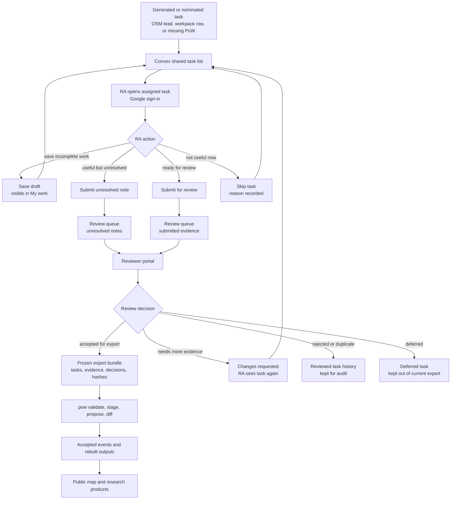
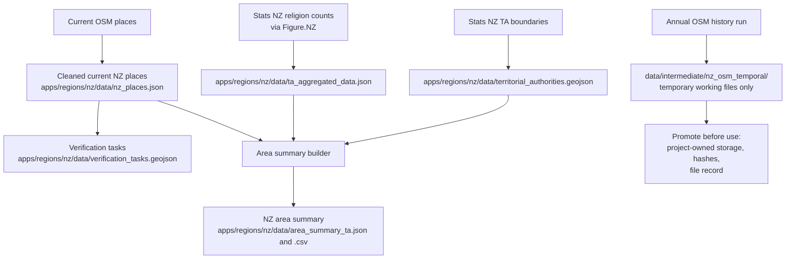
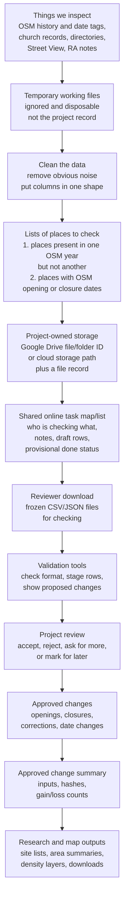
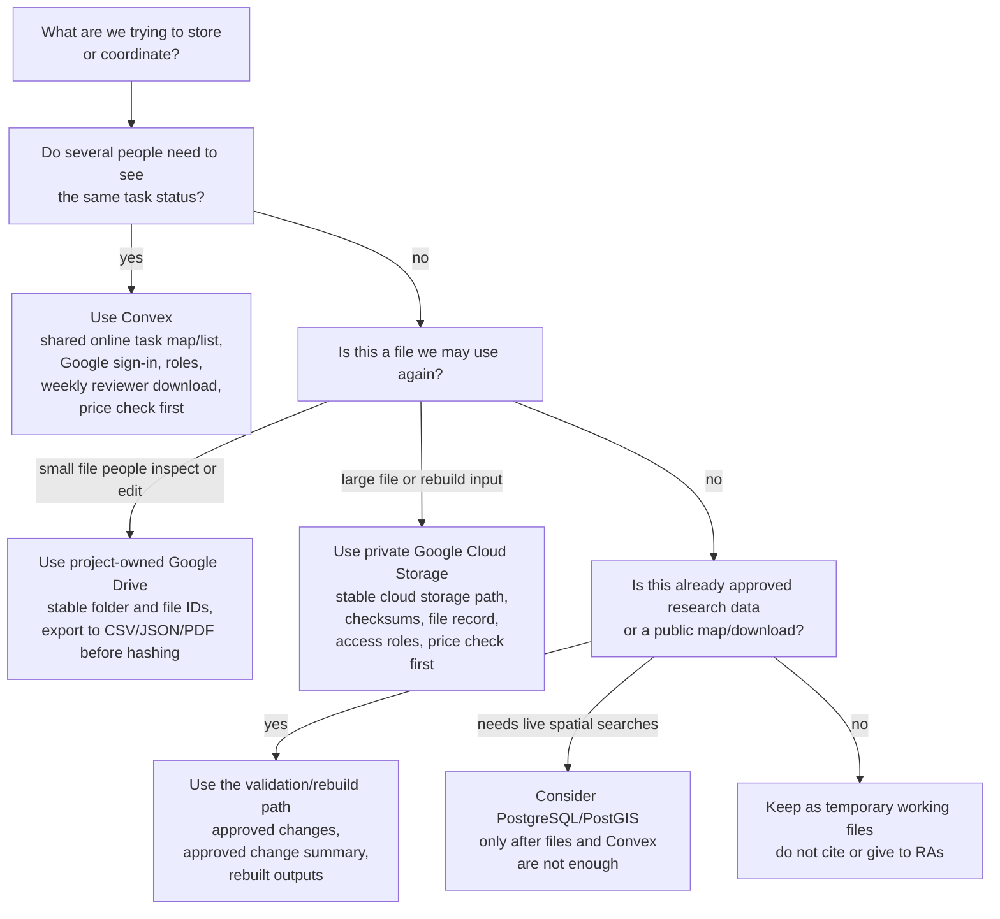

# Project Journal

This journal records decision points: why choices were made, what they imply,
and what remains open. `CHANGELOG.md` records what changed; this file records
the reasoning that should remain visible when the project is reported, audited,
or handed to collaborators.

## 2026-07-07: Deep-history evidence gets a governed contract

Decision:
Deep-history evidence now enters the change-event contract through
source-backed `attribute_update` and `lifecycle_claim` payloads. Dates from
historical sources may be exact or bounded (`value`, `not_earlier_than`,
`not_later_than`) at year, month, or day precision. Source references require
a title plus either a URL or an archive reference; reading-room and other
offline sources validate without inventing URLs. Site-level payloads also carry
`culturally_sensitive` and `sensitivity_basis`, and public-export validation
refuses sensitive payloads until a reviewer clears display.

Rationale:
The RA templates already ask investigators to preserve partial dates,
historical addresses, source titles, and archive context. The governed event
schema needed to carry that evidence directly, otherwise the staging boundary
would force old records into modern web-source shapes. Keeping relocation and
denomination changes in their existing payloads preserves the current identity
and taxonomy rulings while adding the narrower source-claim surface needed for
deep histories.

Consequences:
`pow validate` now tests bounded-date ordering and the URL-or-archive source
rule on JSON and JSONL inputs. A separate public-export mode rejects sensitive
site-level payloads unless review metadata explicitly clears display, while
normal staging still accepts the records for review. The Workbench draft types
now mirror the contract names and enums, including archive references,
`eventKind`, `consultedDate`, and `sensitivityBasis`.

## 2026-06-13: Vanuatu gets a live metric before its census data

Decision:
The Vanuatu map no longer ships purely boundaries-only. It now computes
and shows place-of-worship density — OpenStreetMap `place_of_worship`
points per square kilometre — per province and area council, while the
census religion metrics stay pending. The build fetches the points from
Overpass (214, ODbL), computes geodesic land area and point-in-polygon
counts with `sf`, and writes them into the existing area-summary rows;
the map opens on the density choropleth.

Rationale:
Density needs only points and land area, both of which are reachable
today, so it is a real test of the whole pipeline — fetch, area
assignment, choropleth, popup, legend — without waiting on the PDF-only
VNSO religion tables. It also makes the Vanuatu map useful now rather
than a placeholder. The computed national land area (~12,140 km²) lands
within half a percent of Vanuatu's official ~12,189 km², a cheap check
that the geodesic area is sound.

Consequences:
The earlier "areas first / boundaries-only" framing now has one live
metric layered on top. The map module needed two small accommodations:
a per-metric "no data yet" legend (so switching to a religion metric
reads clearly rather than blanking), and a default metric of density
for Vanuatu. The OSM count reflects OSM tagging, which in Vanuatu folds
some nakamals (kava meeting houses) into `place_of_worship`; the metric
is labelled "places of worship" honestly rather than "churches". Place
counts are a current snapshot repeated across census years, so the year
slider is present but the density does not move with it.

## 2026-06-13: A second country, areas first

Decision:
Vanuatu joins New Zealand as a research map at `apps/regions/vu/`, a
fork of the NZ page on the same shell. Its census geographies are the
country's six provinces (geoBoundaries ADM1) and sixty-five area
councils (ADM2), with census years 2009 and 2020. Per-area religious
affiliation is not yet loaded: the 2020 VNSO census reports religion
nationally but its provincial tables are PDF-only, and the Pacific Data
Hub's structured dataflows stop at population, not religion. Rather than
scrape a PDF speculatively or hand-enter unverifiable numbers, the map
ships as a boundaries-only scaffold — the areas, the years, and the
schema are in place; the values are null and clearly marked pending.

Rationale:
The instruction was to set up the areas if the data could not be reached
over the internet, and that is exactly the honest state: open,
provenance-clean boundaries are reachable; structured provincial
religion is not. The area-summary skeleton uses the same schema as the
NZ products, so when counts arrive they drop into existing rows and the
choropleth lights up with no code change. The boundaries-only legend and
the pending area popups say what is true now instead of implying data
that is absent.

Consequences:
The fork inherits the NZ census module, so the two pages can drift; that
is the accepted cost of a parallel page, and the shared design language
keeps the chrome aligned. Building against all-null data exposed a real
bug the NZ data had masked: JavaScript's `null - null` is 0, so the
change metric had been manufacturing a zero-change domain from missing
values. Guarding the operands fixed it on both maps — a suppressed or
pending denominator now reads as no data, not no change. The places
layer needs nothing Vanuatu-specific: it streams from the global tiles,
so Vanuatu's churches appear the moment the page loads.

## 2026-06-13: SA2 census data arrives through the front door

Decision:
The SA2 overlay consumes a new governed product, `area_summary_sa2.json`
(2,311 statistical areas by three census years), built by
`scripts/build_nz_area_summary_sa2.R` from a provenance-recorded Stats
NZ extract: religious affiliation from the 2023 Census totals-by-topic
SA2 feature service (CC BY 4.0, retrieved 2026-06-13), with 2013 and
2018 counts re-aggregated by Stats NZ onto 2023 SA2 boundaries. The
legacy `religion.json`, `demographics.json`, the 2018 `sa2.geojson`,
and the static demographic stubs are removed rather than audited: the
storage policy classed them as unverifiable demo material, and the new
extract supersedes everything they offered.

Rationale:
The provenance gate held. The repo's own records say the legacy files
"should not be treated as current authoritative Census ingestion", and
a governed product cannot stand on an unverifiable source. Re-fetching
from the official feature service yielded more than provenance: the
extract includes the 2023 census, Stats NZ's own boundary concordance
for earlier years, official land areas, and explicit suppression
sentinels. National totals from the new SA2 product agree with the
territorial-authority product to within 0.006 percent in every census
year.

Consequences:
Small-area honesty is now structural. Rows with suppressed or sub-100
denominators carry quality flags; the map washes those areas out,
marks flagged years in popups, and clamps colour scales to the 2nd–98th
percentile so a handful of extreme small-area values cannot compress
the national palette. The geography select offers territorial authority
and SA2 from one census module; each level loads once and caches for
the session. The 2006 SA2 religion counts in the retired legacy file
were not carried over — if they are ever needed, fetch them through the
same documented route.

## 2026-06-13: The NZ research map rebuilds on the global shell

Decision:
The NZ research map is being rebuilt as a fork of the global MapLibre
shell rather than restyled further in place. The rebuild lives at
`apps/regions/nz/next.html` beside the live Leaflet page and replaces
`index.html` only at feature parity, after screenshot approval. The
census overlay consumes the governed area summary product
(`area_summary_ta.json`, 67 territorial authorities by three census
years) joined to the 2025 boundaries; SA2 resolution waits for a
governed SA2 summary product rather than reading the legacy
`religion.json` and `demographics.json` extracts. The verification
surface is untouched throughout.

Rationale:
Joseph authorised an overhaul wherever rebuilding enhances function.
The Leaflet page and the global map solved the same problems twice:
two search implementations, two popup systems, two filter systems, two
styling passes that drifted apart. The global shell already serves the
same vector tiles, wears the shared theme by construction, and carries
search, religion and denomination filters, Street View, and location
features the research map lacked. Porting the census machinery onto
that shell is less work than porting the shell's features onto
Leaflet, and the result is one codebase to maintain.

Consequences:
Stage one ships territorial-authority choropleths (five metrics, three
census years, a diverging change scale with a symmetric domain), dark
census popups with the full year table and quality footnotes, a legend
that rides under the key pill, NZ city chips, and NZ-biased geocoding.
Colour domains span all census years, so a year switch changes the map,
not the scale. The data-quality dashboard and the stub demographic
popups (age, income, ethnicity) did not port: the static files behind
them are placeholders, and a governed data product should precede any
reappearance. Remaining before the swap: SA2 resolution, screenshot
approval, and link updates on the retiring page.

## 2026-06-13: One stylesheet owns the design language

Decision:
The global map's theme primitives now live in `apps/shared/map-shell.css`:
the colour and safe-area tokens, the dark pill (with per-control
custom-property knobs for background, border, shadow, and opacity), the
corner placement classes, the toast, the popup skin, the attribution
treatment, and a universal `[hidden] { display: none !important }`. The
global map consumes the sheet; `maplibre-flat.css` keeps only that app's
layout and machinery. The research maps adopt the shared sheet surface by
surface, in place of copying styles.

Rationale:
The look of the NZ research maps and the global map drifted apart because
styles were copied between apps and then edited independently. Extraction
makes the design language a single artefact: a change to the pill recipe
reaches every control that wears it, and an app that needs a variant
declares a knob instead of forking the recipe. The extraction was proven
a no-op before any adoption — computed styles for 47 chrome elements
across 63 properties are identical before and after, at both 1280 px and
375 px.

Consequences:
New map surfaces link `map-shell.css` first and add app styles after it.
The proof yielded two lessons: a cached stylesheet in the preview can make a
fresh edit look unapplied (fetch with `cache: "reload"` before judging a
diff), and class-based utilities lose to id-specific rules — the filters
toggle keeps its 44 px touch floor in the app sheet for that reason.
Semantic status colours on research surfaces stay app-side by design; the
shared sheet styles containers, never meaning.

## 2026-06-13: The nearest banner retires

Decision:
The nearest-place banner is gone, and with it the nearest-search
machinery that fed it. Location now gives the blue dot; distances appear
in popups when the user opens a place; the tap-held guide line and the
planning pin stay.

Rationale:
The banner pinned itself to whichever place happened to be nearest and
followed the user around — an answer to a question nobody asked on a
browsing map, occupying the screen the rest of the day's work had been
clearing. The reasoning completes a sequence: the strict near-me toggle,
then the line-on-tap, now this. Each removed an urgency assumption
inherited from the reliefmap fork.

Consequences:
The ported feature 4 is retired rather than amended, and the per-move
tile queries it required are gone with it. The pin's removal route is
tapping the pin. If a nearest readout is ever wanted again, the popup
distance rows and the taxonomy-filtered search are the surviving
foundations to build from.

## 2026-06-13: The guide line waits for a tap

Decision:
Turning on Near Me no longer draws the dashed guide line to the nearest
place of worship. The banner still reports the nearest distance; the
line appears only when the user taps a place and releases on a second
tap.

Rationale:
The ambient nearest-line came from the reliefmap fork, where the user's
need is urgent and the nearest answer is almost always the destination.
On a browsing map the same line presumes a destination the user has not
chosen, and draws attention to one arbitrary place the moment location
turns on. Joseph's framing settled it: people are generally not busting
for church as they would be for a loo. The same reasoning earlier made
the near-me pill a strict toggle; reliefmap's urgency assumptions do not
transfer to this map.

Consequences:
Location on means a dot and a distance readout, nothing more. The line
becomes an expression of interest in a specific place, consistent with
focus-survives-popup-close planning behaviour. The porting inventory's
feature 6 is amended here rather than in the inherited form.

## 2026-06-13: Filters persist across panel close; an indicator carries them

Decision:
Closing the global map's search panel no longer clears the filters. When
the panel closes with filters active, a chip beside the toggle shows the
off-count and clears everything in one tap; reopening the panel expands
the filter section so active filters are in view; reset still clears.
Filter state also travels in the URL fragment beside the camera, and an
exact category typed into search (mosque, anglican, a religion name)
applies the matching filter rather than geocoding.

Rationale:
The clear-on-close rule, inherited from the reliefmap fork, prevented
invisible state. On this map it collided with the workflow the filters
exist for: filtering is the analytical act, and closing the panel is how
the user looks at the result. Clearing on close meant no one could ever
see a filtered map without the panel covering it. The hazard was never
persistence; it was state without a cue. Moving the cue outside the
panel (the chip, the auto-expanded section on reopen, the off-list in
the URL) removes the hazard while keeping the workflow.

Consequences:
A filtered view survives looking at it, can be shared as a link that
arrives with its chip showing, and is always one tap from cleared. The
reliefmap rule is retired here, and the earlier journal entries
describing clear-on-close are superseded on that point.

## 2026-06-13: Map filters group denominations through the taxonomy aliases

Decision:
The global map's search panel filters by the nine palette religions and,
within Christianity, by eight major denomination buckets plus Other
Christian. The buckets group raw OSM denomination strings through the
alias table in `schemas/denomination-taxonomy.json`, fetched by the page
at load; the map does not maintain a second vocabulary.

Rationale:
The served vector tiles carry raw OSM `denomination` values in both the
places and overview tiers, so denomination filtering needs no pipeline
change. Raw values are inconsistent (catholic, roman_catholic, marist),
and the taxonomy already adjudicates those groupings with review flags;
reusing its aliases keeps the filter, the research vocabulary, and the
future mapper generation aligned. If the taxonomy fetch fails the
religion filters still work, so the panel degrades rather than breaks.

Consequences:
One clause builder feeds the layer filters, the counts key, and the
nearest search, so what the map shows, counts, and measures stays
consistent. Closing the panel clears the filters (the reliefmap rule:
filters behind a closed panel are invisible state). Taxonomy updates
change filter behaviour without touching the map code.

## 2026-06-13: The near-me pill is a strict toggle, diverging from reliefmap

Decision:
On the worship map, tapping the near-me pill while location is on turns it
fully off, whatever internal state the geolocate control is in. Reliefmap
keeps MapLibre's stock semantics, where a tap after panning recentres on
the user instead of switching off.

Rationale:
Recentre-on-tap suits reliefmap, where the user wants the nearest toilet
from where they stand. The worship map is a browsing map: users locate
themselves, then pan to distant places. Under stock semantics every pan
demoted the control to its background state, so the next tap zoomed back
to the user rather than turning location off — on a phone the pill felt
stuck. A strict toggle makes the pill predictable; users who want a
recentre tap twice.

Consequences:
The toggle reaches into the control's private _watchState to lift the
background state before triggering, with the same graceful degradation as
the existing state read: if a MapLibre upgrade removes the field, the pill
falls back to stock semantics rather than breaking. Two further fixes
shipped alongside: the nearest search keeps a single pending once-idle
listener (continuous gps fixes kept the map non-idle and the old code
stacked heavy tile queries), and a denied browser permission now tells the
user where to re-enable location.

## 2026-06-12: One compass, shown on demand; refresh replaces the corner slot

Decision:
The global map keeps one custom bearing affordance, the set-north badge,
and shows it only when the map is rotated off north, on phone and desktop
alike. The dead second compass button leaves the markup. The octocat info
menu moves to the top-right under the wordmark, and a refresh button takes
the freed bottom-left slot on both form factors.

Rationale:
The map carried three north affordances on desktop (a dead one among them)
and none of the corner furniture existed for phones, where accidental
two-finger rotation is the case that needs a reset. A compass that appears
exactly when bearing is non-zero advertises the problem it solves.
Refresh-to-clean-slate proved its worth on the reliefmap fork, and phones
need it most: pins, search text, and an open dock accumulate fast on a
small screen. The arrangement mirrors reliefmap.info so the two maps stay
recognisably siblings.

Consequences:
Bottom-left is the reset affordance, top-right holds identity and
project links, top-left is transient state (compass when rotated). The
refresh sweep will include open popups once the popup singleton from the
porting inventory lands.

## 2026-06-12: Keep reserved hues for location features, separate by shape

Decision:
Port the reliefmap location features with their reserved hues intact: the
user-location dot stays the idiomatic blue and the planning pin stays amber.
Marker shape carries the distinction from the religion palette, which uses
blue for Jewish sites and orange/yellow for Hindu and Buddhist sites.

Rationale:
The blue dot with a white ring and pulsing halo is a cross-application idiom
users already know, and site markers are small flat circles, so morphology
separates the two at normal zooms. Recolouring the religion palette would
change the research-facing colour vocabulary on the public map for the sake
of an interaction affordance; recolouring the dot would discard the idiom.
Shape-based separation costs nothing now and leaves both palettes untouched.

Consequences:
The geolocate control ships with MapLibre's default dot styling, enlarged on
phones. The planning pin, when ported, uses relief's amber. If low-zoom
confusion between the dot and Jewish site markers appears in real use, the
fallback is a palette adjustment, which remains available.

## 2026-06-12: Adjudicate the revisions-pipeline decisions into a register

Decision:
Adjudicate the design decisions raised by `CRITIQUE.md` and the open items in
`PLANNING.md` that intersect the revisions pipeline, and record the rulings in
`DECISIONS.md` with rationale, what each ruling forecloses, and the cost to
reverse it.

Rationale:
Several critique recommendations had already been implemented in the schemas
and `pow-cli` without a record stating that they are commitments rather than
provisional code. Other decisions remained genuinely open, and two PLANNING.md
entries contradicted the built system. A register separates the rulings from
the dated narrative in this journal and gives each one a named reversal cost,
so future work can tell which choices are cheap to revisit and which would
rewrite accepted data.

Consequences:
Sixteen rulings now stand, most ratifying the implemented design. Schema
changes land with the register: `taxonomy_version` is now required for any
denomination-bearing payload, and the denomination vocabulary becomes a
versioned artefact at `schemas/denomination-taxonomy.json` with supersession
links and review-flagged placements. The PLANNING.md open items on historical
and demolished places and on Rust adoption timing close with pointers to the
register.

## 2026-05-15: Make missing-address review explicit in the RA workflow

Decision:
Treat missing or corrected street-address evidence as a first-class RA input,
not as an implicit note buried in free text.

Rationale:
Some assigned tasks ask the RA to resolve a missing street address, but the
verification form did not previously give them a clear place to enter the
address, locality, or uncertainty note. That made a legitimate task look
unactionable and increased the chance that address evidence would be lost in a
general source note.

Consequences:
The RA form, Convex evidence draft, reviewer portal, and spreadsheet fallback
now carry source-backed address, locality, and address-note fields. Address
corrections remain evidence for review. They do not directly update the master
map until accepted evidence is exported and passed through the governed `pow`
path.

## 2026-05-15: Keep Google auth public config explicit and refresh early

Decision:
Use the public Google client id directly in the Convex auth configuration and
refresh Google identity tokens before they expire during RA and reviewer work.

Rationale:
The Google client id is public configuration already present in the frontend.
Keeping it only as a hosted Convex environment variable made local anonymous
Convex code generation fail before hosted settings were available. The more
important secret boundary is the deploy key, OAuth secrets, local admin keys,
and session tokens. Separately, RA sessions should not fail mid-task merely
because the browser-held identity token has reached its expiry window.

Consequences:
Local Convex code generation can validate the auth configuration without a
hosted deployment environment. The hosted deployment may still keep
`GOOGLE_CLIENT_ID` as an operator-facing record for older branches, but the
current auth config does not depend on it. The static client now attempts a
quiet pre-expiry refresh and asks the user to sign in again only when Google
cannot refresh the token.

## 2026-05-14: Add unresolved notes to the RA-review workflow

Decision:
Treat useful but incomplete RA submissions as first-class unresolved notes in
the shared task system. An RA can now save a draft, submit an unresolved note,
or submit a completed case for review.

Rationale:
Many real cases will not be settled by the first source check. Forcing those
cases into a completed submission loses the distinction between "this evidence
supports a decision" and "this is a lead that needs more work". OpenStreetMap's
note workflow is a useful model: preserve incomplete observations, keep them
visible to reviewers, and close them only when a decision is justified.

Consequences:
Convex now has an `unresolved_note` task and draft state. Unresolved notes leave
the active RA list, remain visible in `My work`, and appear as a separate queue
in the review portal. Reviewers can accept, reject, defer, mark duplicate, or
request more evidence. The master boundary is unchanged: unresolved notes and
review decisions still require export and `pow` validation before they can
affect public or research data.

## 2026-05-14: Move to strict TypeScript incrementally

Decision:
Use strict TypeScript for Convex and for new Convex-facing workflow UI. Do not
convert the large live static verification map merely for consistency while it
is serving the active New Zealand pilot.

Rationale:
Convex already gives the project typed backend contracts, and new review,
task, nomination, export, and country-configuration interfaces should use
those contracts directly. The live JavaScript map is currently more valuable
as a stable pilot surface than as a migration target.

Consequences:
The TypeScript boundary should grow through new modules and targeted redesigns.
Legacy JavaScript can be migrated when a module is replaced by the Vite/React
workbench or when a pilot need justifies touching it. Strict checking remains a
gate for Convex and new TypeScript surfaces.

## 2026-05-14: Start the review loop with a static Convex portal

Decision:
Build the first reviewer surface as a static, role-gated New Zealand page that
reads submitted Convex evidence drafts and records review decisions. Defer
export buttons and the React/Vite workbench until the first live review cycle
has been exercised.

Rationale:
André's first submissions need a simple reviewer path now. The existing Convex
backend already has review and export functions, so the fastest reliable step
is to expose the review queue without adding a new build system. Keeping export
controls out of the first portal also preserves the master-data boundary: a
review decision can make evidence eligible for export, but it cannot update the
public map or master data by itself.

Consequences:
The static portal can accept, reject, defer, mark duplicates, or request more
evidence for submitted tasks. Accepted-for-export decisions require an evidence
draft from the same task. Export bundles remain a maintainer operation until
the first reviewed batch has been checked through the `pow` path.

## 2026-05-14: Use Convex for live work and keep the governed master replayable

Decision:
Use Convex as the live operational layer for assignments, candidate
nominations, evidence drafts, review decisions, and export batches. Do not make
Convex the only authoritative store for accepted research data. Accepted
decisions should round-trip through an explicit export bundle, `pow`
validation, diff, and later master rebuild before they affect public maps or
analysis products.

Rationale:
Convex gives the project a practical way to coordinate multiple research
assistants and reviewers without spreadsheet handoffs. That convenience should
not replace the scientific requirement to distinguish historical changes in
worship function from corrections to our records. The durable research product
is the accepted, typed change history plus the rebuilt master snapshots, not
the transient live task database.

Consequences:
The next technical milestone is a thin round trip: take accepted Convex review
decisions, export tasks, task events, evidence drafts, review decisions, and a
`site_evidence_wide.csv`, materialise the bundle with hashes, and run it
through `pow validate`, `pow stage`, `pow propose`, and `pow diff`. The
Vanuatu surface should wait until this path has been kicked hard enough to show
that proposed changes can leave the live backend and enter the governed data
pipeline cleanly.

The review step should also move into an authenticated UI. Reviewers should
record accept, reject, request-more-evidence, revise, duplicate/link, and defer
decisions through role-checked Convex functions, and each decision should update
the RA-facing task state immediately. The current 50-case André assignment is a
filtered batch over the shared task list, not a separate worksheet model; later
New Zealand batches, Vanuatu tasks, and missing-place nominations should use
the same task history and review loop.

Workflow map:

## 2026-05-14: Use TypeScript pragmatically around Convex

Decision:
Be more permissive about TypeScript where the project is working directly with
Convex. TypeScript is appropriate for Convex schemas, mutations, queries,
review-workbench prototypes, export glue, and frontend integrations that need
to speak the same typed interface as the live backend.

Rationale:
Convex exposes its application model through TypeScript. Using that surface
reduces translation work during the prototype stage and lets the live task
workflow, evidence drafts, review decisions, and export helpers evolve together
while the data contracts are still being tested.

Consequences:
This does not change the scientific data boundary. Rust remains the governed
validation, diff, replay, and rebuild layer for accepted changes, and R remains
the principal analysis and reporting environment. TypeScript is a practical
workflow language for Convex-backed coordination and prototyping, not a reason
to move the master or research products into Convex.

## 2026-05-14: Seed the first hosted NZ web assignment

Decision:
Use the hosted Convex deployment for the first real NZ RA web assignment, with
the public verification map loading a named 50-task batch from the backend.

Rationale:
The spreadsheet bridge helped us understand the evidence fields, but it asks
the RA to copy rows by hand and gives us no shared task state. A small
backend-backed batch lets André work from a single web link, save drafts, submit
rows for review, and avoid re-checking tasks that have already been acted on.

Consequences:
The hosted task backend now has the `nz-temporal-ra-workpack-001` batch seeded
with 50 open tasks. The public map is configured to use the hosted Convex
deployment and Google sign-in. Human users still have to claim their pending
invites on first sign-in, and accepted evidence still has to move through the
review/export/`pow` path before it can affect the master map.

## 2026-05-13: Start Vanuatu source-first and hand André the NZ workpack

Decision:
For immediate RA work, ask André to work from the private 50-record New Zealand
temporal workpack rather than continuing open-ended demo-map sampling. Start
Vanuatu as a source-first country case before building a Vanuatu task map. Guy
is the assigned RA for the first Vanuatu pass.

Rationale:
The New Zealand temporal workpack already turns noisy OSM history into narrow
evidence questions, so it is the fastest useful task for André. Vanuatu has a
different historical and census structure. The current OSM extract is a useful
starting inventory, but it is sparse and should not drive RA work before the
source protocol is clear.

Consequences:
The Vanuatu protocol now uses 1989, 1999, 2009, and 2020 as the first
structured target years, while allowing lifecycle dates from 1600 onward for
mission, colonial, denominational, and historical locality evidence. The future
interface should take target years and timeline bounds from country
configuration. A time slider should help review and visualise reconstructed
states and diffs; it should not become the primary data-entry mechanism.

## 2026-05-13: Prioritise the shared task backend over spreadsheet copying

Decision:
Make the Convex-backed task map the preferred direction for RA evidence entry,
with Google sign-in, shared task status, draft evidence saves, submitted review
items, and backend skips. Keep the spreadsheet row export as a fallback and
debugging path while hosted authentication, task seeding, and exports to `pow`
are being proven.

Rationale:
The map-to-spreadsheet bridge helped us test the data shape quickly, but it
creates too many manual handoffs for routine RA work. A shared task backend lets
RAs see which tasks have already been saved, skipped, or submitted, reduces
copy/paste errors, and gives reviewers a clearer queue. Convex is still a task
coordination layer, not the master database: accepted changes must still pass
through the governed `pow` validation, diff, and rebuild path.

Consequences:
The static NZ verification map now has a guarded Convex client bridge that stays
disabled until the hosted deployment URL and Google client id are configured.
Bootstrap mutations require a setup token before first users can be invited.
Local browser state remains a degraded fallback only, now scoped by country and
RA initials so it is less likely to mix sessions. The next operational step is
to configure the hosted Convex deployment, seed the first NZ tasks, invite JB,
JW, and André, and verify a save/submit/review/export loop before asking André
to rely on the backend.

## 2026-05-13: Make the 50-case web assignment the first RA backend task

Decision:
The next concrete build task is the 50-case Convex-backed New Zealand web
assignment. André should receive a website link for
`nz-temporal-ra-workpack-001`, sign in with Google, work through the assigned
cases, and save drafts or submissions directly to the shared backend.

Rationale:
The spreadsheet workpack is reproducible and useful as a source file, but it is
not the right primary working surface for a paid RA. A web assignment reduces
copy/paste risk, gives JB and JW shared task status, and lets the review queue
start taking shape before the whole New Zealand task map is backend-driven.

Consequences:
The assigned URL uses `?batch=nz-temporal-ra-workpack-001`; the map loads that
batch from Convex after sign-in and disables spreadsheet copying for the
assignment. The generated seed keeps deterministic task ids for all 50 cases so
rerunning the import updates the same tasks. The remaining operational steps are
to import the seed into the hosted Convex deployment, invite André, and smoke
test one draft save and one submitted review item before sending the link.

## 2026-05-13: Start Convex on Free and upgrade by trigger

Decision:
Start the Convex task-map pilot on the Free plan. Move to Starter only if the
pilot approaches a hard Free quota. Move to Professional when the project needs
daily managed backups, log streaming, exception reporting, email support,
compliance reports, or sustained usage where Starter overage is no longer the
right fit.

Rationale:
The New Zealand pilot is small relative to current Convex Free limits if Convex
stores only task coordination, evidence drafts, review decisions, and export
metadata. The project should not use Convex for raw OSM snapshots, media,
accepted master records, or public map products. Those exclusions keep both
cost and governance risk low.

Consequences:
`docs/convex-task-layer-spec.md` now includes a capacity model and plan triggers.
The most important quota to watch is function calls, especially if we later use
reactive subscriptions rather than explicit refreshes. The next design step is
to move country-specific settings into a `country_configs` table so Vanuatu and
later countries do not require code changes for target years, source options,
timeline bounds, or map defaults.

## 2026-05-10: Organise project work by deep modules

Decision:
Add `docs/system-map.md` as the project module map and use module labels in the
private tasklist.

Rationale:
The project now has several connected but distinct responsibilities: source
storage, extraction, temporal leads, task coordination, evidence intake,
review, reconstruction, research outputs, public maps, and governance. A module
map makes those responsibilities easier to see and reduces the risk that a task
or tool starts owning more than it should.

Consequences:
Each active task should have one primary module. The module does not describe
who is responsible; it describes where the work sits in the system. The private
tasklist should use those module names so tactical work stays connected to the
overall design.

## 2026-05-09: Give André a curated temporal workpack, not raw OSM differences

Decision:
Generate a first 50-record New Zealand temporal RA workpack from the OSM
places-to-check files before asking André to review temporal change evidence.

Rationale:
Raw OSM year differences contain mapping lag, object replacement, node-to-way
changes, tag corrections, and genuine historical signals mixed together. André
should be asked narrow evidence questions, such as whether an OSM date-tag
opening is supported by another source or whether an apparent disappearance is
real worship-use loss rather than OSM object churn.

Consequences:
The workpack is selected reproducibly by
`scripts/build_nz_temporal_ra_workpack.R` and documented in
`docs/development/nz-temporal-ra-workpack.md`. The first workpack contains all
35 possible OSM date-tag opening windows, plus 5 likely object-churn losses, 5
ambiguous date/status cases, and 5 controls. This is a pilot for the workflow;
it is not accepted historical data.

## 2026-05-09: Looking back at nine months of commits

We went through the git history—370 commits since August 2024—and noticed the
project has moved through six fairly distinct phases. Writing this down helps
explain why certain messy interim solutions (demo modes, spreadsheet bridges,
files sitting in Google Drive) are still around, and why we built so much
governance scaffolding before letting anyone actually save to a backend.

**Phase 1: Just get the map working (August–December 2024)**
The early commits are all about deployment: GitHub Pages, CORS fixes, wrestling
with data loading. We swapped map providers when MapLibre throttled us,
obsessed over mobile UI, and watched loading screens hang repeatedly. The first
NZ dataset landed—3,370 places from OpenStreetMap—and we sketched out early
schemas for sites and structures. Most commits were mobile UX tweaks; the
interface kept getting simplified because phones were hard.

**Phase 2: Realising the data was messy (January–March 2025)**
We cleaned house: archived old files, moved frontends into an `apps/` directory,
then started aggressive NZ cleanup. Dropped from 4,718 records to 3,618 by
removing duplicates and false positives like masonic centres. The first manual
review queue appeared—719 records that needed human eyes. We started central
planning documents and admitted the global extractor was "too permissive for
research-grade use."

**Phase 3: Rebuilding the pipeline properly (April–June 2025)**
Modernised Python tooling, started porting the global pipeline to R. Built the
first area summary contract for NZ territorial authorities, with an honest
caveat that place counts were repeated across census years because we did not
have historical snapshots yet. Started designing RA workflows with spreadsheet
templates that could handle fuzzy dates and bounded intervals.

**Phase 4: Figuring out how to verify things (July–September 2025)**
Planned temporal verification workflows. Launched the NZ verification map as
read-only, with a demo action builder so RAs could generate spreadsheet rows
without any backend save functionality. The Rust `pow` CLI took shape—
validation, staging, diff reports. Wrote a critique of our own RA evidence
pipeline, then tightened the schemas in response.

**Phase 5: Adding shared task state (October 2025–January 2026)**
Spiked Convex as a backend for shared task assignments and provisional closures,
with a strict rule: Convex exports into `pow`, never writes to the master
database. Refined RA workflows, added visual evidence support, documented the
storage pipeline. Explicitly demoted Google Drive to "temporary holding, not
the long-term system of record."

**Phase 6: Temporal data and manifests (January–May 2026)**
Extracted NZ OSM history annually from 2013 through 2025. Separated raw snapshot
manifests from the places-to-check archives we generate from them. Defined the
accepted diff contract: "validated diff artefacts are primary research data."
Fixed bugs in `pow diff`, consolidated the public readme. We are still at Phase 1
(~) in the official ROADMAP—governed local ingestion works, but reviewer
decisions and deterministic replay remain `[ ]`.

**What the commit history suggests:**

1. **Maps come first, governance follows.** Every phase started with interface
pressure, then we discovered what data infrastructure we needed to support it.

2. **We document before we build.** The R pipeline, Rust CLI, and Convex spike
all had planning documents arguing the case before the code landed.

3. **NZ is our forcing function.** Global expansion keeps getting deferred while
we try to get New Zealand right first. The cleanup queue, temporal
reconstruction, and RA workflows are all being proven in NZ before any other
country sees them.

4. **Bridge solutions pile up.** Demo modes, local JSON previews, spreadsheet
exports, Google Drive as holding pen—these interim fixes last longer than we
expect because the "proper" backend stays `[ ]`.

5. **Schemas precede implementation.** Change events, geometry history, area
summaries, manifests—all specified in JSON before any code consumed them.

**What this means for now:**
We have invested heavily in governance infrastructure while deferring the
reviewer decision loop that would actually close it. The commit history lines
up with current priorities: finish the OSM date-tag parser, get the NZ
places-to-check files into durable storage with proper manifests, and run a
small RA pilot end-to-end before scaling up.

## 2026-05-08: Save raw OSM snapshots as their own source package

Decision:
Store the New Zealand 2013-2025 raw OpenStreetMap/ohsome annual snapshots as a
separate project Google Drive archive with a tracked `raw_source` file record.

Rationale:
The first places-to-check archive already contains the raw snapshots, but it is
an intermediate review package. Raw source snapshots need their own durable
record so the source extraction can be audited separately from later cleaning,
date-tag parsing, task generation, and accepted change decisions.

Consequences:
The raw archive is now distinct from the generated places-to-check archive.
Downstream manifests can cite the raw-source manifest as an input, while the
places-to-check manifest remains an `intermediate_lead` product. The raw
snapshots remain source extracts under the ODbL: they are not cleaned places of
worship and do not establish accepted historical worship-use states.

## 2026-05-08: Separate brainstorming from project decisions

Decision:
Create `BRAINSTORMING.md` as a place to hold tool and architecture ideas before
they become planning, roadmap, or implementation decisions.

Rationale:
The project needs room to compare tools such as Graphite, Convex, JSON diff
renderers, PostgreSQL/PostGIS, and Rust-first web frameworks without making
every interesting option sound like a commitment. The practical test for each
tool is whether the project can preserve its data, decisions, and review
history if the tool becomes unsuitable or disappears.

Consequences:
Future tool ideas should first record their possible role, limits, migration
path, and decision status in `BRAINSTORMING.md`. Once a tool is adopted, the
actual decision should move into `PLANNING.md` and `JOURNAL.md`. Research data
semantics remain defined by the schemas, `pow`, manifests, and accepted change
events, not by developer workflow or display tools.

## 2026-05-07: Make current data locations explicit

Decision:
Document where the already-ingested New Zealand OpenStreetMap and Census-linked
data currently live, and distinguish committed map data from temporary working
files that still need promotion to project-owned storage.

Rationale:
The project now has several data products with different levels of durability.
Some are committed app files used by the public map. Others are ignored working
outputs from the annual OpenStreetMap history run. Reporting, RA task
generation, and future storage decisions require a plain answer to where each
dataset went and whether it can be recovered without depending on a personal
working checkout.

Current flow:

Consequences:
The current NZ map and data page can be traced to committed files under
`apps/regions/nz/data/`. The 2013-2025 OSM history extraction has not yet been
made durable: it sits under `data/intermediate/nz_osm_temporal/`, which is
ignored and should be treated as temporary working output. Before those rows
seed Convex tasks, RA assignments, or longitudinal estimates, the useful files
must be copied to project-owned storage, hashed, and described by a tracked
file record. Older demographic demo files in the app data folder should be
audited before they are used in reporting.

## 2026-05-07: Treat Convex as a low-cost pilot service, with limits

Decision:
Use the current Convex pricing page as the first pricing check for the task-map
pilot. The one-RA New Zealand pilot should start on Free/Starter if the hosted
account and collaborator model fits. Professional should be considered only
when daily backups, log streaming, exception reporting, support, or usage
limits justify the cost.

This was refined on 2026-05-13: start on Free, use Starter only for quota
pressure, and reserve Professional for backups, logs, support/compliance needs,
or sustained high usage.

Rationale:
The pricing page checked on 2026-05-07 lists Free/Starter for prototypes with
1-6 developers, Professional at $25 per developer per month, and
Business/Enterprise at a $2,500 monthly minimum. This supports using Convex for
shared task status and evidence drafts without committing the project to a
large backend spend.

Consequences:
Convex remains the near-term coordination service, not the storage system of
record. Raw OpenStreetMap snapshots, annual history outputs, media, accepted
diffs, and public map products should stay outside Convex unless a later
pricing and governance review changes that boundary. Recheck the pricing page
before enabling a paid deployment.

## 2026-05-07: Give RAs selected OSM-history rows, not raw differences

Decision:
For the New Zealand temporal reconstruction pilot, ask André to contact church
bodies for source-backed records while the project generates cleaned
OpenStreetMap-history rows centred on the 2013, 2018, and 2023 target years.
André should review selected candidate rows after cleaning, not raw
OpenStreetMap history.

Rationale:
The project has already done substantial current New Zealand cleanup. Raw OSM
history will contain false positives, support buildings, deleted or replaced
objects, node-to-way churn, tag corrections, and features that were simply not
mapped in earlier years. Most apparent 2013/2018/2023 differences should be
expected to be mapping artefacts until checked against non-OSM sources.

Consequences:
The near-horizon workflow is: generate dated OSM snapshots, apply the existing
project cleaning rules to each snapshot, produce lists of places to check for
target-year state questions, and then ask André to verify selected rows against
church-body records, directories, archived websites, annual reports, visual
evidence, or local records. Apparent OSM additions/removals are treated as
places to check for staged evidence, not as accepted historical place-density
inputs.

Open questions:
We still need to decide how much church-body data can be cited or redistributed,
how to prioritise denominations and regions, and how cleaned OSM candidate rows
should enter Convex or `pow` once the first generated sample has been inspected.

## 2026-05-07: Generate annual OSM lists of places to check from 2013

Decision:
Use annual OpenStreetMap snapshots as the default way to generate lists of
places to check over time. For the first New Zealand implementation, build
`1 September`
snapshots from 2013 through the latest completed annual anchor, currently 2025.
Keep the RA-facing and estimation focus on 2013, 2018, and 2023.

Rationale:
Annual snapshots make the method reusable for other countries, where census,
survey, and administrative target years will differ from New Zealand. They also
help distinguish real candidate changes from OpenStreetMap mapping artefacts:
single-year blips, node-to-way replacements, and delayed mapping are easier to
spot when the full annual sequence is visible.

Consequences:
Annual OSM differences are an internal candidate generator, not a yearly RA
work queue. Candidate rows should preserve adjacent-year transition windows
while allowing project reviewers to reduce them into a smaller set of New
Zealand tasks around 2013, 2018, and 2023. The 2026 annual anchor should not
be used until `2026-09-01` has passed.

First strict national run:
The first strict New Zealand node/way extraction completed on 2026-05-07 and
wrote ignored local outputs under `data/intermediate/nz_osm_temporal/`. It
produced 4,777 candidate rows. Cleaned snapshot counts were 775 for 2013, 2,012
for 2018, 3,335 for 2023, and 3,350 for 2025. These figures are counts from
the cleaned OSM extracts only. They are not currently used for the NZ data-page
density plots, which still use the committed current-place
`area_summary_ta.json` product and should not be interpreted as historical
place-density estimates.
After the OSM date-tag list was added, rerunning the cached strict extraction
produced 1,438 rows for places with OSM opening or closure date tags. The
provisional target-year statuses were mostly `present`, with 35 possible gain
windows and no date-tag-derived loss windows. This confirms that OSM date tags
are currently more useful for possible openings and back-propagated presence
than for closure detection.

## 2026-05-07: Treat local ignored data as cache, not storage

Decision:
Add `docs/data-storage-pipeline.md` as the operational storage policy. Local
ignored folders such as `data/raw/`, `data/intermediate/`, `data/derived/`, and
`exports/` are cache only. Any dataset that may be reused for analysis, review,
publication, or task generation must have a durable project-controlled copy and
a tracked file record (manifest).

Rationale:
A laptop can fail, be lost, or diverge from the project record. Keeping large
or restricted data out of Git is still correct, but local-only ignored files are
not recoverable enough for an auditable research pipeline.

Consequences:
The immediate storage pattern is temporary working files plus named
project-controlled storage plus a tracked file record (manifest). For the
pilot, project Google Drive can hold working source files and exported review
artefacts; Google Cloud remains the durable storage reference for fixed source
snapshots, media quarantine, and future spatial database storage. The
2026-05-07 NZ annual OSM extraction should be promoted to this pipeline before
it is used for Convex task generation, analysis, or public map products.

## 2026-05-07: Make global data versioning hash-backed

Decision:
Add `schemas/data-manifest.schema.json` and extend the storage pipeline so every
reusable data artefact has stable logical IDs, immutable version IDs, per-file
SHA-256 hashes, row or feature counts, and a manifest hash. Global data should
be partitioned by dataset family, snapshot date, pipeline stage, and country
before any larger tile or grid partitioning is introduced.

Rationale:
The project is moving toward global longitudinal data. At that scale, informal
local folders and prose-only manifests will not be enough to recover data, audit
changes, compare country partitions, or let agents review versioned dumps.
Hashing must happen at source export, raw snapshot, stage output, durable
storage, and accepted-publication boundaries.

Consequences:
Before the NZ OSM annual extraction is used for Convex task generation or
analysis, create a tracked file record (manifest) that validates against
`schemas/data-manifest.schema.json`. Then wire the same hash-backed file-record
contract into the global extract, normalise, clean, deduplicate, review-queue,
and export stages. Native Google files must be exported to stable bytes before
hashing.

## 2026-05-07: Treat accepted diffs as primary longitudinal data

Decision:
Validated and accepted diffs are the key longitudinal research data. Site
snapshots, area summaries, density layers, and appeared/disappeared maps should
be derived from accepted change events and accepted-diff manifests, not from
unreviewed snapshot comparisons.

Rationale:
The substantive research questions depend on gains and losses: whether worship
use appeared or disappeared at a place, when that affects target-year states,
and how the transitions change counts, densities, denominations, and uncertainty
within areas. If those differences are not stored as auditable, replayable data,
we cannot support serious longitudinal analysis.

Consequences:
OSM annual comparisons remain lists of places to check until reviewed. A
research-grade gain or loss must be represented as an accepted event with source
references, target-year affects, payload hash, review decision, and file-record
linkage. The next `pow` design step should add accepted-diff manifests and
deterministic loss/gain summaries before density products or map layers consume
temporal changes.

## 2026-05-07: Use OSM opening and closure dates as target-year clues

Decision:
Treat OpenStreetMap date and former-use tags, especially `start_date`,
`old_start_date`, and `end_date`, as first-pass clues for whether a place of
worship was in use at New Zealand target years. These tags should seed
provisional 2013, 2018, and 2023 statuses and gain/loss review tasks, then flow
through RA or project review before becoming accepted change events.

Rationale:
OSM opening and closure dates are cheap to extract at scale and often encode
useful local knowledge that previous versions of the map already relied on.
They can point
directly to likely openings, closures, and ambiguous temporal windows. They are
also uneven, user-supplied, and sometimes describe a building, organisation, or
OSM mapping history rather than worship use at a site. Their value is therefore
as structured evidence to review, making target-year uncertainty visible.

Consequences:
The temporal OSM workflow should emit a spreadsheet-style list of places with
OSM opening or closure date tags. Each row should preserve the raw tag, parsed
date bounds, provisional target-year statuses, possible gain/loss window,
evidence basis, and reviewer instruction. A row based only on OSM date tags
remains provisional. A research-grade gain or loss still needs an accepted
event with source references, `target_year_affects`, payload hash, review
decision, and manifest linkage.

Open questions:
We need to define the exact parser for partial and messy OSM date strings,
decide how to handle nonstandard former-use tags such as `disused:*`,
`abandoned:*`, `was:*`, or `historic=*`, and choose how much OSM-only evidence
is enough for low-risk confirmations compared with candidate losses or gains
that affect estimates.

Plain-language translation:
An "OSM year-difference row" says, for example, "this mapped place of worship
appears in the 2018 OSM extract but not the 2013 extract." That row does not
yet tell us whether the place really opened, whether OSM only mapped it late,
or whether an OSM node became a building outline. An "OSM date-tag row" says,
for example, "OSM gives `start_date=2015`, so this is a place to check as a
possible 2013-2018 gain." Both are simply lists of places for a person or
reviewer to check before any research estimate changes.

## 2026-05-07: Separate the shared task map from durable research storage

Decision:
Use a three-part workflow: an online map/list for shared RA and reviewer task
status; project-controlled storage for reusable files; and `pow`-reviewed
changes for research-grade longitudinal data.

Rationale:
The project needs an ergonomic shared task map soon, but the task backend should
not become the master database. The mission-critical data are the validated
diffs and accepted change events from which gains, losses, target-year states,
density changes, and map layers can be replayed. Storage decisions therefore
need to distinguish live coordination, durable evidence storage, and accepted
research artefacts.

Data workflow, in plain language:

Storage and action decision tree:

Immediate actions implied:

1. Price-check Convex for the pilot online task map/list: seats, hosted project
   limits, storage, backend actions/functions run, bandwidth, backups, and
   export access.
2. Price-check Google Cloud Storage for durable snapshots and places-to-check
   files:
   storage, operation counts, download/transfer costs, file-retention rules,
   object versioning, and access-control needs.
3. Keep project Google Drive for near-term working evidence, but export native
   files to stable bytes before hashing or ingestion.
4. Defer PostgreSQL/PostGIS or Cloud SQL until static files plus Convex exports
   cannot support review and staging.
5. Before any OSM places-to-check file seeds Convex or RA tasks, promote it
   from temporary working files to durable storage and commit a tracked file
   record.
6. The durable location must be outside any personal laptop and named in the
   file record: a Drive file or folder ID, a cloud storage path, or a database
   name. Repo-relative `data/...` paths are execution hints only.

Consequences:
Convex can move the RA pilot forward, especially for shared task status and
provisional closure, but it remains an online work queue, not the research
record. Google Drive and cloud storage are recovery layers for source files and
generated lists of
places to check. The canonical research record is still accepted events and
accepted-diff manifests generated through `pow` review and replay.

## 2026-05-03: Treat functional changes as data

Decision:
The project should treat changes in place-of-worship function as first-class
data. The mission-critical diffs are whether a site functioned as a place of
worship at a specified time, whether that worship use appeared or disappeared,
and whether the use changed denomination, became multi-denominational, became
multi-purpose, split across several worship uses, or merged previously separate
uses.

Rationale:
The research objective is spatial and temporal analysis of worship places, not
only inventory management for buildings. A building may exist before worship use
begins and may remain after worship use ends. Building outlines, demolition,
rebuilding, imagery, and property evidence are therefore supporting evidence and
structure history. The analytical state is the function of the site at a time:
worship use, denomination or tradition set, organisation links, confidence, and
target-year status.

Consequences:
`pow diff` must report functional transitions separately from geometry or
structure changes. Accepted changes should preserve effective time, evidence,
review status, confidence, and target-year implications. The current
`change-event` schema is a start, but it still needs an explicit functional
state model before review decisions depend on it: worship-use status,
denomination sets, multi-denomination, multi-purpose use, organisation-site
links, and appeared/disappeared target-year states should be specified rather
than squeezed into a single status or denomination field.

## 2026-05-03: Surface research outputs through CLI contracts first

Status:
Superseded in part by the later Convex task-map backend decision. The `pow`
contracts remain authoritative for accepted data changes, but provisional
web-based task coordination can now proceed through Convex.

Decision:
Defer web-based data management and make the local governed data-modification
contracts strong first. The near-term surface for data modification,
verification, and analytical consequences is the `pow` CLI plus SQLite staging,
plain reports, and R-readable exports.

Rationale:
The key research-facing outputs must be efficient, safe, and robust. A web
portal can make contribution easier, but it should not decide the underlying
semantics of validation, staging, review, diffing, replay, or export. Building
`pow diff` first lets the project show exactly how a proposed batch would change
target-year worship-function states, appeared/disappeared counts, denomination
or tradition summaries, multi-use classifications, area densities, map layers,
downloads, and uncertainty statements before any interactive editor can submit
to a backend.

Consequences:
The roadmap should keep evidence governance and research outputs coupled in
each phase. The next CLI milestone should produce both review-facing and
investigator-facing artefacts: text summaries for humans, JSON for audit and
API reuse, CSV/GeoJSON for maps and downloads, and R-readable outputs for
analysis workflows. A later TUI or authenticated portal should call the same
contracts rather than invent its own data-management path. Public web products
should consume reviewed or explicitly provisional exports, not live unreviewed
submissions.

## 2026-05-03: Treat change-event schemas as pre-release contracts

Decision:
Do not preserve backward compatibility for awkward change-event shapes before
`pow diff`, portal intake, or master rebuilds exist. Preserve internal coherence
instead: update schemas, examples, tests, and RA vocabularies together.

Rationale:
The schema is currently a design contract, not a public API or accepted master
data format. Carrying forward early modelling mistakes would make the later
diff, review, and export surfaces harder to reason about.

Consequences:
The immediate schema work can tighten rules and rename vocabulary where needed.
The project should still avoid gratuitous churn, but if a schema shape prevents
direct representation of worship-function change, it should be corrected now
rather than worked around in `pow diff`.

## 2026-05-03: Scope `pow diff` v1 to the reviewer report

Decision:
The first `pow diff` implementation should produce the reviewer report only:
per-site changesets, per-target-year affects, validation and warning rollups,
source coverage, and identity-decision flags for one staged batch.

Rationale:
Those outputs can be derived directly from staged change events using the new
`previous_*` fields and `target_year_affects`. Full `before.geojson`,
`after.geojson`, `area_summary_diff.csv`, density estimates, and map/export
effects require complete state reconstruction. That work fits naturally with
`pow rebuild-master` and later export commands.

Consequences:
`pow diff` v1 should still emit machine-readable JSON, but the JSON should
describe reviewer-facing event effects. Full rebuilt snapshot comparisons
belong in the rebuild/export layer. The security and audit issues raised in
review, including cryptographic identity binding, source content hashes,
batch-hash linkage, `client_event_id` uniqueness, licence policy, and takedown
semantics, remain a separate pre-portal audit pass.

## 2026-05-03: Keep RA validation explicit and single-maintainer

Decision:
For the current New Zealand RA pilot, make the command-line workflow extremely
explicit and step-by-step, with screenshot-style figures, and instruct RAs not
to open pull requests, commit changes, edit repository templates, or submit
GitHub changes. Remove the general contributor guide while Joseph remains the
single developer until the data contracts, RA validation workflow, and map
products are stable.

Rationale:
The RA task is evidence checking, not software contribution. A detailed tutorial
reduces avoidable support friction and lowers the chance that evidence work is
mixed with repository changes. Keeping development single-maintainer also
protects the still-moving schema, CLI, staging, and review contracts from
premature external workflow commitments.

Consequences:
RA-facing documentation should direct assistants to the agreed spreadsheet,
CSV export, `pow validate`, optional local staging, and project-team review.
Repository documentation can still invite public OpenStreetMap corrections, but
it should not invite GitHub pull requests until contribution, review, security,
and licensing policies are stable. Future agents should not recreate
`CONTRIBUTING.md` unless the project explicitly reopens GitHub contribution.

## 2026-05-03: Keep the repository public but narrow GitHub intake

Decision:
Keep the GitHub repository public because the public map links to it and the
project benefits from transparent source, licensing, and provenance. During the
single-maintainer pilot, disable GitHub Issues, Discussions, and Wiki, and add
minimal `main` branch protection that prevents force-pushes and branch deletion
without requiring pull requests.

Rationale:
Making the repository private would reduce transparency and complicate the
public map's source trail. The main risks are not public read access; they are
premature contribution channels, accidental private or restricted data intake,
and destructive repository operations. Those risks are better handled by
keeping raw RA evidence outside Git, disabling public GitHub intake surfaces,
and protecting `main` while preserving efficient maintainer pushes.

Consequences:
For now, documentation, planning, small schema-contract changes, and narrow CLI
patches can be committed directly to `main` when reviewed locally. Use short
branches only for risky code, multi-file migrations, experiments that may be
discarded, or work that needs explicit review before landing. Public users
should still be directed to correct OpenStreetMap where appropriate; project
evidence intake should wait for the staged RA workflow and later authenticated
portal/API.

## 2026-05-03: Treat the map-first RA workflow as the product target

Decision:
Clarify that the current RA pilot uses the NZ map for search and triage, the
spreadsheet for evidence entry, and `pow validate` for checking exported CSVs.
The product target is a map-first workflow in which an authenticated RA can
select 2013, 2018, or 2023, click a site or empty location, and propose a
missing site, duplicate/merge, closure, changed use, denomination change,
shared-building case, or uncertain target-year state.

Rationale:
The CLI tutorial explained validation mechanics but not how an RA should move
from a map finding to a concrete evidence row. Missing current sites, duplicate
points, and places present in 2013 but absent in 2018 are the core temporal and
identity problems the system must handle. Documenting those cases now gives RAs
a usable interim procedure and gives the later portal a concrete interaction
specification.

Consequences:
Until authenticated map intake exists, RAs should record these cases in the
wide spreadsheet and send validated CSVs for review. The map demo remains
non-saving and unsuitable for private or restricted data. The future portal
should expose time-point controls for 2013, 2018, and 2023 and route every
proposal through staging and review rather than writing directly to the master
database.

Implementation note:
The first static version of this idea now appears on the NZ verification map as
provisional 2013, 2018, and 2023 target-year controls. It uses explicit
target-year fields when available and otherwise derives a visible provisional
status from OSM date tags. This makes missing or ambiguous opening, closure, or
change-date evidence visible to RAs without treating OSM dates as accepted
historical truth.
In demo mode, the map also now includes a local RA action builder that can
produce a tab-separated wide evidence row and a review JSON preview from the
selected task. This is deliberately no-save and no-submit: it tests the
ergonomics of a map-first workflow while leaving authentication, staging,
validation, and master writes outside the static page.

Design note:
Use the current static verification map for the first RA workbench controls
before committing to a Leptos or other Rust frontend. The immediate problem is
interaction design: which actions should be selectable, what evidence fields
are genuinely needed, how target-year states should be shown, and where RAs get
confused. A static no-save workbench can answer those questions quickly. Once
the actions and staged event contracts are stable, a Leptos frontend remains a
reasonable candidate for an authenticated Rust-oriented portal, provided it
uses the same validation contracts and API rather than inventing a parallel
data path.

## 2026-05-03: Make the current RA task map-first and time-bounded

Decision:
For the current New Zealand pilot, direct the RA to start from the verification
map and produce a small mixed evidence batch rather than treating the CLI as
the centre of the work. The pilot target is a varied set of high-value cases:
high-priority records, missing opening/closure/change-date evidence, duplicates,
missing current sites, 2013-present/2018-absent cases, shared or changed-use
sites, and a small control sample.

Rationale:
RA time is limited. A broad search or a CLI-first workflow would produce
volume before the save, evaluate, review, and merge-track flow has been tested.
A compact map-first batch gives the project real examples across the categories
the future portal must support, while still keeping evidence in the
spreadsheet and validation contracts.

Consequences:
`docs/ra-nz-pilot-task.md` is now the first RA-facing document for the current
pilot. The CLI tutorial remains important, but as a validation and support
guide. The next engineering step should use these pilot rows to wire the
minimal save/evaluate/review loop rather than waiting for exhaustive NZ
coverage. Until backend save exists, the shared working spreadsheet is the
persistent working store; the map demo is only an inspection and copy-helper
surface.

## 2026-05-03: Proposed events live as derived stage batches

Decision:
`pow propose --persist` writes its emitted change events back into
`.pow/staging.sqlite` as a new derived batch, with each event stored as one
row in the existing `stage_records` table (`record_kind = 'proposed_event'`)
and the new batch linked to its source via `stage_batches.parent_batch_id`.
`pow diff <batch_id>` reads any batch whose stored records are change events,
whether they came from `pow propose --persist` or from `pow stage` of a JSONL
batch.

Rationale:
The reviewer needs a canonical place to read proposed events from. Stdout-only
output is fine for inspection but cannot be diffed without an external file.
A dedicated `proposed_events` table would have duplicated `stage_records`
behaviour (raw + parsed JSON, indexed by batch and record). Reusing the
existing tables keeps the read path uniform: a `record_kind` filter is enough
to distinguish proposed events from raw RA evidence rows, and the new
`parent_batch_id` column makes the source lineage navigable in plain SQL.

Consequences:
`pow diff` v1 is implemented around this storage convention. The migration
adds one nullable column to `stage_batches` and one composite index. Existing
`.pow/staging.sqlite` files upgrade idempotently on the next CLI run. The
deferred audit/security pass (cryptographic identity binding, source content
hashes, immutability enforcement, client-event uniqueness, licence blocking,
takedown semantics) and the future review/accept commands remain on the
checklist; nothing in this storage decision pre-commits the portal contract.

## 2026-05-03: Treat the RA action builder as the default verification surface

Decision:
For the current pilot, the NZ verification map should land in demo mode: the
RA action builder, session log, and nomination controls are visible on first
paint, and `?demo=0` opts in to the read-only feedback view. This was
implemented as a single-line flip of the `DEMO_MODE` parser plus updates to
the NZ README and `docs/ra-nz-pilot-task.md` so the bare URL is the canonical
demo entry.

Rationale:
The non-demo state is read-only with no functional path behind it; gating the
only working surface behind a small inline "Open demo mode" link added
friction without protecting anything. The Tier 1 demo banner already tells
the visitor that nothing is saved or submitted and that private data should
not be entered, so the safety framing is preserved by making demo the
default. While the RA workflow is the only audience and there is no real
read-only product yet, defaulting to demo matches what the page is actually
for.

Consequences:
External reviewers landing on the page will see draft controls immediately
rather than a read-only view; this is acceptable while the pilot audience is
known but the default should flip back once a secure-staged read-only product
exists. The `pow_ra_session_v1`, `pow_ra_initials`, and
`pow_ra_quickstart_dismissed_v1` keys remain client-side and namespaced, so
the future flip back can migrate or warn cleanly. The Tier 3 PR carries the
documentation updates (NZ README and RA pilot task) so any reviewer following
the docs lands in the same state the code produces.

## 2026-05-03: Stage the RA verification UI in three small tiers

Decision:
The RA-facing verification map work landed as three small pull requests
rather than one large UI rewrite: ergonomics first, session workflow second,
and demo-by-default documentation third.

Rationale:
Small, focused PRs made the RA pilot surface easier to review and revert.
This was appropriate for an active pilot, where usability fixes needed to land
without broad backend, schema, or evidence-template changes.

Consequences:
Stacked PRs require care after squash merges. Before merging the next branch
in a stack, rebase or restack it onto current `main` and retarget the PR so the
diff is real. The durable coordination rule belongs in `AGENTS.md`; the
journal only needs to preserve the decision and the lesson.

## 2026-05-03: Keep the RA pilot UI-first

Decision:
Move CLI tutorials, staging notes, and proposal-mapping docs that are not
essential for the research-assistant pilot into `docs/development/`. The
default RA path is now the NZ verification map plus the shared working
spreadsheet; command-line validation and staging remain project-team or
developer tasks unless explicitly assigned.

Rationale:
RA time is limited, and the pilot is testing whether a map-first evidence
workflow can support useful New Zealand validation. Surfacing CLI material in
the RA start path split attention away from the UI tasks we need tested now.

Consequences:
RA-facing docs should explain what to inspect, how to record evidence, how to
nominate missing places, and how to mark 2013, 2018, and 2023 target-year
states. Development docs can still document `pow validate`, `pow stage`,
`pow propose`, and staging internals, but they should not be linked as the
default RA workflow.

## 2026-05-03: Project-owned RA working sheets

Decision:
Use project-owned Google Sheets as the temporary RA evidence store, not
RA-owned copies. The immediate pilot can share one project-controlled working
sheet directly with the RA. A later provisioning step should create per-RA or
per-batch sheets from a locked project-owned template and grant RA access.

Rationale:
Project ownership keeps the evidence store retrievable, permissioned,
offboardable, and auditable. RA-owned copies would remove the manual
sheet-supply step but would make access control and long-term custody harder.

Consequences:
Sheet links should be supplied directly and kept out of GitHub. Planning should
favour automated provisioning within the project Google Drive workspace, with
locked headers, batch metadata, RA access grants, and later portal integration.
The first helper is `scripts/build_ra_working_sheet.py`, which builds the
multi-tab workbook from the repository CSV templates for import into Google
Drive as a native project-owned Sheet, with frozen headers, filters, and
main-tab controlled-field dropdowns.

## 2026-05-03: Street imagery and field observation evidence

Decision:
Treat dated street-level imagery and approved field observations as explicit
RA evidence types. Use `source_type = street_imagery` for providers such as
Google Street View, Apple Look Around, Mapillary, KartaView, Bing Streetside,
or similar services, and `source_type = field_observation` for approved RA or
project-team site visits.

Rationale:
Visual evidence can have low measurement error for visible worship-use claims,
such as signs, service boards, and named place-of-worship markers. It is weaker
for absence because missing visible signage does not prove that worship use was
absent.

Consequences:
Rows should record provider or observer type, source link or agreed reference,
capture or visit date, and a short site-level visual claim. Do not store or
republish Street View screenshots, RA photos, videos, private conversations, or
personal contact details in Git or public outputs unless a later approved media
workflow covers consent, licensing, quarantine, and review.

## 2026-05-03: Project ids outrank external ids

Decision:
Accepted places of worship receive durable project-owned `site_id` values.
RA, community, or map-generated suggestions use provisional `candidate_site_id`
values until review. OSM object ids, charity ids, directory ids, and other
provider record ids are source identifiers attached to a project site; they do
not define project site identity.

Rationale:
The master must remain stable when upstream sources change. A trusted user may
nominate a missing place before the next OSM refresh supplies the same site
with an OSM id. In that case, OSM should enrich or challenge the existing
project site after review, not replace the project identity or create an
unreviewed duplicate.

Consequences:
The August/September OSM refresh should generate identity-link and conflict
tasks against the current master. If OSM matches an accepted project site,
review can attach the OSM id and source metadata to the existing `site_id`. If
OSM conflicts with accepted evidence, it should create proposed change events
against the existing site unless review decides that the record is a distinct
site, duplicate, split, merge, or relocation. Accepted events then rebuild the
master and produce diffs; OSM and user suggestions never overwrite the master
directly.

## 2026-05-03: Add a project FAQ

Decision:
Create a root `FAQ.md` for plain-language operational rules that cut across
planning, RA guidance, schemas, and future backend work.

Rationale:
Several important design choices are easy to ask in ordinary language but hard
to find in long planning documents: whether the Sheet is shared, whether OSM
ids define sites, how accepted candidates handle later OSM matches, and how
tasks become master changes.

Consequences:
The FAQ is explanatory, not the only source of truth. Authoritative contracts
remain in schemas and planning documents, but the README should link to the FAQ
so RAs, collaborators, and future agents can quickly find the project model.

## 2026-05-03: Treat RA sheet header order as a contract

Decision:
Treat the `site_evidence_wide` column order as a data contract between the map
action builder, the Google Sheet, CSV export, and `pow validate`. The map emits
tab-separated rows in this exact order, so generated rows should be pasted into
column A under the unchanged header.

Rationale:
If the Sheet header is reordered, renamed, or missing columns, a copied row can
paste valid-looking values into the wrong cells. That would waste RA work and
could silently corrupt staged evidence.

Consequences:
The live pilot Sheet has a warning protection on the header row. RA guidance
now says to paste into column A under the unchanged header. The CLI validator
should error when an exported CSV has the same known template columns in a
different order, or appears to be a known template but no longer matches the
template header exactly.

## 2026-05-03: Separate shared task state from the master

Decision:
The RA map's `tentatively closed` state is only a local browser aid for the
current demo. The durable target is a shared task store outside the master
database that defines task assignment and provisional closure until review.

Rationale:
The shared Sheet can legitimately contain multiple rows for the same place when
each row contributes different evidence: a different source, target year,
identity judgement, duplicate judgement, or worship-function claim. That is not
the same problem as duplicate labour. Avoiding accidental duplicate work
requires shared task status, while preserving multiple evidence rows requires a
one-to-many relationship from task or site to evidence rows.

Consequences:
RA-facing guidance now tells assistants that browser task badges are local only
and that the shared Sheet is the durable pilot record. Planning now calls for a
shared task store with statuses such as `open`, `in_progress`,
`provisionally_closed`, `needs_review`, `reviewed`, and `reopened`. Accepted
review decisions become change events for the master; provisional task statuses
do not mutate the master directly.

## 2026-05-03: Capture opening, closure, and later changes during target-year triage

Decision:
Keep the 2013, 2018, and 2023 target-year fields as the New Zealand estimation
spine, but let each RA-generated map row carry one structured opening, closure,
or later worship-function change date when a source supports it.

Rationale:
Sources often answer more than the immediate target-year question. A directory,
Street View capture, field observation, or denominational record may show that
worship began before a target year, ended after a target year, or changed to a
shared or multi-denominational use later, such as in 2024. Losing that evidence
would make later reconstruction and denomination/use-change analysis harder.

Consequences:
The RA action builder now exposes optional opening/closure/change controls
before row copying and maps the selected event into the existing wide evidence
date and precision fields. If one source supports several distinct dated
claims, multiple evidence rows for the same site are acceptable when the notes
make the repeat intentional. Review and later ingestion still decide whether
those rows become accepted change events.

## 2026-05-03: Spike Convex for the shared task map

Decision:
Use Convex as the preferred near-term backend spike for the live New Zealand
task map and reviewer workbench. Keep the master database, accepted change
events, rebuilds, and public map exports outside Convex.

Rationale:
The immediate bottleneck is coordination, not canonical storage. Browser-local
task badges cannot coordinate multiple RAs, devices, or project-review passes.
Convex is built for live application state and can support shared assignments,
provisional closures, evidence drafts, reviewer comments, and review queues
with less custom infrastructure than a Rust/PostGIS portal.

Consequences:
The next backend prototype should model tasks, task events, evidence drafts,
review decisions, user roles, and weekly reviewer downloads in Convex. A
reviewer-triggered or scheduled export must feed the existing `pow` validation,
proposal, diff, replay, and research-output path. Google Cloud/PostGIS remains
the durable staging and storage reference for heavier geospatial queries,
quarantined media, and provider-neutral archival exports if the task pilot
outgrows Convex. Convex task state must not mutate the master directly or appear
on public maps except through reviewed exports.

## 2026-05-03: Specify the Convex task-map backend before implementation

Decision:
Write the Convex task-map backend contract before adding a backend dependency or
rewiring the NZ verification map.

Rationale:
Convex can reduce the RA workflow friction, but only if its responsibilities
are narrow: shared task status, evidence drafts, review decisions, and reviewer
downloads. Without a contract, it would be easy for the live workbench to blur
into canonical storage or public publication.

Consequences:
`docs/convex-task-layer-spec.md` is now the implementation reference for the
first Convex spike. It defines roles, statuses, tables, task events, evidence
drafts, review decisions, export batches, security boundaries, and the
Convex-to-`pow` export contract. Implementation should start with the smallest
slice that replaces browser-local task/session state while preserving the Sheet
and `pow` export fallback.

## 2026-05-03: Scaffold the Convex task database

Decision:
Add an initial Convex backend scaffold for shared New Zealand RA task state
before wiring the live verification map to backend writes.

Rationale:
The immediate product risk is wasting RA time through browser-local task state
and manual Sheet/session-JSON coordination. A narrow Convex scaffold lets us
test shared task exposure, provisional closure, evidence drafts, reviewer
decisions, export batches, and user-nominated candidates without changing the
master database or public map. Keeping the frontend disconnected for this first
step preserves the current RA demo while backend contracts are checked.

Consequences:
`convex/` now contains the provisional schema and role-checked functions.
`scripts/build_convex_task_seed.py` converts the current NZ verification
GeoJSON into a Convex import payload, and
`docs/development/convex-task-layer-setup.md` explains how to run a local
deployment and seed a sample. The next steps are dependency install/codegen,
sample import, function-runner smoke tests, and then small frontend wiring for
task reads and provisional status writes. Convex still cannot mutate the master
or public map products directly.

## 2026-05-03: Smoke-test the local Convex task loop

Decision:
Use a local Convex deployment to smoke-test the scaffold before wiring the NZ
verification map to it.

Rationale:
The first risk was whether the provisional task-store model could actually
carry the loop we need: task import, manual candidate creation, task claiming,
evidence draft save, submission for review, reviewer decision, export file-set
creation, and export freezing. Testing that loop locally keeps the current RA
page stable and avoids exposing unfinished backend writes.

Consequences:
The local smoke test generated Convex `_generated` files, imported a five-task
NZ sample, created one manual candidate task for a site not on OSM/project map,
and proved the save-submit-review-export path. The next implementation step is
frontend wiring behind a clear development/demo gate: read tasks from Convex
first, then write claim/skip/provisional-close states, then save evidence
drafts. The local smoke data are test-only and do not enter the master.

## 2026-05-03: Prefer pending invites for hosted Convex onboarding

Decision:
For the hosted RA pilot, bootstrap pending project-user invites rather than
creating active users from mocked command-line identities.

Rationale:
The local smoke test used a mocked identity, which is fine for proving the
backend loop but wrong for real RA work. André should claim a pending `ra`
invite using his own Google-authenticated identity, and JB should likewise
claim the admin role with a real identity. That gives the task-event log a
stable identity chain before any evidence is saved.

Consequences:
`users:bootstrapPendingInvites` can initialise a fresh deployment with a
pending admin and one or more pending RA invites. The Google OpenID Connect
auth config now lives in `convex/auth.config.ts` and reads the deployment
`GOOGLE_CLIENT_ID` environment variable, so no client id or secret is committed.
This environment-variable detail was later superseded by the 2026-05-15 auth
configuration decision: the Google client id is public configuration and is now
committed directly, while secrets remain outside the repository. The remaining
work is hosted deployment setup, Google client configuration, and frontend
sign-in/wiring behind the Convex demo gate.

## 2026-05-02: Use Google Cloud for the first portal staging baseline

Status:
Superseded in part by the 2026-05-03 Convex task-map decision below. Google
Cloud remains the durable staging, geospatial storage, media quarantine, and
provider-neutral export reference; Convex is now the preferred near-term spike
for live shared task/review state.

Decision:
Use Google Cloud as the reference backend for durable authenticated staging,
geospatial storage, private media quarantine, and provider-neutral archival
exports in the New Zealand portal pilot.

Rationale:
The immediate problem is safe, auditable intake: managed authentication,
permission scopes, staged submissions, geospatial validation, image quarantine,
reviewer decisions, and dry-run master diffs. Google Cloud provides mature
pieces for this path:
Identity Platform for managed OAuth and multi-factor authentication support,
Cloud Run for a Rust API, Cloud SQL/PostgreSQL with PostGIS for staging and
review geometry, Cloud Storage for raw submissions and quarantined images, and a
durable ecosystem that is likely to remain available over the long horizon.

Consequences:
The planning docs should treat Google Cloud as the baseline implementation, while
keeping provider-neutral contracts for identity claims, SQL/GeoJSON exports,
object storage references, audit records, and master-change manifests. GitHub
may be used as an audit or export mirror, but not as the primary review backend.

Open questions:
SpacetimeDB remains a possible later spike if the portal needs Rust-first
realtime state or reducer-style governed updates. Convex is now handled by the
2026-05-03 task-map decision below.

## 2026-05-02: Treat relocation as new site identity when place changes

Decision:
Use `site_id` for the mappable place of worship, not for a congregation or
organisation that may move between places. If a worship community relocates to a
materially different place, create a new `site_id` for the destination and link
the records through a relocation event, successor relation, and organisation
evidence where available. Geometry corrections, address renumbering, street
renaming, and better building outlines should preserve `site_id` and append
geometry-history states.

Rationale:
The project reports places located in space and time. Treating a moving
congregation as one site would blur place-based density, area assignment, and
historical map products. Treating every corrected coordinate as a new site would
inflate counts and break longitudinal continuity. The stable rule is therefore
place continuity first, organisation continuity second.

Consequences:
`schemas/change-event.schema.json` is the append-only event envelope for
accepted or staged changes, with both effective dates and `recorded_at` for
bitemporal replay. `schemas/geometry-history.schema.json` records time-bounded
geometry states for a site or structure. `site_snapshot` rows should be treated
as derived caches rebuilt from accepted change events, not as directly edited
records.

## 2026-05-02: Keep Python narrow and optional

Decision:
Keep Python as a lightweight support layer, not as the default research or
governed-ingestion stack. The default `uv` environment should stay minimal.
Install the FastAPI/GeoPandas API prototype only through an explicit `api` extra,
keep Parquet acceleration in the existing `fast-parquet` extra, and keep
archive-only dependencies in a `legacy` extra.

Rationale:
The active research pipeline is R-first, and the governed mutation layer is
planned for Rust. Most current Python scripts under `scripts/` use only the
standard library. Keeping FastAPI, Starlette, GeoPandas, Pandas, Polars,
OSM conversion, and legacy parser packages in the default environment increases
security surface and maintenance cost without supporting routine RA or research
work.

Consequences:
Routine Python utility work should use `uv sync` and `uv run`. API prototype work
should use `uv sync --extra api`; Parquet fast-path work should add
`--extra fast-parquet`; archived legacy inspection should use `--extra legacy`.
New canonical data-cleaning, event-replay, and master-rebuild work should go to
R or Rust rather than expanding the default Python dependency set.

## 2026-05-02: Keep edit and review maps API-backed, not CLI-backed

Decision:
The edit map should remain map-first and should not call the Rust CLI directly.
The first `pow validate` CLI is the local and CI validation surface for exported
RA spreadsheets, bulk evidence files, and agent-produced event proposals. A
future authenticated map should submit proposals to a backend API that reuses the
same Rust validation rules, writes only to staging, and returns clear submission
states: staged, rejected by validation, or saved only locally in demo mode.

Rationale:
The working map needs to feel fast and spatial. Large explanatory panels would
make the core task harder: selecting a site, building, or point and entering the
smallest relevant correction or nomination. The safety boundary belongs at the
API and staging layer, not inside a static HTML page. Keeping the CLI and API on
the same validation contracts means RA spreadsheets, map submissions, bulk
uploads, and AI-assisted proposals can converge on one governed path without
allowing direct master writes.

Consequences:
The entry UI should use concise controls, disabled states, and confirmation
messages that identify the true persistence state. The reviewer UI should show
the same map and site context, plus validation warnings, nearby duplicate
candidates, linked OSM objects, linked building geometry, existing master
values, proposed values, and the evidence trail. Review decisions should emit
accepted or rejected change events; public map layers should still be derived
from reviewed exports and rebuilt snapshots rather than live unreviewed
submissions.

## 2026-05-02: Use SQLite-compatible staging first, evaluate Turso later

Decision:
Use a plain SQLite-compatible staging design for the next local `pow stage` and
`pow diff` milestone. Treat Turso as a possible later spike, not the default
database choice for the first staging implementation.

Rationale:
The immediate need is a small, auditable local staging store for RA batches:
raw-input snapshots, parsed rows, validation diagnostics, staged proposals,
review decisions, accepted change events, and diff reports. SQLite is sufficient
for that milestone, is easy to inspect, and keeps the database contract simple.
The linked Turso project is promising because it is written in Rust, is
SQLite-compatible, and advertises features relevant to future collaboration
such as change data capture, improved write concurrency, multi-language
bindings, and WebAssembly support. However, its repository currently describes
the software as beta and advises caution with production data. That makes it a
candidate for evaluation after the schema, staging, and review contracts are
stable, not the foundation for the first governed intake path.

Consequences:
Design the next staging tables in standard SQLite terms and avoid relying on
provider-specific extensions. Keep exports explicit enough to migrate later to
Turso, libSQL, Cloud SQL/PostgreSQL/PostGIS, or another backend. Turso should be
evaluated only when we have concrete pressure for SQLite-compatible sync, change
data capture, browser/WASM workflows, or agent-friendly local database
inspection that plain SQLite cannot handle well.

## 2026-05-01: Keep the changelog lean and use this journal for decisions

Decision:
Use `JOURNAL.md` for decision rationale and `CHANGELOG.md` for implementation
changes.

Rationale:
Many project choices are methodological rather than only technical. Examples
include what counts as site evidence, how to treat current versus historical
place counts, and how to stage community or AI contributions before master
ingestion.

Consequences:
Future entries should summarise context, decision, rationale, consequences, and
open questions. The changelog should stay concise and release-oriented.

## 2026-05-01: Treat the grant as a reporting reference, not a tracked source

Decision:
Keep original grant materials in the ignored local `grant/` folder and use them
as the document we report against.

Rationale:
The grant remains the reference point for objectives, reporting, and
accountability. Keeping the original file outside Git lets the public
repository describe project direction while avoiding dependence on a local
administrative document.

Consequences:
Planning notes should remain mindful of grant aims and explain justified shifts
in scope. Repo documentation should not depend on the grant file being present.

## 2026-05-01: Keep the research pipeline R-first

Decision:
Use R as the primary research-facing pipeline language, with Python retained for
API, tooling, and support scripts. Use `uv` for Python work.

Rationale:
The research pipeline needs to remain legible to investigators and research
assistants. Python is useful for app support and static-task generation, but the
main extraction, cleaning, and analytical products should remain reviewable in R
unless there is a clear reason to move a component elsewhere.

Consequences:
Optimisation should target specific bottlenecks rather than trigger a wholesale
rewrite. `extendr` remains a possible later path for hot R code.

## 2026-05-01: Use area summaries as the portal contract

Decision:
Make `area_summary_ta.json` the first New Zealand example of a provenance-rich
analytical product for the map and future portal.

Rationale:
Map layers should consume reproducible analytical products with explicit units,
years, boundaries, denominators, sources, and quality flags. This better matches
researcher download and citation needs than browser-derived legacy census
tables.

Consequences:
The current NZ area summary combines current committed place counts with
2013, 2018, and 2023 Census religion denominators. It must be labelled as a
current inventory overlay, not a historical place-density estimate.

## 2026-05-01: Do not back-project current places into historical density

Decision:
Do not interpret current `nz_places.json` counts as true 2013 or 2018 place
density.

Rationale:
True historical density requires evidence that a place existed and was in
worship use at the target year. Current OSM-derived inventories cannot safely
answer that question alone.

Consequences:
Historical density should be reconstructed through evidence layers such as OSM
history, OSM date tags, visual evidence, directories, denominational sources,
charity or organisation records, building evidence, and reviewed target-year
status.

## 2026-05-01: Collect bounded historical evidence before exact dates

Decision:
RA templates should record exact dates when available and bounded dates when
sources only show limits, such as "opened by 2013" or "closed after 2018".

Rationale:
Forcing vague source evidence into exact birth or death dates would create
false precision.

Consequences:
The ingestion model needs first-class fields for `not_earlier_than` and
`not_later_than` evidence, source wording, precision, and review status.

## 2026-05-01: Contributions should stage evidence, not write to the master

Decision:
Human, RA, community, scripted, and AI-assisted contributions should go through
staging, validation, review, adjudication, and master-change proposals.

Rationale:
The master database needs auditability, reproducibility, and protection from
unchecked edits.

Consequences:
Google Sheets can be the first familiar RA adapter. A later API can accept
structured contributions from humans and agents, but master updates should be
accepted only through reviewed proposals.

## 2026-05-01: Verification edits are staged, reversible, and auditable

Decision:
The NZ verification map is a staging surface. It prepares review or nomination
JSON and does not directly edit the master database.

Rationale:
Reviewers need a fast way to inspect evidence and propose changes, while the
master needs an audit trail.

Consequences:
Before submission, a reviewer can discard or regenerate staged JSON. After
staging, undo should mean a `retracted` decision or a superseding decision linked
by `supersedes_decision_id`. After master acceptance, undo should require a
reviewed reversal proposal and an audit entry. Silent overwrites should be
avoided.

## 2026-05-01: Use the NZ verification map as a feedback pilot

Decision:
The current verification map should be treated as an internal or RA-facing
feedback pilot, not a public correction interface.

Rationale:
The workflow is still being tested. It is useful for reviewers to identify
records, evidence gaps, and ergonomic problems, but the backend staging and
review contract is not complete.

Consequences:
For this pilot, staged JSON is sufficient. A future version can post to a
staging API once validation and undo semantics are clearer.

Implementation note:
For RA feedback, the verification map should show individual points by default
rather than clustered markers. Clustering is useful for public browsing, but it
hides co-located or nearby records that reviewers need to notice.

Follow-up decision:
The public RA feedback page should be read-only until a secure staging sink
exists. The earlier draft decision and nomination controls generated only local
browser JSON, which was useful for a smoke test but too easy to confuse with a
real submission path.

Demo-mode exception:
The RA may inspect draft decision and nomination controls through an explicit
`?demo=1` URL. Demo mode must show clear warnings that nothing is saved or
submitted, and it must keep the normal public verification URL read-only.

## 2026-05-01: Missing sites and building complications require first-class staging

Decision:
Verification must support nominations that are not simply fixes to existing
OSM-derived master rows.

Rationale:
Important evidence may concern current places missing from OSM, lost places
present in 2013 or another target year, denomination switches, shared buildings,
split/merged site records, and organisation evidence that does not map directly
to a building.

Consequences:
Nominations need their own ids, evidence, target-year status, proposed action,
and links to any relevant master, OSM, building, or organisation records.

## 2026-05-01: Treat charity data as organisation evidence

Decision:
Charity records should be modelled as organisation observations before they are
linked to site observations.

Rationale:
Annual returns, registration dates, deregistration dates, activities, and
addresses can be valuable, but one charity may operate multiple sites and one
building may host several communities.

Consequences:
Charity evidence should support site matching with explicit confidence and date
bounds. It should not automatically become building-level evidence.

## 2026-05-01: Defer fuzzy placement from address-poor historical sources

Decision:
Historical sources without street addresses can be retained as congregation or
regional evidence, but should not yet enter site-level density products.

Rationale:
Sources such as theses and denominational histories may contain substantial
evidence about congregations while only identifying parishes, towns, or regions.
That evidence is valuable, but precise placement would require assumptions.

Consequences:
Preserve raw wording and regional cues. Later, fuzzy regional placement may
support uncertain back-propagated maps or regional counts once confidence rules
and uncertainty visualisation are defined.

## Open Decision: OSM fixes versus project audit API

Question:
Should the review surface direct users to OSM to fix errors, or to a project
API to audit evidence and stage proposed changes?

Current recommendation:
For the research workflow, direct reviewers to a project audit API or staged
audit form. Keep OSM links as source context and optional external editing links,
but do not make OSM editing the primary correction path.

Rationale:
The project needs to track evidence for historical status, non-OSM sites,
lost sites, building complications, and organisation-level sources. OSM is an
important source, but it cannot represent all research evidence and should not
be treated as the master correction channel.

Near-term pilot:
Expose the NZ verification draft to the RA for feedback first. Avoid exposing
the global map as an input surface until staging, moderation, and abuse controls
exist. Keep any input as draft staged JSON or a test-only endpoint that is not
linked to the master.

## 2026-05-01: Treat data intake as a security boundary

Decision:
Any workflow that accepts incoming data must be designed as an untrusted-input
surface from the beginning.

Rationale:
RA spreadsheets, public forms, direct API clients, file uploads, partner bulk
submissions, and AI-agent contributions can introduce bad data, spam, malicious
files, private information, licence violations, or attempts to alter published
outputs. Security cannot be added only after the intake path exists.

Consequences:
The default architecture is read-only master exports plus staged submissions.
Before any intake endpoint is exposed beyond the core team, define
authentication or contributor identification, permission scopes, rate limits,
upload type and size limits, malware scanning where feasible, privacy and
licence checks, validation, quarantine for low-trust submissions, audit logs,
abuse handling, and reviewed promotion into accepted data. No intake path should
write directly to the master or to public map products.

## 2026-05-01: Use managed authentication

Decision:
Use a managed authentication service. Do not build authentication ourselves.

Rationale:
Password storage, password reset, multi-factor authentication, login sessions,
token refresh, and account recovery are security-sensitive systems. The project
needs staged evidence, permission scopes, and audit records, but it should not
carry the operational risk of custom authentication.

Consequences:
The future staging API should verify provider-issued identity tokens and then
map authenticated identities to project permissions such as submit-only, review,
adjudicate, and master-commit. Scripts and AI agents should use scoped machine
credentials. The project should store provider subject ids, contributor records,
permission grants, and audit events, not passwords or session secrets. Provider
selection remains a later deployment decision.

## 2026-05-01: Use Rust for governed data modification

Decision:
Use Rust as the preferred systems layer for data modification, validation,
staging, event application, master rebuilding, and export generation. Keep R as
the primary investigator-facing layer for analysis, summaries, plots, and
reports.

Rationale:
The project needs strict contracts around data changes: immutable inputs,
typed validation, reproducible diffs, auditable acceptance, and explainable
master snapshots. Rust is well suited to this governed state-change layer.
R remains better for collaborator-facing research work, data exploration, and
statistical reporting, and it is already the canonical research pipeline.

Consequences:
Rust should not become a general rewrite of the research workflow. It should
begin with explicit invariants and an event model: staged proposals, validation
results, review decisions, accepted changes, and rebuild manifests. The first
implementation should be a local CLI that validates and diffs a small NZ staged
batch without writing to the master. Future API work can reuse the same typed
contracts once authentication, permissions, and staging storage are ready.

Open questions:
The repository still needs a concrete event schema, storage choice for staged
and accepted events, and a migration path from current static JSON outputs to
event-rebuilt master snapshots. These should be specified before a Rust service
or public write endpoint is built.
