# Workflow Script Catalogue

This file documents the script-level functions that matter for the current
research-assistant (RA) and review workflow. It is not a reference for every
helper function in `scripts/`. The aim is to make the data path readable:
source extraction, task generation, Convex seeding, review export, and handoff
to `pow`.

Last reviewed: 2026-07-06.

## Boundary Rule

Scripts may generate source extracts, task seeds, workpacks, manifests, and
review bundles. They should not directly update the master database or public
map products unless the script is explicitly part of a reviewed rebuild path.
Ignored local files under `data/` or `exports/` are cache or handoff artefacts
until they have durable storage and a tracked manifest.

## Current RA And Review Path

```mermaid
flowchart LR
  A["OSM snapshots and current map data"] --> B["build_nz_osm_temporal_candidates.R"]
  B --> C["NZ temporal places-to-check files"]
  C --> D["build_nz_temporal_ra_workpack.R"]
  D --> E["50-row RA workpack CSV"]
  E --> F["build_convex_workpack_seed.py"]
  F --> G["Convex task import payload"]
  G --> H["upsertTasksFromStaticMap"]
  H --> I["RA assignment and review portal"]
  I --> J["Convex export bundle"]
  J --> K["materialise_convex_export.py"]
  K --> L["pow validate, stage, propose, diff"]
  S["RA spreadsheet CSV"] --> T["build_convex_spreadsheet_submission_seed.py"]
  T --> U["importSubmittedEvidenceDrafts"]
  U --> I
```

## Task And Workpack Scripts

| Script | Main entry point | Purpose | Inputs | Outputs | When to run |
| --- | --- | --- | --- | --- | --- |
| `scripts/build_nz_osm_temporal_candidates.R` | `main()` | Build cleaned annual New Zealand OpenStreetMap (OSM) temporal leads and date-tag places-to-check files. | OSM/ohsome snapshots fetched by the script or cached raw GeoJSON in `data/intermediate/nz_osm_temporal/`; current map index for replacement checks. | Ignored temporal lead files, including candidate rows, date-tag rows, GeoJSON, and manifest-like summaries under `data/intermediate/nz_osm_temporal/`. | After changing OSM temporal rules, snapshot years, target years, date parsing, or the raw snapshot cache. |
| `scripts/build_nz_temporal_ra_workpack.R` | `main()` | Reduce noisy temporal leads to a small reproducible RA workpack with one narrow evidence question per row. | `nz_osm_date_tag_places_to_check.csv` and temporal candidate files from `data/intermediate/nz_osm_temporal/`. | Ignored workpack CSV and summary JSON under `exports/nz_temporal_ra_workpack/`. | Before seeding or refreshing a small curated New Zealand RA assignment. |
| `scripts/build_convex_workpack_seed.py` | `main()` | Convert the curated RA workpack CSV into a Convex task import payload. | Workpack CSV and summary JSON from `exports/nz_temporal_ra_workpack/`. | Ignored JSON payload under `exports/convex-task-seed/`, with deterministic task ids and source context. | Before importing or refreshing `nz-temporal-ra-workpack-001` in Convex. |
| `scripts/build_convex_task_seed.py` | `main()` | Convert the static NZ verification GeoJSON into a broader Convex task import payload. | `apps/regions/nz/data/verification_tasks.geojson`. | JSON payload printed to stdout or written to `--output`. | For broader static-map task seeding, smoke tests, or future full-map imports. Do not use it to replace the curated workpack without a review plan. |
| `scripts/build_vu_osm_starter_seed.py` | `main()` | Convert the sparse Vanuatu OSM-derived extract into a balanced 50-case source-first Convex starter batch. | `data/global/vu_places.json`. | Ignored JSON payload under `exports/convex-task-seed/vu-source-first-test-001.json`. | When the Vanuatu source-first portal needs initial places to check before Guy submits richer source-led spreadsheets. |
| `scripts/build_convex_spreadsheet_submission_seed.py` | `main()` | Convert an exported RA `site_evidence_wide` CSV into provisional Convex tasks plus submitted evidence drafts. | A project-owned Google Sheet export or compatible CSV using the wide evidence columns. | Ignored JSON payload for `evidence:importSubmittedEvidenceDrafts`. | When an RA or partner spreadsheet should drop into the authenticated review portal rather than remain a separate worksheet. |
| `scripts/build_ra_working_sheet.py` | `main()` | Build a fallback Google Sheets import workbook from the RA evidence templates. | CSV tabs in `docs/templates/ra-historical-site-evidence/`. | Ignored `.xlsx` workbook under `exports/ra-working-sheet/`. | Only when a project-owned spreadsheet fallback, partner handoff, or offline evidence sheet is needed. The normal pilot path is Convex. |

## Review Export Scripts

| Script | Main entry point | Purpose | Inputs | Outputs | When to run |
| --- | --- | --- | --- | --- | --- |
| `scripts/materialise_convex_export.py` | `main()` | Materialise a JSON bundle returned by `exports:getExportBundle` into local files for `pow`. | JSON copied from the Convex `getExportBundle` query. | Ignored export directory under `exports/convex-roundtrip/<export_batch_id>/`, including `tasks.jsonl`, `task_events.jsonl`, `evidence_drafts.jsonl`, `review_decisions.jsonl`, `site_evidence_wide.csv`, `export_manifest.json`, and `SHA256SUMS`. | After a curator creates and freezes a Convex export batch for a reviewed set of tasks. |
| `scripts/generate_manifest.py` | `main()` | Generate a SHA-256 manifest for one local file. | A path supplied on the command line. | JSON manifest printed to stdout or a caller-controlled destination. | For small one-off artefact records. Prefer stage-specific manifests where a script already emits richer provenance. |

## Supporting Map And Research Scripts

These scripts are important to the wider pipeline, but they are one step away
from the live RA/review loop.

| Script | Main entry point | Purpose | Notes |
| --- | --- | --- | --- |
| `scripts/build_nz_verification_tasks.py` | `main()` | Build static NZ verification-task GeoJSON from current cleaned NZ places. | Feeds the static map and can feed `build_convex_task_seed.py`; task outputs remain provisional. |
| `scripts/clean_nz_places.py` | `main()` | Apply New Zealand-specific cleaning rules to current place records. | Affects current map data and review queues; preserve audit notes when rules change. |
| `scripts/build_nz_review_queue.py` | `main()` | Build the New Zealand manual review queue from cleaned records. | Useful for non-temporal cleanup and broad quality review. |
| `scripts/build_nz_area_summary.R` | `make_indicators()` / `make_visual_layers()` | Build territorial-authority area summaries and map visual layers. | Current place counts are not yet historical target-year counts. |
| `scripts/build_us_nhgis_deep_past.R` | script entry point | Build United States NHGIS county deep-history products for 1850 to 1936. | Reads ignored NHGIS extracts under `data/raw/us_nhgis/`; writes derived public map products and `docs/manifests/us-nhgis-county-1850-1936.json`. |
| `scripts/extract_global_data.R` | `main()` | Extract global OSM place-of-worship records into country partitions. | R-first replacement for the older permissive global extractor. |
| `scripts/clean_global_places.R` | `main()` | Clean global country partitions with deterministic filtering rules. | Source for global cleaning reference behaviour. |
| `scripts/deduplicate_global_places.R` | `main()` | Deduplicate cleaned global country partitions. | Use after cleaning and before review-queue generation. |
| `scripts/build_global_review_queue.R` | `main()` | Build country-level review queues from cleaned global outputs. | Use to triage weak tags, low-confidence candidates, and ambiguous country records. |

## Update Rules

When adding or materially changing a workflow script:

1. Keep the script's command-line help current.
2. Document inputs, outputs, and whether the output is cache, durable storage,
   or a reviewed export.
3. Add or update a manifest when the output may seed Convex, support analysis,
   or appear in reporting.
4. Update this catalogue if the script is part of the RA, review, export, or
   rebuild path.
5. Update `CHANGELOG.md` for collaborator-visible workflow changes.
