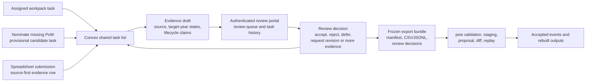

# Convex Task-Map Backend Specification

Public direction: `ROADMAP.md`. Detailed active planning and governance records are maintained in the private research tier.

Portal hub: `docs/portal-data-entry-plan.md`.

Related designs:

- `docs/development/content-addressed-review.md`
- `docs/portal-database-storage-plan.md`
- `docs/portal-submission-review-plan.md`
- `docs/portal-auth-security-plan.md`
- `docs/community-ingestion-api-plan.md`
- `docs/master-verification-workflow-plan.md`

## Purpose

The Convex task-map backend is the live coordination backend for the New Zealand
places of worship task map and reviewer workbench.

It exists to remove the current clunky pilot workflow:

```text
Browser-local task badge
  + copied TSV row
  + shared Google Sheet
  + session JSON export
  + manual project review
```

and replace it with:

```text
RA opens task
  -> Convex records shared task status
  -> RA saves evidence draft
  -> RA marks task complete, skipped, or needs review
  -> authenticated reviewer sees evidence and task history
  -> reviewer decision updates the shared task
  -> reviewer downloads reviewed decisions for pow
  -> pow validates, diffs, and feeds reviewed rebuilds
```

The target dataflow for the review-layer prototype is:



Convex should solve coordination, shared task status, draft evidence capture,
reviewer queues, and export readiness. It should not become the master
database.

The project can use Convex more heavily for the live workbench, including the
Professional plan if reliability or operational support justifies it. That
does not change the governed boundary: accepted research data must remain
exportable, hashable, and replayable outside Convex.

## Boundaries

Convex owns:

- shared task status for the task map,
- assignments and claims,
- RA evidence drafts,
- task-event logs,
- skip and reopen reasons,
- reviewer comments,
- review decisions,
- RA-visible decision summaries and next actions,
- reviewer download records,
- lightweight user profile and role metadata.

Convex does not own:

- canonical `site_id` assignment,
- accepted master records,
- master rebuilds,
- public map publication,
- long-term raw media storage,
- high-volume geospatial analysis,
- research-facing R outputs,
- provider-neutral archival exports.

The master remains event-rebuilt. Accepted Convex review decisions should be
exported into the `pow` pipeline and become accepted only after validation,
diff, replay, and project sign-off.

## Design Principles

1. Treat task state as provisional.
2. Treat incoming data as untrusted until reviewed.
3. Preserve evidence as source-backed claims, not silent edits.
4. Preserve every meaningful state change as an event.
5. Keep public map products downstream of reviewed exports.
6. Make all Convex data exportable without needing live Convex access.
7. Keep the user interface map-first and low-friction.
8. Keep the first implementation narrow enough to replace the current Sheet and
   session JSON clunkiness for one RA.
9. Keep cost exposure narrow: task status and draft evidence belong in Convex;
   raw OSM snapshots, media, and accepted master data do not.
10. Treat assignment batches as filtered views of one shared task list, not as
    separate working databases.

## Pricing And Capacity Assumption

Checked against `https://www.convex.dev/pricing` and
`https://docs.convex.dev/production/state/limits` on 2026-05-13. Recheck before
paid signup or a larger country rollout.

Start the New Zealand pilot on Free. Move to Starter only if a real quota is
approaching or trips. Move to Professional when the project needs daily managed
backups, log streaming, exception reporting, email support, compliance reports,
or consistently high usage that makes Starter overage less attractive.

Current limits and prices make the first New Zealand pilot small relative to
Free-plan capacity:

| Resource | Free/Starter included | NZ pilot estimate | Planning note |
| --- | ---: | ---: | --- |
| Database storage | 0.5 GB | roughly 10-20 MB | 3,618 tasks plus indexes and an event/draft log should stay well inside Free. |
| Function calls | 1,000,000/month | roughly 100K-600K/month | Depends on RA count and whether the frontend uses periodic refreshes or reactive subscriptions. Watch this first. |
| Database I/O | 1 GB/month | under 200 MB/month | Should be modest if task lists are filtered and exports are batched. |
| File storage | 1 GB | 0 GB planned | The first spike should not use Convex file storage. |
| Developers | 1-6 | 1-2 | This counts Convex dashboard/CLI developers, not invited RAs using Google sign-in. |

A four-country pilot should still be plausible on Free or Starter if Convex
stores only task state and evidence drafts. A global master-scale load does not
belong in Convex. The project may eventually track around two million global
places of worship, but those records should remain in the master/rebuild and
research-output path, not in the live task layer.

This reinforces the scope boundary: Convex is appropriate for shared task
coordination, evidence drafts, comments, review status, and reviewer downloads.
Large OSM history files, source snapshots, media, accepted diffs, and public
map products should remain outside Convex unless a later pricing and
governance review explicitly changes that boundary.

## Features Used And Avoided

Use Convex for:

- schemas,
- mutations,
- queries and later reactive task queries,
- Google OpenID Connect authentication,
- scheduled or reviewer-triggered export functions if needed,
- append-only task events,
- evidence draft and review-decision state,
- provisional candidate tasks for user-nominated places of worship.

Avoid Convex for the first spike:

- public media/file storage,
- large OSM source snapshots,
- accepted master data,
- full-text or vector search,
- long-running geospatial processing,
- direct writes to public map products,
- HTTP actions that bypass `pow` for accepted data changes.

## Users And Roles

Roles are project roles, not merely authentication identities.

- `ra`: can claim tasks, save evidence drafts, skip tasks, and mark tasks ready
  for review.
- `reviewer`: can inspect evidence drafts, comment, request changes, reject, or
  accept a task for download into `pow`.
- `curator`: technical role name for the person who creates reviewer downloads,
  freezes review decisions for export, and marks exported batches as handed to
  `pow`.
- `admin`: can manage users, role grants, country/batch configuration, and
  launch gates.
- `service`: can run imports, task generation, scheduled checks, and exports
  with scoped credentials.

Authentication uses Google sign-in for the New Zealand pilot through Convex's
OpenID Connect auth configuration. Convex functions must enforce project roles
server-side; the client should never decide permissions by itself.

## Core Status Model

Task statuses:

- `open`: available for work.
- `in_progress`: claimed or opened by an RA.
- `draft_saved`: at least one evidence draft exists.
- `skipped`: RA skipped the task with an optional reason.
- `provisionally_closed`: RA believes the task has been handled.
- `needs_review`: ready for reviewer attention or flagged by validation.
- `unresolved_note`: useful but incomplete evidence has been submitted for
  reviewer triage, modelled on map-note workflows.
- `changes_requested`: reviewer asks for more evidence or a correction.
- `reviewed`: reviewer has made a decision.
- `exported`: the reviewed decision was included in an export batch.
- `reopened`: a reviewer returned the task to active work.

In the RA assignment view, `open`, `in_progress`, `draft_saved`,
`changes_requested`, and `reopened` are active work. `needs_review`,
`unresolved_note`, `skipped`, `reviewed`, and `exported` stay visible in
`My work` so RAs can see what they have already handled without repeating it.

Review decision statuses:

- `accepted_for_export`: reviewer accepts the evidence for export to `pow`.
- `rejected`: reviewer rejects the claim or task outcome.
- `needs_more_evidence`: reviewer cannot decide from the evidence supplied.
- `duplicate_task`: task duplicates another task and should be linked or
  closed.
- `deferred`: useful evidence, but outside the current review round.

No status in Convex means "accepted into the master".
Every review decision should carry a short decision note so later exports can
explain why the case was accepted, rejected, deferred, or returned for more
evidence.

## Core Data Model

The first Convex schema should be explicit and narrow. Convex schemas provide
runtime validation and TypeScript types, so the pilot should use a schema once
the initial table shapes below are accepted.

### `users`

Project-local user records.

Fields:

- `auth_subject`: stable provider subject or token identifier.
- `email`: nullable, private.
- `display_name`: nullable.
- `initials`: short display value stamped on evidence.
- `roles`: array of role strings.
- `status`: `active`, `disabled`, or `pending`.
- `created_at`, `updated_at`.

Indexes:

- `by_auth_subject`
- `by_email`
- `by_status`

### `task_batches`

Generated or imported task sets.

Fields:

- `batch_id`: stable human-readable id.
- `country_code`: e.g. `NZ`.
- `source_kind`: `static_map_import`, `osm_refresh`, `ra_nomination`,
  `manual_curator`, or `system_check`.
- `source_manifest_id`: optional link to static data or input manifest.
- `target_years`: country-specific array, e.g. `[2013, 2018, 2023]` for New
  Zealand or `[1989, 1999, 2009, 2020]` for Vanuatu.
- `status`: `draft`, `active`, `frozen`, `exported`, or `archived`.
- `created_by`, `created_at`, `updated_at`.
- `notes`.

Indexes:

- `by_country_status`
- `by_batch_id`

### `country_configs`

One row per country pilot. This should become the source of truth for
country-specific task-map settings instead of hard-coding them in each
frontend, sheet, and import script.

Fields:

- `country_code`: e.g. `NZ` or `VU`.
- `country_name`.
- `target_years`: ordered numeric array, e.g. `[2013, 2018, 2023]` for New
  Zealand or `[1989, 1999, 2009, 2020]` for Vanuatu.
- `target_year_reference_dates`: optional map from year to reference date when
  the country needs a census-date anchor.
- `lifecycle_date_min_year`: e.g. `1600` for Vanuatu.
- `map_centre`, `map_zoom`, and optional bounds.
- `source_type_options`: source vocabulary values enabled for that country.
- `nomination_type_options`: country-specific candidate task types.
- `status`: `draft`, `active`, or `archived`.

First implementation rule:
seed `NZ` and `VU` before Vanuatu frontend work proceeds. `tasks`,
`task_batches`, manual candidate tasks, frontend target-year controls, and
exports should read country target years from this table once it exists.

### `tasks`

One row per work item shown on the task map.

Fields:

- `task_id`: stable id used by the frontend and exports.
- `batch_id`: id reference to `task_batches`.
- `country_code`.
- `task_type`: `verify_existing_site`, `missing_from_project_map`,
  `possible_duplicate`, `target_year_status`, `lifecycle_date_needed`,
  `denomination_or_shared_use`, `geometry_check`, `osm_identity_link`, or
  `other`.
- `priority`: `high`, `medium`, `low`.
- `status`: one task status from the model above.
- `assigned_to`: optional user id.
- `claimed_by`: optional user id.
- `claimed_at`: optional timestamp.
- `selected_target_year`: optional year.
- `target_years`: array.
- `matched_current_site_id`: optional project site id.
- `candidate_site_id`: optional provisional candidate id.
- `source_record_id`: static task id or source record id.
- `matched_osm_id`: optional OSM id.
- `osm_object_type`: optional `node`, `way`, or `relation`.
- `name`, `address`, `locality`.
- `geometry`: GeoJSON point or bounding geometry for display.
- `nearby_site_refs`: optional compact references for duplicate checks.
- `automated_checks`: array of check summaries.
- `task_brief`: concise RA-facing task text.
- `created_at`, `updated_at`.
- `last_event_at`.

Indexes:

- `by_status_priority`
- `by_country_status`
- `by_assignee_status`
- `by_batch_status`
- `by_source_record_id`
- `by_matched_site`
- `by_candidate_site`
- `by_osm`

### Reusable candidate intake

The next build step is a reusable `Nominate missing PoW` flow on top of the
existing task and evidence-draft model. It should work for the New Zealand
assignment page first, then be reused for Vanuatu and later public-country
maps.

Use this wording consistently in the interface and documentation. Do not label
the action `Add to map`: the user is proposing a candidate for review, not
changing the master or the public map.

The flow should:

1. appear as a clear `Nominate missing PoW` control near the task list and map,
2. let the user place the candidate by clicking the map, entering coordinates,
   or entering an address/locality,
3. ask for candidate type, name, source title, source URL or file reference,
   evidence note, and target-year status where known,
4. show nearby existing sites before submission so the user can flag a possible
   match, duplicate, shared building, successor site, or unrelated candidate,
5. call `tasks:createManualCandidateTask` to create a provisional
   `candidate_site_id` and ordinary review task,
6. reopen the standard evidence form for that new task, so save/submit,
   validation, review, and export use the same path as seeded tasks, and
7. keep all country-specific target years, date bounds, map defaults, and
   nomination options in `country_configs` rather than hard-coding New Zealand
   assumptions into the component.

This flow creates reviewable task state only. It does not mint a durable master
`site_id`, change the public map, or accept the candidate into the master. A
reviewer must still reject it, link it to an existing site, request more
evidence, or accept it for export to `pow`.

### `task_events`

Append-only task history. Every meaningful change should create an event.

Fields:

- `event_id`: stable id.
- `task_id`.
- `event_type`: `opened`, `claimed`, `unclaimed`, `draft_saved`,
  `row_copied`, `skipped`, `submitted_for_review`,
  `submitted_unresolved_note`, `review_started`, `review_decided`,
  `changes_requested`, `reopened`, `exported`, or `note_added`.
- `actor_user_id`.
- `actor_role`.
- `occurred_at`.
- `previous_status`: optional.
- `new_status`: optional.
- `reason`: optional.
- `evidence_draft_id`: optional.
- `review_decision_id`: optional.
- `export_batch_id`: optional.
- `client_context`: optional object containing browser/session metadata without
  private telemetry.

Indexes:

- `by_task_time`
- `by_actor_time`
- `by_event_type_time`

### `evidence_drafts`

Structured evidence entered from the map. This replaces the copied TSV row and
session JSON as the day-to-day RA record.

Fields:

- `evidence_draft_id`.
- `task_id`.
- `draft_status`: `draft`, `submitted`, `unresolved_note`, `superseded`,
  `withdrawn`, `accepted_for_export`, or `rejected`.
- `created_by`, `created_at`, `updated_at`.
- `source_type`.
- `provider`.
- `source_title`.
- `source_url_or_file`.
- `source_date_or_capture_date`: optional partial date string.
- `source_notes`.
- `action`: map action value.
- `target_year_statuses`: object keyed by the task batch's target years.
- `target_year_evidence`: object keyed by the task batch's target years.
- `existence_status`.
- `worship_use_status`.
- `assessment_confidence`.
- `match_confidence`.
- `geocoding_confidence`.
- `denomination_or_tradition_raw`: exact source, sign, or community wording preserved as evidence.
- `denomination_label_basis`: `named_documentary_source`, `displayed_sign_or_notice`, `current_self_description`, `local_investigator_account`, or `unknown`. A self-description must come from a named public source or display unless a separately approved oral-evidence protocol applies.
- `denomination_relation`: `label_only`, `record_correction`, `historical_change`, `shared_or_concurrent_use`, or `uncertain`; non-label-only values are follow-up signals rather than complete accepted event objects.
- `observation_contract_version`: identifies the prompt contract; `guided_observation_v1` distinguishes new direct observations from unversioned legacy evidence notes.
- `evidence_note`: direct observation only when `observation_contract_version = guided_observation_v1`; older unversioned values remain generic evidence notes.
- `interpretation_note`: optional claim the observation might support.
- `uncertainty_note`: optional limit or follow-up need.
- `lifecycle_event`: optional.
- `lifecycle_date`: optional partial date string. Country protocols may allow
  early historical dates; the Vanuatu protocol accepts valid dates from 1600
  onward.
- `lifecycle_date_precision`: optional.
- `lifecycle_note`: optional.
- `related_ids_or_note`.
- `generated_wide_row`: optional TSV or object form matching
  `site_evidence_wide`.
- `privacy_flag`: `clear`, `needs_review`, or `restricted`.
- `licence_flag`: `clear`, `needs_review`, or `restricted`.
- `validation_summary`: optional latest validation result.

Submitted evidence and unresolved notes are read-only for RAs. If an RA needs to correct or extend either, the UI starts a revision with a new `evidence_draft_id`. The earlier submitted draft remains part of the audit trail and is marked `superseded` only after the revision is submitted.

An accepted draft with no assessed project target year remains in `evidence_drafts.jsonl` and the review trail. The exporter omits it from `site_evidence_wide.csv`, because a `pow` event-candidate row requires at least one assessed target year. A present-day field observation whose capture year is not a project target year and a raw-label denomination record both default every target year to `not_assessed`; either can enter the wide handoff only when separate evidence supports a target-year state. A provisional denomination relation must not change `site_type`.

Indexes:

- `by_task_status`
- `by_creator_time`
- `by_source_url`

### `review_decisions`

Reviewer outcome for a submitted evidence draft or task.

Fields:

- `review_decision_id`.
- `task_id`.
- `evidence_draft_id`: optional.
- `reviewer_user_id`.
- `decision_status`.
- `decision_note`.
- `accepted_action`: optional.
- `identity_decision`: optional, e.g. `same_site`, `new_candidate`,
  `duplicate`, `split`, `merge`, `relocation`, or `uncertain`.
- `target_year_affects`: array of target-year affect objects.
- `required_follow_up`: optional.
- `created_at`, `updated_at`.

Indexes:

- `by_task`
- `by_reviewer_time`
- `by_decision_status`

### `export_batches`

Reviewer-controlled downloads from Convex to the governed pipeline.

Fields:

- `export_batch_id`.
- `country_code`.
- `status`: `draft`, `frozen`, `exported`, `validated`, `failed`, or
  `archived`.
- `created_by`, `created_at`, `frozen_at`, `exported_at`.
- `included_task_ids`.
- `included_review_decision_ids`.
- `schema_version`.
- `export_format`: `site_evidence_wide_csv`, `change_events_jsonl`,
  `review_decisions_jsonl`, or `bundle` (the code value for all export files
  together).
- `output_manifest`: optional object with filenames, hashes, and counts.
- `pow_validation_status`: optional `not_run`, `passed`, `failed`.
- `notes`.

Indexes:

- `by_country_status`
- `by_created_time`

## Function Surface

Use Convex queries for live reads, mutations for state changes, and actions for
external side effects such as exports or calls to validation services.

### Queries

- `listTasks(filters)`: task list for the map sidebar.
- `getTask(taskId)`: task details, current status, and latest evidence summary.
- `getTaskEvents(taskId)`: append-only task history for reviewer context.
- `listMyTasks(statuses)`: RA history and active-work summary, with latest
  draft and review information.
- `listReviewQueue(filters)`: reviewer work queue.
- `getEvidenceDraft(draftId)`: one evidence draft.
- `listExportBatches(filters)`: reviewer download history.

### Mutations

- `claimTask(taskId)`.
- `releaseTask(taskId)`.
- `saveEvidenceDraft(taskId, draft)`.
- `submitEvidenceDraft(draftId)`.
- `skipTask(taskId, reason)`.
- `markProvisionallyClosed(taskId, evidenceDraftId)`.
- `addTaskNote(taskId, note)`.
- `requestChanges(taskId, evidenceDraftId, note)`.
- `recordReviewDecision(taskId, evidenceDraftId, decision)`.
- `reopenTask(taskId, reason)`.
- `createManualTask(taskInput)`.
- `createExportBatch(filtersOrIds)`.
- `freezeExportBatch(exportBatchId)`.

Every mutation must:

1. verify user identity,
2. check role permission,
3. validate input shape and controlled vocabulary,
4. update the current document,
5. append a `task_events` row.

### Actions And Scheduled Work

- `generateTasksFromStaticMap(manifest)`: import tasks from current static
  verification data.
- `exportBatch(exportBatchId)`: produce a CSV/JSONL file set for `pow`.
- `runValidationExport(exportBatchId)`: optional call to a Rust validation
  service when available.
- `weeklyCuratorExport()`: technical function name for a scheduled draft export
  of reviewed tasks, requiring reviewer confirmation before handoff to `pow`.

Scheduled functions may prepare export drafts, but should not silently mark data
as accepted into the master.

## Frontend Behaviour

The task map should subscribe to task queries so multiple users see task state
changes without manual refresh.

Minimum RA behaviours:

1. open map,
2. sign in,
3. see task status and assignment badges,
4. claim or open a task,
5. enter evidence,
6. save draft,
7. submit for review, skip, or provisionally close,
8. move to next task.

Minimum reviewer behaviours:

1. view review queue,
2. inspect task, evidence draft, source links, target-year states,
   opening/closure/change-date claims, nearby duplicates, and OSM candidate
   links,
3. record decision,
4. request changes or reopen task,
5. include accepted decisions in a reviewer download for `pow`.

## Authenticated Review Portal

The reviewer surface should be an authenticated UI, not a spreadsheet editing
step. It may start as a small route or panel attached to the task map, but every
review action must run through Convex role checks.

The review portal should let a reviewer:

1. filter submitted tasks by country, batch, status, source type, and assigned
   RA,
2. inspect the task history, source links, evidence draft, target-year states,
   lifecycle-date claims, nearby project/OSM candidates, and validation
   warnings,
3. record one decision: accept for export, reject, request more evidence,
   request revision, mark duplicate/link to existing site, or defer,
4. write a short rationale that is visible in the task history,
5. update the RA-facing task or worksheet state immediately, so the RA can see
   whether the task was accepted, rejected, reopened, or needs more evidence,
6. freeze accepted decisions into an export batch only after the task state and
   decision log agree.

For the prototype, `nz-temporal-ra-workpack-001` is just a batch filter over
the shared task list. Later NZ batches, Vanuatu tasks, missing-site
nominations, and reviewer-created follow-up tasks should enter the same task
store. This keeps assignment work, reviewer decisions, and future multi-RA
coordination on one history rather than creating separate workbooks that must
be reconciled by hand.

The frontend should keep the current spreadsheet row preview during the
transition, but it should become a secondary export/debug view once Convex is
trusted.

## Export Contract To `pow`

Convex exports are the boundary between live task coordination and governed
data modification.

The first export file set should include:

- `export_manifest.json`,
- `tasks.jsonl`,
- `task_events.jsonl`,
- `evidence_drafts.jsonl`,
- `review_decisions.jsonl`,
- `site_evidence_wide.csv` where possible.

The manifest should include:

- `export_batch_id`,
- `country_code`,
- `created_at`,
- `created_by`,
- `convex_deployment`,
- `schema_version`,
- `included_task_count`,
- `included_evidence_count`,
- `included_review_decision_count`,
- output filenames,
- SHA-256 hashes,
- export function version,
- target `pow` command expectations.

For the first version, `site_evidence_wide.csv` is the lowest-risk export
because the existing RA template and `pow validate` path already understand
that shape. Later exports may emit change-event JSONL directly after the
mapping is proven.

Schema-version rule:
`site_evidence_wide` is the first wire schema. A major schema mismatch should
stop export validation. A minor version mismatch may warn if fields are
backward-compatible. Reordering, renaming, or removing `WIDE_EVIDENCE_FIELDS`
columns is a major change.

OSM-as-evidence rule:
An evidence draft whose only source is OSM may be exported for OSM identity-link
or OSM-date-tag review, or as `uncertain` target-year evidence. Exporting
`present` or `absent` target-year conclusions should normally require a
non-OSM source, such as a denominational directory, official register, dated
street imagery, field observation, archive, council/heritage record, or other
source approved by a reviewer.

## Security And Privacy

Minimum controls before real RA use:

- invite-only authentication,
- server-side role checks in every mutation and action,
- no public anonymous writes,
- a documented backend kill switch,
- no private contact details or restricted source material in normal evidence
  fields,
- request size limits for evidence text,
- strict source URL/file-reference validation,
- audit events for all task state changes,
- export batches frozen before handoff,
- no direct master writes,
- public map products consume reviewed exports only.

Do not use Convex file storage for field-observation media. Images are internal evidence by design and belong in restricted project-controlled object storage under `docs/field-observation-packet-spec.md`; Convex may hold only opaque references, guided text, workflow state, and review events.

Rate limiting:
For the first invite-only pilot, rely on authentication, role checks, short
text fields, and small trusted-user numbers rather than building a custom
per-user limiter immediately. Revisit this before public signup, external
community contribution, bulk upload, or any anonymous endpoint.

Kill switch:

1. Set `window.POW_CONVEX_CONFIG.enabled = false` in the deployed
   `apps/regions/nz/js/convex-config.js`.
2. Redeploy the static site. The map then returns to local fallback and
   spreadsheet export behaviour.
3. Record the incident and recovery decision in `JOURNAL.md`, and preserve any
   Convex export or dashboard evidence needed for audit.

## Migration From Current Pilot

Phase 0: Current demo

- Browser `localStorage` tracks copied/skipped tasks.
- Shared Google Sheet stores evidence rows.
- Session JSON is a backup/debug log.

Phase 1: Convex task state

- Import static verification tasks into Convex.
- Import the curated 50-case New Zealand temporal workpack as the first
  assigned web batch (`nz-temporal-ra-workpack-001`).
- Replace browser-local copied/skipped state with Convex task events.
- Keep the Sheet export path as a fallback.

Phase 2: Evidence drafts

- Save map evidence drafts directly in Convex.
- Keep generated TSV preview for reviewer/export debugging.
- Submit evidence drafts to reviewer queue.
- Add the reusable `Nominate missing PoW` flow: create a provisional candidate
  task in Convex, then reuse the standard evidence form for save/submit.
- During this phase, decide explicitly which surface is authoritative for each
  batch. Do not ask an RA to maintain the same evidence in both Convex and a
  Sheet except during a named test.

Phase 3: Review and export

- Reviewers make decisions in the task workbench.
- A person with export permission freezes the reviewed file set.
- Convex returns a file bundle with tasks, task events, evidence drafts, review
  decisions, and `site_evidence_wide.csv`.
- A local materialiser writes the bundle to ignored export files, adds
  SHA-256 hashes, and produces a manifest for `pow`.
- The exported file set is validated by `pow`.
- Convex becomes the default RA working surface only after this export path has
  produced a file set that `pow validate` accepts.

Phase 4: Remove Sheet as default

- Sheet becomes an optional export/checking format, not Andre's primary working
  surface.

## Initial Scaffold

The first implementation scaffold lives in `convex/`:

- `schema.ts`: users, task batches, tasks, task events, evidence drafts, review
  decisions, and export batches.
- `users.ts`: first-admin bootstrap, invite creation, invite claiming, and
  user lookup.
- `tasks.ts`: static task import, task claiming, skipping, provisional closure,
  reopening, notes, and manual candidate task creation for places not on OSM or
  not on the project map.
- `evidence.ts`: evidence draft save and submit mutations.
- `reviews.ts`: reviewer queue and review-decision mutations.
- `exports.ts`: reviewer export batch creation, freezing, and file-set retrieval.

Two seed bridges now feed `tasks:upsertTasksFromStaticMap`:

- `scripts/build_convex_task_seed.py` converts the current static NZ
  verification GeoJSON into a broad task batch.
- `scripts/build_convex_workpack_seed.py` converts the curated 50-case
  New Zealand temporal workpack into the assigned web batch
  `nz-temporal-ra-workpack-001`.

Setup details live in `docs/development/convex-task-layer-setup.md`.

The static NZ verification map now has a guarded Convex client bridge for
Google sign-in, task-state refresh, evidence draft save, submit-for-review, and
backend skip actions. A `batch=` query parameter switches the page into assigned
workpack mode, where tasks are loaded from Convex and spreadsheet copy/paste is
disabled for the RA. The bridge is disabled by default until the hosted
deployment URL and Google client id are configured. The scaffold still has no
master-write path.

The first export bundle path is now available through
`exports:getExportBundle`. It returns raw task/review documents plus a file
block for `export_manifest.json`, JSONL artefacts, and
`site_evidence_wide.csv`. The local materialiser
`scripts/materialise_convex_export.py` writes those files and hash manifests so
the curator can run the first Convex-to-`pow` round trip without treating
Convex as the master.

## Definition Of Done For The First Spike

The first Convex spike is complete when:

1. an invited RA can sign in,
2. tasks load from Convex on the NZ map,
3. task status updates live across two browser sessions,
4. an RA can claim, skip, save draft evidence, and submit for review,
5. a reviewer can see submitted evidence and record a decision,
6. a person with export permission can export reviewed decisions and evidence
   drafts,
7. the export contains a manifest and a `site_evidence_wide.csv`,
8. `pow validate` can run on the exported CSV,
9. no Convex mutation can write to the master or public map data,
10. docs explain how to recover if Convex is unavailable.

The next small spike after the 50-case assignment is the reusable missing-site
nomination flow. It should be implemented as a shared component because the
same candidate intake pattern is needed for Vanuatu, later country task maps,
and the larger public site.

Before expanding the Vanuatu interface, run one accepted NZ review decision
through the export bundle, materialiser, `pow validate`, `pow stage`,
`pow propose --persist`, and `pow diff`. This confirms that Convex can be the
live workbench while the master remains governed by exported events and replay.

## Open Questions

- Should the first export be only `site_evidence_wide.csv`, or should it also
  emit draft change-event JSONL?
- Should task assignment be explicit (`claimTask`) or implicit when an RA opens
  a task?
- Should reviewers need a side-by-side view of superseded evidence drafts, or
  is latest-submitted-plus-history enough for the pilot?
- How much duplicate/nearby-site context should be precomputed into tasks
  versus queried from a separate spatial service?
- Should reviewer export be weekly by schedule, manual only, or scheduled draft
  plus manual freeze?
- What is the rollback procedure if a reviewed Convex export is later found to
  contain sensitive or incorrect evidence?
- Which three open questions block the next spike, and who owns each answer?

## Convex Reference Points

These official Convex docs are the implementation references for this spec:

- Schemas: <https://docs.convex.dev/database/schemas>
- Realtime: <https://docs.convex.dev/realtime>
- Authentication: <https://docs.convex.dev/auth>
- Actions: <https://docs.convex.dev/functions/actions>
- Scheduled functions: <https://docs.convex.dev/scheduling/scheduled-functions>
