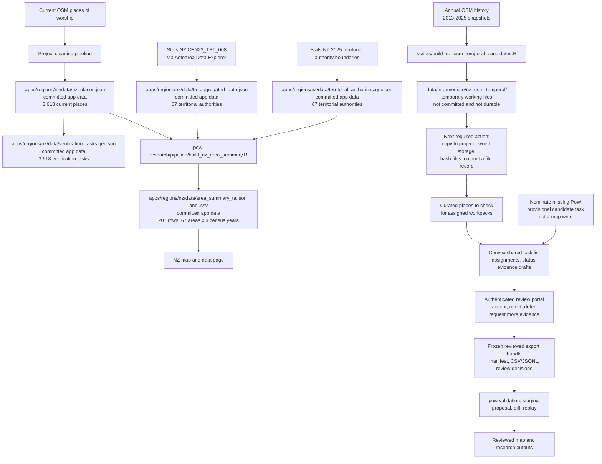
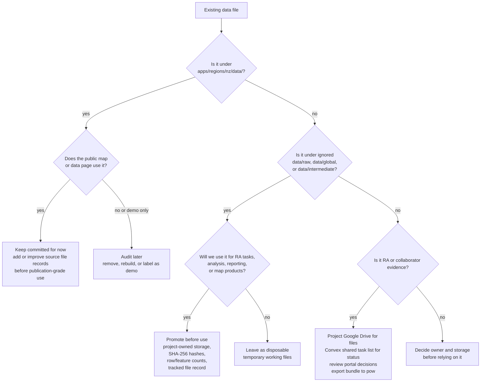
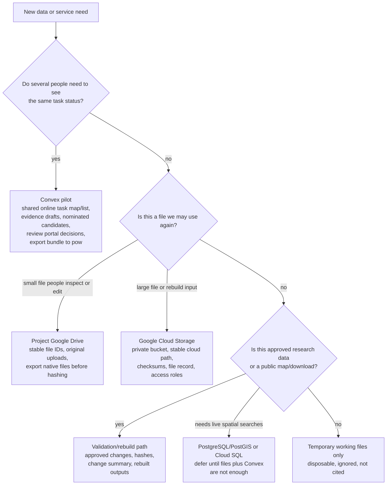

# Data Storage Pipeline

This document defines how generated and contributed data should be stored so
the project can recover from laptop loss, audit sources, and rebuild outputs.

## Core Rule

No important dataset may exist only in a local ignored folder.

Repo-relative paths such as `data/raw/`, `data/intermediate/`,
`data/derived/`, and `exports/` are temporary working files. They are useful
because they keep large, licensed, private, or noisy files out of Git. They are
not durable storage and are not the location of record.

Every dataset that may be used for analysis, review, publication, or future
task generation needs:

1. a temporary working copy for processing only;
2. a durable project-controlled copy outside any personal laptop;
3. a tracked manifest in Git that identifies the durable copy and records
   provenance, checksums, row counts, licence/privacy status, and rebuild
   instructions.

Git stores code, schemas, documentation, and manifests. It should not store
large raw extracts, private source files, or generated intermediate products.

## Current Data Flow And Locations

The project currently has two different kinds of data locations:

- committed public app data, which is in Git and is served by the map; and
- temporary working files under ignored folders such as `data/raw/` and
  `data/intermediate/`, which are useful for processing but are not a project
  storage location.

This is the current New Zealand flow:

The proposed [content-addressed review contract](development/content-addressed-review.md) defines the byte-level meaning of a frozen reviewed export. The current Convex prototype remains an earlier implementation stage.

### Current Data Inventory

| Data source                                                                             | Script or path that created it                                                                                                               | Where it is now                                                                                                                                         | Current status                                                                                                                                                                                                                                                                                                     | Next action                                                                                                                                                                   |
| --------------------------------------------------------------------------------------- | -------------------------------------------------------------------------------------------------------------------------------------------- | ------------------------------------------------------------------------------------------------------------------------------------------------------- | ------------------------------------------------------------------------------------------------------------------------------------------------------------------------------------------------------------------------------------------------------------------------------------------------------------------ | ----------------------------------------------------------------------------------------------------------------------------------------------------------------------------- |
| Current New Zealand OSM places of worship                                               | Project OSM cleaning pipeline; see also `scripts/clean_nz_places.py` and `scripts/build_nz_verification_tasks.py`                            | `apps/regions/nz/data/nz_places.json` and `apps/regions/nz/data/verification_tasks.geojson`                                                             | Committed app data used by the current NZ map and verification map. The served files contain 3,618 current places/tasks; `manifest:nz-places-osm:nz:current` records the current file and the unrecoverable raw-extract gaps.                                                                                                                                                      | Keep serving this as the current map baseline, but make the raw and intermediate source lineage recoverable if earlier source records become available.                       |
| Global OSM country extracts and cleaned country files                                   | `scripts/extract_global_data.R`, `scripts/normalize_global_places.R`, `scripts/clean_global_places.R`, `scripts/deduplicate_global_places.R` | Ignored working files under `data/raw/`, `data/global/`, and `data/intermediate/global/`                                                                | Not committed and not durable. These files may exist in a working checkout, but they are not the project record.                                                                                                                                                                                                   | Do not cite or give these files to collaborators until the relevant partitions are copied to project-owned storage and described by file records.                             |
| New Zealand annual OSM history, 2013-2025                                               | `scripts/build_nz_osm_temporal_candidates.R`                                                                                                 | temporary working files under `data/intermediate/nz_osm_temporal/`; durable archives in project Google Drive; tracked manifests under `docs/manifests/` | Raw OSM/ohsome snapshots are stored separately from the generated places-to-check archive. The first strict national run produced 4,777 year-difference rows and cleaned snapshot counts of 775 for 2013, 2,012 for 2018, 3,335 for 2023, and 3,350 for 2025. A later cached run produced 1,438 OSM date-tag rows. | Cite the raw-source manifest when rebuilding from OSM snapshots, and cite the places-to-check manifest before importing selected rows into Convex or assigning them to an RA. |
| Stats NZ religious-affiliation counts by territorial authority for 2013, 2018, and 2023 | `~/GIT/pow-research/pipeline/build_ta_aggregated_from_cen23_tbt.R`                                                                            | `apps/regions/nz/data/ta_aggregated_data.json`; archived official extract at `archive/statsnz-cen23-tbt-ta-religion/`; superseded Figure.NZ fallback at `archive/stats_nz_religious_affiliation_by_ta.csv` | Committed app data used by `area_summary_ta.json`. The builder reads the official Stats NZ CEN23_TBT_008 v1.0 extract retrieved through Aotearoa Data Explorer on 2026-07-18, verifies its 69-area by 13-variable by three-year cube, and emits the 67 shipped territorial authorities under CC BY 4.0. The PI ruling dated 2026-07-18 superseded the Figure.NZ bridge and fallback CSV. | Refresh through Aotearoa Data Explorer, archive and hash the selected extract, then rebuild with the private pipeline script and update the TA product manifest.                |
| Stats NZ 2025 territorial authority boundaries                                          | Boundary metadata under `archive/statsnz-territorial-authority-2025-SHP/`; processed app output under `apps/regions/nz/data/`                | `apps/regions/nz/data/territorial_authorities.geojson`                                                                                                  | Committed app data used for area assignment and land-area density calculations. `manifest:nz-census-religion:nz:2013-2023:ta` records the file hash, 67-feature count, join-key digest, official layer, and licence; the original download and transformation chain remain unverified.                                                                                                | Preserve any recovered source archive or transformation record and update the manifest warning; do not reconstruct missing provenance from file dates.                       |
| NZ territorial-authority area summary                                                   | `~/GIT/pow-research/pipeline/build_nz_area_summary.R`                                                                                         | `apps/regions/nz/data/area_summary_ta.json` and `apps/regions/nz/data/area_summary_ta.csv`                                                              | Committed app data used by the NZ data page. It combines current place counts with official Stats NZ 2013, 2018, and 2023 Census religion denominators. It does not yet contain historical place counts for those years.                                                                                              | Fix visual colour scaling where needed, then rebuild from accepted historical changes once reviewed gains and losses exist.                                                   |
| Stats NZ religious-affiliation counts by SA2 for 2013, 2018, and 2023                   | `scripts/fetch_nz_sa2_census_religion.R`                                                                                                     | Long extract and manifest under `archive/statsnz-2023-census-totals-sa2/`; generalised boundaries at `apps/regions/nz/data/sa2_2023.geojson`            | Committed source extract from the Stats NZ "2023 Census totals by topic for individuals by SA2" feature service (CC BY 4.0, retrieved 2026-06-13). Counts are rr3-rounded with -999 marking suppressed cells; 2013 and 2018 counts are Stats NZ's own concordance onto 2023 SA2 boundaries.                       | Re-run the fetch script for refreshes; the manifest records service URL, licence, and retrieval date.                                                                         |
| NZ statistical-area-2 area summary                                                      | `scripts/build_nz_area_summary_sa2.R`                                                                                                        | `apps/regions/nz/data/area_summary_sa2.json` and `apps/regions/nz/data/area_summary_sa2.csv`                                                            | Committed app data used by the NZ map's census overlay. 2,311 areas by three census years; rows with suppressed or sub-100 denominators carry quality flags. National totals agree with the TA product to within 0.006 percent per year.                                                                           | Rebuild after any place-snapshot or source refresh; keep the small-denominator floor aligned with the map's wash-out behaviour.                                               |
| Older demographic demo files (removed 2026-06-13)                                       | Older scripts such as `scripts/fetch_age_gender_nz.R`, `scripts/fetch_ethnicity_density_nz.R`, and related fetch scripts                     | Removed from the working tree; recoverable from git history before commit `2026-06-13`                                                                  | The unverifiable legacy/demo files (`*_static.json`, `religion.json`, `demographics.json`, and the 2018 `sa2.geojson`) were removed under this table's audit-or-remove action once the provenance-recorded SA2 extract superseded them.                                                                            | None; re-fetch through documented sources if any variable is needed again.                                                                                                    |
| Vanuatu province and area-council boundaries with place-of-worship density                | `scripts/build_vu_area_scaffold.R`                                                                                                          | `apps/regions/vu/data/adm1_2020.geojson`, `adm2_2020.geojson`, and `area_summary_adm1/adm2.json`; manifests at `archive/geoboundaries-vut/` and `archive/osm-vu-pow/` | Committed app data used by the Vanuatu research map. Boundaries from geoBoundaries gbOpen (ADM1 ODbL, ADM2 CC BY 3.0 IGO), pinned to release `9469f09`. Place-of-worship density (OSM `amenity=place_of_worship`, ODbL; 214 points, 2026-06-13) is computed live: geodesic land area and point-in-polygon counts per area, repeated across census years 2009 and 2020. Religion values stay null. | Drop per-area 2009/2020 religious-affiliation counts into the summary rows (no schema change); the 2020 VNSO provincial tables are PDF-only. Re-run the script to refresh the OSM density. |
| Vanuatu OSM places of worship                                                           | `scripts/build_vu_area_scaffold.R` (Overpass)                                                                                              | `archive/osm-vu-pow/pow_vu.json` and `pow_vu_manifest.json`                                                                                             | Source extract for the density metric: `amenity=place_of_worship` in Vanuatu via Overpass (ODbL). In Vanuatu this includes some nakamals (kava meeting houses) alongside churches, so the metric is "places of worship as OSM records them".                                                                       | Refresh with the build script; widen or filter the OSM query if a stricter church-only definition is wanted.                                                                  |

The immediate answer to "where did it go?" is therefore:

- the current NZ map data and first NZ Census-linked area summary went into
  committed app files under `apps/regions/nz/data/`;
- the annual OSM history run went into ignored temporary working files under
  `data/intermediate/nz_osm_temporal/`; and
- older global and raw OSM files under `data/` are also ignored working files
  unless and until a file record points to a durable project-owned copy.

### Current Action Checklist

Use this checklist for the files we already have:

## Storage Tiers

### Tier 0: Temporary Working Files

Purpose:
temporary processing, inspection, and smoke testing.

Examples:

- `data/raw/...`
- `data/intermediate/...`
- `data/derived/...`
- `exports/...`

Rules:

- Treat as disposable.
- Never cite a local-only file as the source of a map or analysis product.
- Do not ask RAs or collaborators to depend on a local path.
- Do not treat the repository checkout or any personal laptop as the durable
  location for project data.
- Promote or discard local outputs promptly after inspection.
- Record local paths only as optional `local_cache_hint` values in file
  records, never as `durable_files`. The field name is technical; it means
  "where this script happened to write temporary working files."

### Tier 1: Project Working Store

Purpose:
near-term resilience for pilot data and collaborator handoff.

Default:
project-controlled Google Drive, using stable folders and file IDs. Until a
folder is created, use this intended hierarchy in planning and manifests:

- `Places of Worship/Data/raw/<country>/<dataset>/<retrieval_date>/`
- `Places of Worship/Data/intermediate/<country>/<dataset>/<run_id>/`
- `Places of Worship/Data/review/<country>/<review_batch_id>/`
- `Places of Worship/Data/exports/<country>/<dataset_version_id>/`

Examples:

- RA working Sheets.
- exported RA session JSON.
- church-body spreadsheets or PDFs supplied for review.
- first-pass generated candidate CSV/GeoJSON files that need project review.

Rules:

- Use project-owned files or folders, not a collaborator's personal copy, when
  the file becomes project evidence.
- Preserve original uploads separately from edited derivatives.
- Record the Drive file ID or URL in a tracked manifest.
- Export native Google Sheets to a stable file format before ingestion.
- Do not rely on Drive alone for accepted or published master outputs.

### Tier 2: Durable Archive And Staging

Purpose:
longer-term storage for immutable raw snapshots, reviewed exports, media
quarantine, and rebuild inputs.

Default reference:
Google Cloud Storage for object storage; PostgreSQL/PostGIS when the project
needs live map/database searches over stored spatial data. This follows the
portal storage plan and keeps the path compatible with future Rust services.

Intended object layout, once a bucket is opened:

- `gs://<project-bucket>/raw/<country>/<dataset>/<retrieval_date>/...`
- `gs://<project-bucket>/intermediate/<country>/<dataset>/<run_id>/...`
- `gs://<project-bucket>/accepted/<country>/<dataset_version_id>/...`
- `gs://<project-bucket>/public/<country>/<dataset_version_id>/...`

The concrete bucket name must be chosen when the cloud project is configured
and then recorded in tracked manifests. Do not use a personal account bucket as
the durable project location.

Rules:

- Store immutable snapshots under dated keys.
- Never overwrite a dated object. Supersede it with a new version and manifest.
- Keep private or restricted source material out of public buckets.
- Use signed or role-restricted access for non-public artefacts.
- Accepted exports must still pass through the `pow` validation/replay path
  before changing public maps or density products.

## Storage Decision Tree

Use this decision tree before creating accounts, buckets, folders, or database
tables:

Provider actions should follow the smallest durable choice that protects the
data:

- Use Convex for live task coordination when more than one person needs shared
  task status, assignment, provisional closure, candidate nomination, evidence
  drafts, review decisions, or reviewer export bundles.
- Use project Google Drive for near-term working evidence when collaborators
  need familiar access and files are still being inspected or cleaned.
- Use Google Cloud Storage when the data are immutable, large, needed for
  rebuilds, or too important to depend on Drive alone.
- Add PostgreSQL/PostGIS only when a service needs durable geospatial queries
  that static files, manifests, and Convex exports cannot provide.
- Keep accepted events, accepted diffs, and rebuilt public products outside the
  online task map/list; they belong to the `pow` validation, review, replay,
  and file-record contracts.
- Every durable choice must name a non-local project-controlled location:
  Drive file ID/folder ID, cloud storage path, or database name.
  A personal-machine path can appear only as a disposable cache hint.

Before enabling any paid service or bucket, check pricing for the relevant
cost drivers rather than relying on a copied estimate: user seats, storage
volume, object operations, backend actions/functions run, database size,
backups, bandwidth, download/transfer costs, logging, monitoring, and support.

### Convex Pricing Snapshot

Checked against `https://www.convex.dev/pricing` on 2026-05-07. Recheck the
page before enabling a paid hosted deployment.

For the current one-RA New Zealand pilot, Convex looks suitable as a low-cost
coordination service if it stores task status, draft evidence, comments, and
reviewer downloads only. The pricing page currently lists:

- Free and Starter for personal projects and prototypes, with 1-6 developers.
  The listed included resources include 1 million function calls per month, 0.5
  GB database storage, 1 GB file storage, 20 GB-hours action compute, 1 GB
  database I/O, and 1 GB data egress. Pay-as-you-go unit prices are listed for
  Starter usage beyond included resources.
- Professional at $25 per developer per month, with 1-20 developers. This adds
  production features we may care about later: log streaming, exception
  reporting, daily backups, custom domains, email support, and higher included
  resource amounts.
- Business and Enterprise at a $2,500 monthly minimum, which is outside the
  pilot unless institutional requirements later demand enterprise controls.

Operational implication:
start the hosted pilot on Free/Starter if the account and collaborator model
fits. Move to Professional only when daily backups, log streaming, exception
reporting, support, or usage limits make that worthwhile. Do not use Convex as
the durable store for raw OSM snapshots, annual history outputs, media, or
accepted master data; those still need project-owned storage, file records, and
the `pow` review/rebuild path.

## Minimum Manifest

Each durable dataset needs a small tracked manifest. The manifest should live in
Git under a documentation or manifest folder, while the data files live in the
working store or durable archive.

Required fields:

- `manifest_id`: stable identifier for this manifest.
- `dataset_id`: stable identifier for the dataset or run.
- `dataset_role`: code label for the file's stage. Current validator values
  are `raw_source`, `intermediate_lead` (a generated list of places to check,
  not accepted evidence), `staged_evidence`, `accepted_export`, or
  `public_product`.
- `country_code`: ISO country code where applicable.
- `created_at`: UTC timestamp.
- `created_by`: person, script, or service.
- `pipeline_commit`: Git commit used to generate the file, when applicable.
- `source`: provider, source URL, retrieval date, licence, and citation.
- `durable_files`: cloud storage path or Drive file ID, format, byte size, SHA-256,
  row count or feature count, and privacy/licence status.
- `local_cache_hint`: optional repo-relative path to temporary working files for
  regeneration or inspection. This is only a hint, not a storage location or
  recovery record.
- `validation`: command run, result, warnings, and whether the file is accepted
  for downstream use.
- `downstream_status`: whether the data is a generated list of places to check,
  staged, accepted, exported, or superseded.

The tracked manifest is the recovery handle. If the laptop dies, a maintainer
should be able to use the manifest to find the durable files, verify their
checksums, and rerun the relevant pipeline.

## Versioning And Hashing

Hashing is part of the storage contract, not a later verification step. The
global pipeline will eventually contain millions of sites and many country,
year, and processing-stage partitions, so version identifiers must be stable,
machine-readable, and cheap to compare.

### Identifier Levels

Use three related identifiers:

- `dataset_id`: stable logical dataset name, such as
  `osm-pow:nz:2025-09-01:cleaned` or `osm-pow:global:2025-09-01:raw`.
- `dataset_version_id`: immutable version of that dataset, formed from the
  `dataset_id` plus a short manifest hash, for example
  `osm-pow:nz:2025-09-01:cleaned:4f8a91c2d3aa`.
- `manifest_id`: stable manifest record for the run, usually matching the
  `dataset_version_id` with a `manifest:` prefix.

The `dataset_id` is human-facing and can be reused when a dataset is superseded.
The `dataset_version_id` and `manifest_id` are immutable.

### Required Hashes

Each manifest must record:

- `sha256` for every durable file, computed from the exact bytes that would be
  downloaded or restored;
- `manifest_sha256`, computed from a canonical JSON representation of the
  manifest with `manifest_sha256` itself set to `null`;
- input hashes for source files, raw exports, or previous-stage manifests;
- output hashes for each generated partition;
- the Git commit and command or parameters used to generate the outputs.

Native Google Sheets, Docs, or Slides are not hashable as live mutable objects.
Before ingestion, export them to a stable file format such as CSV, TSV, XLSX,
JSON, or PDF, then hash the exported bytes and record the Drive file ID plus the
export MIME type.

### Hash Timing

Hash at these boundaries:

1. immediately after downloading or exporting a source file;
2. after writing each raw snapshot;
3. after each normalise, clean, deduplicate, review-queue, or export stage;
4. after copying or uploading to durable storage, using the durable bytes where
   possible;
5. before any accepted dataset changes a public map, density product, or master
   rebuild.

If a file is compressed, hash the stored compressed bytes and record the
compression format. If downstream code needs the uncompressed record stream, add
an optional `content_sha256` for a canonical uncompressed representation.

### Global Partitioning

Global data should be partitioned before it becomes large enough to be awkward:

- by `dataset_family`, for example `osm-pow`;
- by snapshot date, using the fixed annual anchor where applicable;
- by pipeline stage: `raw`, `normalised`, `cleaned`, `deduplicated`,
  `review_queue`, `accepted`, or `public`;
- by `country_code` for country products;
- by tile or grid only when country partitioning is too coarse for review or
  map serving.

Each country partition needs its own file hashes and row/feature counts. A
global rollup manifest should list all country partition manifests and aggregate
counts, rather than storing one opaque global file as the only recovery unit.

### Supersession

Never overwrite an immutable version. If a script, source, cleaning rule,
schema, or manual decision changes, create a new `dataset_version_id` and mark
the old manifest as superseded by the new one. The old durable files may be
retained or archived later, but the manifest must remain sufficient to
explain what changed.

### Near-Term Requirement

Before the next serious data run is used for Convex task generation, RA review,
analysis, or public products, add manifest validation around the run. The first
implementation can be small: compute file SHA-256 values, row/feature counts,
the generating Git commit, and a manifest hash for the NZ OSM annual extraction.
The same convention should then be applied to global country partitions.

## Implementation Milestones

### Milestone 1: NZ Hash Manifest

Before the 2026-05-07 NZ OSM annual extraction is used for any task generation,
create a tracked manifest that validates against
`schemas/data-manifest.schema.json`. The manifest should record the candidate
CSV, candidate GeoJSON, generated manifest, and any retained raw snapshot files.
It should include byte counts, SHA-256 hashes, row or feature counts, the
generating Git commit, command, and validation notes.

### Milestone 2: Manifest Validation Command

Add a repository command that validates data manifests against
`schemas/data-manifest.schema.json`. The command should be usable locally and in
continuous integration once CI is configured. The current templates have valid
JSON syntax, but schema validation is not yet automated in the repository.

### Milestone 3: Pipeline Integration

Update extract, normalise, clean, deduplicate, review-queue, and export scripts
so each stage emits or updates a manifest. A stage may consume a local
execution cache restored from a durable source, but it must record input
manifest IDs and output hashes. This makes the global pipeline replayable by
country and stage.

### Milestone 4: Global Rollup Manifests

Once country manifests exist, add a global rollup manifest per snapshot date.
The rollup should contain aggregate counts and references to country partition
manifests, not a single unpartitioned global artefact as the only recovery
handle.

### Milestone 5: Accepted Diff Manifests

Validated, accepted diffs are primary research data because gains, losses,
target-year states, density changes, and appeared/disappeared map layers must be
derived from them. Add an accepted-diff manifest before any diff is used for
research estimates.

An accepted-diff manifest must record:

- accepted event IDs;
- payload hashes and source-manifest links for every accepted event;
- target years covered;
- country, area, or grid partitions covered;
- the command, Git commit, schema versions, and taxonomy versions used;
- output hashes for reviewer JSON, summary CSVs, and any map/export artefacts;
- loss/gain/status-change summaries derived from accepted event replay.

Snapshot comparisons, including OSM annual comparisons, may produce lists of
places to check. They are not accepted loss/gain data until represented as
reviewed change events and included in an accepted-diff manifest.

## NZ OSM Annual Extraction

The 2026-05-07 strict New Zealand annual OSM extraction currently exists only
as ignored local execution-cache output under
`data/intermediate/nz_osm_temporal/`. This is not a project storage location.
The run is documented in `JOURNAL.md` and
`docs/development/nz-osm-temporal-cleaning.md`, but the generated files still
need promotion to a named non-local project location before they are used as an
input to RA task generation or analysis.

Required promotion before use:

1. copy the CSV/GeoJSON list of places that appear in one OSM year but not
   another, the CSV/GeoJSON list of places with OSM opening or closure date
   tags, the run manifest, and any raw snapshot files needed for reproducibility
   to the project working store or durable archive;
2. compute SHA-256 checksums after upload/export;
3. add a tracked manifest recording object/file IDs, counts, checksums, source,
   script, parameters, and Git commit;
4. mark the dataset as `intermediate_lead`, meaning a generated list of places
   to check, not accepted evidence;
5. only then select a smaller RA task set or import the places to check into
   Convex.

## Operational Workflow

For each data-producing run:

1. Run the script into ignored temporary working files.
2. Inspect counts, warnings, and a sample of rows.
3. If the output is not useful, delete or leave it as disposable cache.
4. If the output may be reused, upload or copy it to durable project-controlled
   storage.
5. Generate checksums and counts from the durable copy or exported file.
6. Commit a manifest and, where useful, a journal note.
7. Downstream scripts consume either the durable copy or temporary working files
   restored from the durable copy, never an undocumented local-only file.

## Current Defaults

- RA-facing working files: project-controlled Google Drive.
- Live task coordination: Convex.
- Local execution cache: ignored `data/` and `exports/`, disposable and never
  the storage location.
- Durable reference for future staging and object storage: Google Cloud.
- Public map/data products: generated only from reviewed exports and tracked
  committed app data.

No current default uses a maintainer laptop, repository checkout, or ignored
local folder as the storage location for reusable data.

This document deliberately does not add another storage provider. The immediate
problem is recoverability and provenance, not provider proliferation.
