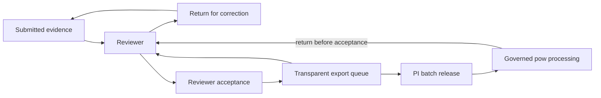
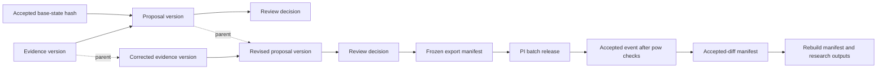

# Content-Addressed Review Contract

**Status:** Design contract prepared for merge, revised 2026-09-11. The project lead approved the workflow below on 2026-09-11. Implementation follows in separate changes. The first two steps, the canonicalisation contract and immutable evidence versions, are implemented and documented in [evidence-versions.md](evidence-versions.md); proposal pinning, the export queue, frozen exports, PI batch release, and `pow` release verification remain unimplemented and the live per-item PI acceptance stays in force.

## Decision In Brief

Review proposals should behave like commits. A submitted evidence version receives a content-derived identifier, a revision links to its parent, a change proposal identifies the accepted state on which it was based, and every review decision identifies the proposal version the reviewer considered. Accepted events and export manifests continue the same chain into `pow` and the rebuilt research products.

Convex remains the shared task and review service. `pow` remains the governed validation, acceptance, replay, and export boundary. Git stores code, schemas, documentation, and compact manifests. The content-addressed contract lets the dashboard, command-line tools, and later agent clients refer to the same review objects. Per-task Git branches and GitHub pull requests remain outside the review workflow.

## Approved Review And Release Workflow

Submitted evidence goes to a reviewer. The reviewer either returns it for correction or accepts it into a transparent export queue. A principal investigator (PI) can return queued items to review or explicitly release a batch for governed `pow` processing. Batch release provides PI acceptance for the exact included versions, replacing a separate PI acceptance action for every item.



The export queue shows the evidence and proposal versions, reviewer decisions, unresolved questions, and proposed batch membership. Queue visibility supports PI inspection; explicit batch release records the PI's authority. Earlier evidence and decisions remain retrievable when a case returns to review.

The live backend currently implements per-item PI acceptance in `convex/acceptances.ts`, and `convex/exports.ts` selects `pi_accepted` tasks. The approved design moves PI acceptance to batch release. Those existing controls remain in force until the replacement is implemented and tested. The [2026-09-04 PI acceptance brief](pi-acceptance-layer-brief-2026-09-04.md) remains the historical record of the earlier design.

## The Pull-Request Analogy

The analogy maps Git's version structure and review relations onto project review objects. Convex and `pow` continue to store and process those objects.

| Git concept | Places-of-worship equivalent | Consequence |
| --- | --- | --- |
| Base commit | Accepted site-state or event-log hash | A proposal states the accepted state from which it was prepared. |
| Commit | Immutable proposal version | A reviewer can retrieve the proposal that a decision concerns. |
| Parent commit | Parent proposal hash | Revisions retain earlier proposals and link the proposal history. |
| Diff | `pow diff` over proposed events | Review concerns the scientific and analytical consequences of a proposed change. |
| Review comment | Task-linked question or review note | Questions can identify a proposal, evidence version, field, or map artefact. |
| Review decision | Immutable decision referencing a proposal hash | A later proposal requires its own decision. |
| Merge | Accepted event plus accepted-diff manifest after PI batch release and governed `pow` acceptance | Accepted longitudinal data retain the proposal, evidence, decision, and rebuild chain. |

## Why The Current Hashes Are Insufficient

The current system hashes several parts of the review history. Batch imports may include a `claim_hash` for duplicate detection. Review decisions and per-item PI acceptances receive SHA-256 hashes over their stored fields. `pow stage` hashes the raw input bytes and retains that hash with the staged batch.

Taken together, these pieces stop short of identifying a complete review version. Evidence remains in draft rows that existing mutations can patch. A review decision identifies an `evidence_draft_id`, leaving the reviewed content unspecified. Freezing an export stores task and decision identifiers, while `getExportBundle` later queries the current task, event, and evidence rows. A later row change can therefore change the returned files while retaining the export-batch identifier.

Content-addressed review closes this gap by making submitted scientific objects immutable and linking every downstream object by hash.

## Object Graph



Mutable task status remains a coordination index around this graph. Task events record status transitions. The submitted evidence, proposal, decision, PI batch release, accepted event, and frozen export are immutable records. Return and withdrawal events change eligibility while preserving those records.

## Hash Envelope

Every content-addressed review object uses an immutable envelope:

```json
{
  "hash_contract": "pow-object.v1",
  "object_type": "proposal_version",
  "schema_version": "change-proposal.v1",
  "logical_id": "proposal:nz-temporal-001:48",
  "parent_object_hashes": [],
  "created_by": "actor:project-user-id",
  "recorded_at": "2026-08-27T04:30:00.000Z",
  "payload": {
    "base_state_hash": "sha256:...",
    "evidence_version_hashes": ["sha256:..."],
    "proposed_event_hashes": ["sha256:..."]
  }
}
```

The `object_hash` is `sha256:` followed by the lowercase hexadecimal SHA-256 digest of the UTF-8 bytes produced by the contract's canonical JSON serialisation. The serialised envelope excludes `object_hash`, Convex document identifiers, database creation metadata, indexes, cached display fields, and mutable task status.

Version 1 should use a published cross-language JSON canonicalisation standard, with [RFC 8785 JSON Canonicalization Scheme](https://www.rfc-editor.org/rfc/rfc8785) as the proposed choice. The implementation must pin the standard and its library versions, reject values outside the supported JSON domain, and publish common TypeScript and Rust fixtures before any hash becomes authoritative. Schema rules must distinguish ordered arrays from set-like arrays; set-like arrays are sorted by their defined stable field before canonicalisation. Canonicalisation preserves the submitted scientific values and text.

Hashing establishes content identity. Authenticated actor records establish attribution. Server-enforced roles and project sign-off establish authority. Source assessment and human review establish whether the scientific claim is acceptable.

## Required Review Objects

| Object | Immutable contents | Required references |
| --- | --- | --- |
| Evidence version | Submitted observations, source references, interpretation, uncertainty, privacy and licence state, schema version, actor, and recorded time | Parent evidence-version hash for a correction; stable task and evidence-family identifiers |
| Proposal version | Proposed events or field changes and the validation summary used for review | Evidence-version hashes, base-state hash, parent proposal hash when revised, schema and taxonomy versions |
| Review decision | Decision, rationale, requested follow-up, identity and target-year conclusions, reviewer, and recorded time | Proposal hash, reviewed evidence-version hashes, and any agent-review hash considered |
| PI batch release | PI identity, release time, rationale, and exact approved membership | Frozen export-manifest hash, proposal hashes, evidence-version hashes, and reviewer-decision hashes |
| Return or withdrawal event | Actor, time, reason, affected items, and processing disposition | Affected proposal, decision, export-manifest, and release hashes where present |
| Accepted event | Event envelope used by replay | Proposal hash, accepting reviewer-decision hash, PI batch-release hash, evidence-version hashes, payload hash, source-manifest references, schema and taxonomy versions |
| Frozen export manifest | The immutable files handed to `pow` | Sorted object-hash lists, per-file hashes and byte counts, schema versions, generator commit, country and batch scope, freeze time |
| Rebuild manifest | Inputs, command, code version, replay horizon, and output files | Accepted-event and input-manifest hashes, per-output hashes, target years and area partitions |

Import duplicate detection and scientific version identity serve different purposes. A server-computed evidence-content hash may later replace the current client-supplied `claim_hash`. The evidence-version hash also includes the version envelope, including its parent, actor, schema, and recorded time.

The `base_state_hash` identifies a canonical base manifest for every site or other target the proposal may change. The base manifest records the accepted event hashes, reconstructed fields, source and taxonomy versions, and replay horizon used to prepare the proposal. It includes dependencies across affected sites, including relocation, split, and merge relationships. Implementation fixtures must demonstrate which changes invalidate those dependencies. An accepted event concerning an unrelated target leaves the proposal current.

## Version And Decision Rules

An autosaved draft may change in place. Submission creates an immutable evidence version and returns its hash. The server assigns the actor and recorded time and requires an idempotency token; retrying the same submission returns the existing version. The dashboard can continue to present a simple Save or Submit interaction because the version boundary is a server operation.

A correction creates a child evidence version linked to the version it supersedes. A later dated observation creates a distinct evidence version because it contributes new longitudinal evidence. Every version remains retrievable.

A proposal pins its evidence versions and `base_state_hash`. A proposal created after a correction or accepted-state change receives a new `proposal_hash` and links to its parent proposal where applicable.

A review decision pins the proposal hash and the evidence-version hashes shown to the reviewer. Recording a decision against an outdated proposal returns a stale-version result. The reviewer then sees the parent-to-current diff and decides on the current proposal.

A changed or withdrawn decision is a new decision referencing the earlier decision hash. Earlier decisions remain in the audit history.

Reviewer acceptance admits the pinned proposal to the export queue. The reviewer decision `accepted_for_export` expresses that approval; the PI batch release authorises the handoff. An accepted event references the reviewer decision, proposal, and PI batch release. Acceptance into the event log requires governed `pow` validation, diff, sign-off, and replay verification.

Returning a queued item to review records the actor, reason, and affected versions, and suspends its export eligibility. Evidence corrections create child versions. Even if the evidence stays unchanged, renewed reviewer acceptance requires a fresh decision after return. Eligibility is also suspended by a changed proposal, superseded decision, or stale base state.

A frozen export containing a returned item is withdrawn or superseded through an appended event. Its files remain retrievable with their original hashes. A replacement export has a new manifest and needs its own PI batch release.

A released batch can return to review before `pow` accepts its changes. Withdrawal and acceptance must share a processing guard that blocks a concurrent worker from accepting a withdrawn release. If acceptance has already occurred, correction proceeds through a new reviewed proposal and governed change. The accepted event history remains intact.

## Frozen Exports

Freezing an export must create and durably store the export bytes before the export receives `frozen` status. Later retrieval returns those stored bytes and verifies their hashes. Reconstruction from current database rows remains a draft-export operation.

The export manifest records the included object hashes, file names, SHA-256 hashes, byte counts, row counts, schema versions, country and batch scope, generator commit, creation time, and freeze time. The manifest hash covers the canonical manifest with its own hash field omitted. A sorted object list makes the manifest independent of query order.

Task and status snapshots may accompany an export as review context. Their file hashes freeze the supplied context, while the evidence, proposal, decision, and accepted-event hashes identify the scientific objects used by `pow`.

Freezing records a verified snapshot for PI inspection. The PI release is an immutable record that references the frozen manifest hash, avoiding a circular hash dependency between the manifest and release. Task status changes to `exported` only after durable storage, hash verification, and explicit PI batch release succeed. A failed freeze leaves the batch in draft status and records the failure as an event.

At release, the server rechecks every included proposal, reviewer decision, and relevant base state. A returned, superseded, or stale item blocks release of that snapshot. `pow` verifies the release and its current eligibility before accepting changes, as well as the object and file hashes. Retrying release of the same unchanged snapshot returns the existing release record.

The batch-release role retains the existing PI restrictions on self-acceptance and required additional opinions. A PI with authority over every included item must release the batch; otherwise the batch must be reassigned or its membership revised.

## Dashboard, CLI, And Agent Ergonomics

People should usually see stable task names and short hash prefixes. The interface exposes the full hash through copy controls, downloads, and machine-readable responses. A decision screen shows whether the proposal remains current and offers a parent-to-current diff after revision.

The same contract supports later command-line and agent clients. Illustrative commands are:

```sh
pow remote proposal show sha256:<proposal-hash>
pow remote proposal diff sha256:<parent-hash> sha256:<proposal-hash>
pow remote question raise --proposal sha256:<proposal-hash> --field /geometry
pow remote review recommend --proposal sha256:<proposal-hash>
pow export verify path/to/export-manifest.json
```

Task-linked questions, agent recommendations, and generated review maps should identify the proposal hash they concern. A map artefact should also record its scientific overlay hash, renderer and style versions, extent, and input hashes. Standard OpenStreetMap basemap tiles provide visual context and remain outside the scientific overlay hash.

## Implementation Sequence

The first implementation step is the canonicalisation contract and a small set of golden fixtures shared by TypeScript and Rust. The fixtures should cover nested objects, Unicode, coordinates, timestamps, nulls, ordered arrays, set-like arrays, and omitted optional fields. Implemented 2026-09-11 as `pow-canonical-json.v1`; see [evidence-versions.md](evidence-versions.md).

The second implementation step is immutable evidence versions. Submission should create the version on the server, compute its hash, and prevent later patches to the submitted content. Corrections should create linked child versions. Implemented 2026-09-11 as `evidence-version.v1`: every write onto submitted content records an attributed child version rather than patching silently, and the draft row stays a locator.

The third implementation step is proposal and decision pinning. A proposal should record its accepted base-state hash, evidence-version hashes, proposed-event hashes, and parent proposal. Review decisions should require the proposal hash and reject stale writes.

The fourth implementation step is the export queue, durable frozen exports, and PI batch release. Freeze should serialise, store, hash, and verify the export package as a recoverable operation. Return events suspend eligibility. PI release pins the verified manifest and current decisions. Export retrieval should return the stored package and its current withdrawal or supersession disposition.

The fifth implementation step is `pow` verification, acceptance, and replay. `pow` should verify every referenced object and file hash, the PI release, and release eligibility before acceptance. It must coordinate acceptance with withdrawal, preserve the hash chain in accepted events, and reproduce rebuilt outputs under manifest hashes.

Each step should land as a focused pull request after the active portal branch has stabilised. The design is compatible with the current dashboard and prepares the same review objects for command-line and agent clients.

## Migration

Existing per-item PI acceptance records retain their original meaning and hashes. Migration preserves those records as historical approvals; a batch release requires an explicit PI action against its exact manifest. The replacement must cover the queue, return path, release permission, export checks, and `pow` processing guard before retiring the live `pi_accepted` gate. Portal labels and the RA guide must change with that implementation.

Existing `decision_hash` values retain their current contract as version 0. New decision hashes use a named version 1 envelope. A change in hash semantics requires an explicit contract version. The [internal batch-review implementation](internal-agent-review.md) introduces `decision_hash_version: 1` for snapshot-linked decisions using the `review-decision.v1` envelope documented there. Ordinary decisions without a snapshot retain version 0. This implements decision-to-snapshot hashing; the storage-independent evidence graph and PI batch release described above remain further implementation steps.

Existing submitted rows can enter the new graph through migration records that identify the source row, the migration run, and the time when migration copied the row. Stored historical actor and creation fields may be retained when present. The migration record should avoid implying that the version hash existed when the original submission occurred.

The migration should preserve current identifiers as locators while introducing storage-independent logical identifiers and content-derived hashes. Convex document identifiers remain implementation details and stay outside exported hash envelopes.

## Acceptance Criteria

1. TypeScript and Rust produce the same hash for every golden fixture.
2. Reordering JSON object member names leaves the hash unchanged.
3. Changing any hashed field changes the hash.
4. Set-like arrays produce the same hash after their specified pre-sort; ordered arrays retain order as data.
5. Retrying a submission with the same idempotency token returns the existing version and hash.
6. Correcting submitted evidence creates a child version and preserves the parent.
7. A decision with a stale proposal hash is rejected with the current hash and a retrievable diff.
8. Retrieving a frozen export after later task activity returns byte-identical files.
9. `pow` rejects an export package whose object, file, or manifest hash fails verification.
10. Replaying the accepted event log under pinned inputs reproduces the declared output hashes.
11. Reviewer acceptance places the pinned proposal in the export queue; a return suspends eligibility and preserves the decision history.
12. PI release pins the exact frozen manifest and current evidence, proposal, and decision versions; retrying an unchanged release returns the existing record.
13. Returning an item from a frozen or released batch withdraws or supersedes the affected export while preserving its bytes; a replacement needs fresh release.
14. A changed decision, revised proposal, or relevant base-state change blocks release or acceptance; an unrelated site change leaves eligibility intact.
15. A concurrent withdrawal and `pow` acceptance produce an unambiguous outcome: withdrawal prevents acceptance, or completed acceptance requires a governed correction.
16. PI role, self-acceptance, and additional-opinion restrictions apply to every item in a released batch.

## Deferred Extensions

Digital signatures, a public transparency log, per-task Git branches, automatic agent acceptance, and hashing third-party basemap pixels are deferred. The version graph leaves room for signatures and external timestamping if later governance or publication needs justify them.

## Merge And Implementation Boundary

The approved workflow is reviewer acceptance into a transparent export queue, return to review when needed, and explicit PI batch release before governed `pow` processing. Submission creates immutable evidence versions. Decisions and releases identify the content they approve; frozen exports retain verified bytes. Dashboards, command-line tools, and agent clients share those versioned review objects.

Merging this document adopts the design contract. The implementation steps and acceptance criteria above govern subsequent code changes. The live per-item PI acceptance controls remain the operational authority until that replacement passes its checks.
