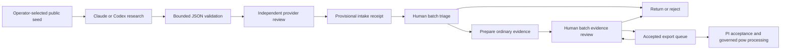

# Internal agent research and human batch review

Status: internal pilot. The runner searches public material, obtains an independent advisory review, and produces a validated JSON bundle. A deployment-gated Convex intake route can put that bundle in the human review queue. Governed data changes continue through the existing evidence, acceptance, and `pow` contracts.

## Workflow and authority



The researcher and advisory reviewer use different providers. Provider diversity helps reveal disagreements. Factual independence also depends on the sources, which both agents may share. Each claim retains its source URL, quotation, temporal scope, uncertainty, and reader provenance. Advisory review records whether the source was opened, seen only through a search snippet, or not checked. An `accept` recommendation requires an opened, supported check for every claim.

Human batch review is a feasibility requirement. Reviewers select an explicit set of records, see the relevant evidence, inspect exceptions, and approve those versions together. The backend checks every selected version before committing the transaction. A stale item invalidates the batch so that an unseen revision cannot inherit approval. Sampling-based acceptance needs an explicit sampling and escalation policy; this pilot grants no authority to accept unseen records merely because a sample passed.

Raw agent dossiers enter as `agent_intake_only` drafts. They may contain several kinds of historical claim, whereas ordinary evidence specifies observations, interpretations, periods, and proposed states. Human preparation must preserve those distinctions before ordinary acceptance. Create a fresh human-owned draft with `evidence:saveEvidenceDraft` using the task identifier and omitting `evidenceDraftId`, then submit it through the ordinary evidence-and-periods contract. Preserve the receipt identifier in its source notes. A different qualified reviewer makes the acceptance decision. Cloning an intake draft retains its provisional marker and service authorship. Intake-only drafts therefore support batch return or rejection, while completed ordinary evidence uses the existing acceptance rules. The advisory model cannot accept, release, or write map data.

The [approved review and release design](content-addressed-review.md) makes PI batch release the final authority before governed processing and allows returns from the transparent export queue. The current backend still uses per-item PI acceptance. Human batch reviewer decisions in this pilot do not replace that PI gate or implement immutable export files.

## Relationship to the earlier review design

The earlier [contribution design](../portal-free-contribution-design.md) distinguishes human-confirmed agent drafts from autonomous submissions and proposes run manifests, duplicate prevention, sensitivity routing, pause controls, and sampled batch inspection. The [Claude batch-review design](../portal-claude-batch-review.md) treats AI reviews as append-only recommendations. This pilot retains that authority boundary and reuses `agent_reviews` and task events.

The first implementation adds a narrow transport contract and manual execution. Coordination remains operator-driven: choose a seed, run research and review, validate, and explicitly submit to an enabled development deployment. Automatic scheduling, country-wide fan-out, source-file ingestion, and sample-based acceptance need further implementation and evaluation.

## Run locally

Use authenticated Claude and Codex command-line clients that support the required isolation flags. The runner checks those flags and stops on incompatibility. Its permitted models are Claude `sonnet` and Codex `gpt-5.6-luna`; there is no fallback to a more expensive model. Claude's alias can resolve to a newer Sonnet; the model identifier the provider reports is therefore part of the record. Since 2026-09-24 a run without one is refused: the runner stops before buying the review when the researcher reported no model identifier, and intake refuses a bundle whose research run, review run or dossier manifest lacks one, or whose dossier and research manifests name different models. A Codex run whose trace names no model fails this check until the runner can read the model from the provider.

Create an operator-selected seed containing `place_ref`, `name`, `country_code`, `seed_latitude`, `seed_longitude`, and `seed_source`. The internal pilot permits public, non-sensitive New Zealand seeds. Keep real runs, logs, and research decisions in the private research tier. The checked-in fixture uses invented evidence and is only for contract tests.

```sh
python3 scripts/agent_research/internal_runner.py \
  --backend codex --review-backend claude \
  --seed /absolute/path/public-seed.json \
  --out /absolute/path/private-run-directory \
  --public-nonsensitive --timeout 180 --budget-usd 2 \
  --pause-file /absolute/path/STOP

python3 scripts/agent_research/intake.py validate /absolute/path/private-run-directory/bundle.json
cargo run -p pow-cli -- validate-agent /absolute/path/private-run-directory/bundle.json --report json
```

The timeout applies to each provider attempt. The Claude budget is a reported-dollar ceiling enforced by its client; Codex has no equivalent dollar ceiling here. Its model, elapsed-time limit, output cap, and manual invocation bound the pilot operationally. Usage or cost unavailable from the client remains unknown. Do not interpret missing billing fields as zero cost. Creating the pause file prevents the next provider invocation; it is not an interrupt for an already running process.

Successful bundles contain a deterministic submission key, the dossier and review, and provider manifests with timestamps, trace and prompt hashes, model identifiers, exit status, and available usage. Rewriting an output bundle with different content is refused. Failed attempts retain local diagnostic records and produce no submit-ready bundle.

Personal details found anywhere in a dossier are replaced by a marker such as `[person_name withheld]` and recorded in its quarantine block. The redaction walks every string value of the dossier, whatever its schema says, in two passes: the pattern pass finds phone numbers, email addresses and honorific-led names; the known-value pass then withholds every recurrence of each quarantined value, compared without regard to case, character width or spacing, and of a caught name without its honorific. The runner keeps two forms of that block. The private dossier copy in the run directory (`dossier.json`) holds each item's kind, its claim and the SHA-256 of the withheld value, so a later run can recognise a recurring detail. The review prompt and the bundle carry only each item's `kind` and `context_claim_id`, with `redacted: true` and an `item_count` equal to the number of items; no value and no hash of a value reaches the reviewer or Convex. All three validators screen the whole outgoing bundle, the reviewer's text and both run manifests included, with the policy in `schemas/screen-policy.v1.json`: every string value and every undeclared object key is checked for the three patterns, and any 40- or 64-digit hex token (a maximal run of ASCII letters and digits, in any case, alone or inside longer text) is refused unless the whole value of a designated hash field is that digest, since a hash of a personal detail is itself a pseudonymous personal detail. Each designated field states its provenance in the policy file: the submission key and the idempotency key are recomputed from their inputs in the same record and refused on mismatch, and the run and prompt digests, whose inputs stay in the private run directory, are accepted on the operator's attestation. Diagnostics and refusal records name an undeclared object key only by its position among its object's keys in code-point order (`<key#N>`), and schema messages name paths and rules, never values. They also refuse a quarantine block that is unredacted, carries a value or a hash, miscounts its items, or names an unknown claim. `lib.redact_quarantine` refuses an item that has neither a value nor a valid hash.

The runner also checks everything it would transport against the values it quarantined and their hashes. Reviewer output that carries a personal detail, a quarantined value or its hash is refused before transport and never silently redacted, since redaction could change what the reviewer said. This is the interim behaviour: the target design flags such output as inadmissible in its current form and holds it for human review with suggested redactions. The screen runs before any schema check on the reviewer's output, so a detail in an invalid field is still refused as a personal detail. The original review stays in the private run directory as `review.refused.json` (mode 0600), and `run-result.json` records `personal_detail_refusal` with the stage, the refused paths and, for each finding, its path, detector and code-point span, never the text, so the later flag-and-hold review can reuse the record.

Every claim's source host must fall inside the domains of the allowlist version the dossier names (`allowlist_version`; the one version today is `nz-v1`, in `fixtures/allowlist-nz-v1.json`). All three validators read the host with one policy: the host is taken from the locator as written, never after URL decoding or IDNA mapping; a non-ASCII host, userinfo, an empty or out-of-range port, and an empty or malformed label are refused; the host is lower-cased and exactly one trailing root dot is stripped. Punycode (`xn--`) labels pass as ASCII labels. A listed domain covers itself and its subdomains; a lookalike suffix such as `notanglicanlife.org.nz` does not match. An off-list host, a missing or unknown allowlist version, or an allowlist for another country is a validation failure in all three validators. The allowlist's church-website rule, which admits a parish's own domain once a reader found it through a listed directory, cannot be checked from a dossier. A parish's own domain is therefore refused like any other unlisted host until the allowlist names it. The runner checks the dossier before review and writes the count to its run row: `run-result.json` carries `allowlist_version`, `allowlist_violations` and `allowlist_violation_hosts`, which are null when the run failed before a dossier existed.

## Submit explicitly

After installing this code on a development deployment, its operator must enable `POW_INTERNAL_AGENT_INGEST_ENABLED=true`. The following controller command validates the file again and passes its exact bytes and SHA-256 to the internal mutation:

```sh
python3 scripts/agent_research/intake.py submit /absolute/path/private-run-directory/bundle.json \
  --deployment dev
```

Use a personal Convex CLI sign-in; the installed CLI refuses deployment-specific keys with this selector. The `dev` selector targets the operator’s personal development deployment; `local` is also permitted. Named deployments and production selectors are refused. The controller holds Convex credentials; model processes receive no deployment credentials. The server independently validates the bundle, recomputes its hash, and creates the provisional task, evidence draft, advisory review, audit event, and immutable receipt atomically. Retrying identical bytes returns the existing receipt. That lookup precedes validation and requires the stored bytes to equal the submitted bytes, so a rule tightened after the first ingest does not turn an exact retry into an error. The submit command reaches the same receipt without sending a locally refused bundle anywhere: it passes only the bundle's SHA-256 to the read-only `internalAgentIntake:findReceiptByHash` query, which returns the receipt with the SHA-256 of the bytes actually stored, and compares that digest with its own. It reports the receipt and exits successfully when they match, and otherwise fails with the validation errors. Reusing a submission key with changed bytes fails.

Authenticated reviewers, curators, and administrators can inspect receipts with `internalAgentIntake:getReceipt` or `listReceipts`. The list returns `page`, `continueCursor`, and `isDone`; pass the continuation token as `cursor` to inspect further pages. `batchDisposeReceipts` accepts `items` containing `receipt_id` and `expected_hash`, an `outcome` of `return` or `reject`, and a human note. Its batch limit is 20 records. For completed ordinary evidence, `reviews:getReviewSnapshot({taskId, evidenceDraftId})` returns the inspected evidence context, summary, and `snapshot_hash`. Submit selected items to `reviews:batchRecordReviewDecisions({items})`, each containing `task_id`, `evidence_draft_id`, `snapshot_hash`, and an ordinary `decision` with `decision_status: "accepted_for_export"`, the same evidence-draft identifier, and a human decision note. The endpoint applies the ordinary author-exclusion, additional-opinion, pending-period, and location checks. It retains the exact inspected snapshot and records its hash with each decision; `reviews:getRecordedReviewSnapshot` retrieves that audit record. Snapshots are limited to 128 KiB each and 512 KiB across the batch. Changes to related periods, derived states, historical claims, or advisory reviews also invalidate the snapshot.

The queue supplies the newest advisory review for the evidence draft currently under review. After a revision, the reviewer can decide the new draft while awaiting a new advisory review. The server rejects attempts to attach an advisory review from a different draft. Batch returns and rejections use the ordinary decision path, including its note requirement, review-claim release, and actor-role selection. Batch acceptance includes provisionally closed tasks under the same task-status rules as individual review.

Snapshot-linked decisions store `decision_hash_version: 1`. Their SHA-256 input is the canonical JSON envelope `{schema_version: "review-decision.v1", decision: <version-0 decision fields>, review_snapshot_hash: <inspected snapshot hash>}`. The version-0 fields are `review_decision_id`, `task_id`, `evidence_draft_id`, `reviewer_user_id` as a string, `decision_status`, `decision_note`, `accepted_action`, `identity_decision`, `location_outcome`, `target_year_affects`, `required_follow_up`, `agent_review_id`, `agent_review_agreement`, `created_at`, and `updated_at`. Canonicalisation drops absent fields. Decisions without a snapshot retain the version-0 hash contract and omit `decision_hash_version`. Database metadata and stored hash fields are excluded from each hash input.

The shared [intake regression cases](../../scripts/agent_research/fixtures/intake-regressions.json) run in the Python, TypeScript, and Rust suites. They cover empty URL userinfo, domestic and international NZ phone strings, historical year strings, escaped controls in values and keys, trailing newlines in constrained fields, source dates with a time suffix, invalid or reversed manifest timestamps, off-allowlist and lookalike source hosts, an unknown allowlist version, absent, empty or inconsistent reported model identifiers, and quarantine blocks that are unredacted, carry a value or a hash, miscount their items or name an unknown claim. Run manifests require complete UTC timestamps; source dates are validated by their calendar-date component. The Rust command also escapes controls in terminal error messages.

The runner's `raw_trace_sha256` hashes process stdout bytes, a newline byte, and process stderr bytes in that order. It differs from the hash of the enclosing JSONL attempt file. Stored stdout and stderr undergo credential redaction and output limits. Therefore, reproduction from retained text is possible only when those transformations preserve the bytes. Verify and record that equality when preserving a run. `prompt_sha256` hashes the combined system and user text with the runner's separator. Claude's flat usage fields describe the primary model; helper usage and total reported cost remain in `provider_usage.modelUsage`. Codex's flat usage fields describe the process. Comparisons must account for those scopes and the providers' cache-accounting conventions. Cost is therefore read per billing model: each Claude manifest carries `usage.per_model`, one row per model in `modelUsage` with its reported identifier, tokens, web searches and list-price cost, and totals summed over those rows. A total is null, never zero, when any model omits the field. The dossier's `cost_usd_reported` is that per-model total with `cost_basis: tool_list_price`. When the per-model block is absent, as for Codex, or any model omits its cost, the dossier keeps a null cost with `cost_basis: unknown`: the runner cannot establish that a plan covered the run. A helper model the client chooses can account for most of a run's tokens and spend, so a cost read from the flat block can understate spend several-fold.

Intake also records the advisory reviewer's per-claim checks with their real access method, its recommendation on the intake evidence version, and the researcher's status assessment as rows in the append-only `agent_judgments` table ([agent judgments](agent-judgments.md)). The `sources_checked` summary on the `agent_reviews` row now says `not_checked` where the reviewer did not check the source and `model_assessment` otherwise.

These are backend operations for internal runs; the existing RA interface is unaffected. A batch-review screen and automatic conversion of agent claims into ordinary evidence remain follow-up work.

## Hostile input and evaluation limits

JSON validation enforces structure and bounds; it cannot prove a source truthful or remove all prompt injection. The controller treats model output as data. It accepts bounded UTF-8 JSON, rejects duplicate or prototype-like keys and non-finite numbers, and checks claim coverage, dates, provider identities, and source locators. The transport limit is 64 KiB, nesting is limited to 32 levels, and dossiers contain at most 20 claims. Source locators use public HTTP(S) DNS hostnames checked syntactically; numeric IP hosts are refused. Ingestion does not fetch them or resolve their hostnames.

Model processes start in a fresh working directory with shell, file-editing, connector, hook, and subagent capabilities disabled by their client configuration. They receive only the selected public seed and the resulting dossier. Tool-event auditing adds a detection layer where the client exposes events. These controls reduce the impact of malicious source instructions; client regressions and unreported provider-side behaviour remain evaluation limits.

The intake route accepts JSON only. Source URLs may still identify PDFs, and a provider’s built-in web tool may attempt to fetch them despite prompt instructions. Such instructions are not a file-quarantine control. It neither downloads attachments nor parses PDFs, archives, scripts, or office documents. Future file ingestion needs a quarantined fetcher, redirect and DNS checks, MIME and size limits, isolated parsing, provenance hashes, and explicit release of extracted text. A model's own safety response contributes behavioural evidence alongside those controls.

Evaluate public discovery against what public sources could establish. Hold privately supplied observations out of research prompts. A model should preserve uncertainty about undocumented worship rather than infer absence from a sale, denominational closure, or deconsecration. Measure source support, scope errors, disagreements, human review time, rejected or deferred cases, usage, and latency separately. Small internal runs establish whether this pipeline works; they do not estimate quality or cost across the global inventory.

Client configuration follows the installed command-line help, with [Codex security guidance](https://developers.openai.com/codex/security) and the [Claude CLI reference](https://code.claude.com/docs/en/cli-reference) as supporting documentation. Recheck the controls when upgrading either client.

## Revisitable first passes

The [first-pass archive](agent-first-passes.md) preserves provisional partial or blocked research alongside validated dossiers. The local tool records annotations and parent hashes and verifies recovery copies. It is an independent staging tool; the runner and Convex intake continue to use their existing contracts.
