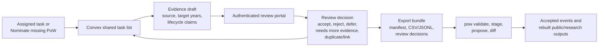

# Portal Submission Review Plan

Planning source of truth: `PLANNING.md`.

Portal hub: `docs/portal-data-entry-plan.md`.

Task-layer contract: `docs/convex-task-layer-spec.md`.

## Purpose

Review should be fast for trusted reviewers and strict about the master data
boundary. The review tool should show what was submitted, what the master
currently says, what evidence is available, which automated checks ran, and what
change would result if accepted.

## Current V1 Direction

The first review surface is a small authenticated static page at
`apps/regions/nz/review.html`. It uses the same Google/Convex sign-in bridge as
the assignment page and records review decisions against evidence drafts already
saved in Convex. This is the fastest path to reviewing André's first submitted
work without introducing a build step.

React + Vite + Convex React remain the preferred direction for the fuller
review workbench, but the migration should happen after the first review loop
has been exercised. The static v1 records decisions only; export bundles stay
in the maintainer workflow until the review decisions have been checked against
`pow`.

For v1, keep the decision vocabulary narrow and aligned with the current
Convex schema:

- `accepted_for_export`,
- `rejected`,
- `needs_more_evidence`,
- `duplicate_task`,
- `deferred`.

The portal should not write to the master, publish public map changes, or
create a second review database. It reads and writes Convex task/review state,
then relies on the export bundle and `pow` for governed data changes.

Static v1 scope:

- list submitted New Zealand tasks that need review;
- show the task, latest evidence draft, generated wide row, target-year
  statuses, lifecycle notes, source details, and task history;
- record accepted-for-export, rejected, needs-more-evidence, duplicate, or
  deferred decisions;
- refresh the queue after each decision;
- omit export buttons.

## Review Queue

The first queue should support:

- filter by country, priority, proposed action, validation status, submitter, and
  media presence
- map preview with selected point or building outline
- current master record and proposed staged values
- source and evidence references
- validation warnings and duplicate-risk flags
- optional AI review notes, clearly marked as suggestions
- reviewer decision controls

Default review decisions:

- accept for export
- reject
- request more evidence
- mark duplicate or link to an existing site
- defer

Later versions may add retract, supersede, and adjudication routing once the
first reviewed export round trip works.

## States

Submission states should be explicit:

- `submitted`
- `validating`
- `needs_triage`
- `under_review`
- `needs_more_info`
- `accepted_for_change_proposal`
- `rejected`
- `deferred`
- `retracted`
- `superseded`
- `exported_to_master_dry_run`

State changes should be append-only audit events. Avoid overwriting a previous
decision in place.

## Undo And Reversal

Before review, a contributor or reviewer may retract a staged submission. After
review, correction should happen through a superseding decision linked to the
earlier decision. After a master change is accepted, reversal should require a
new reviewed change proposal.

This preserves the ability to explain what happened when project records are
reported, audited, or rebuilt.

## GitHub Audit Mirror

GitHub can be useful for community visibility and durable public snapshots, but
it should not be the primary review backend. For the live task-map spike,
Convex should be the source of truth for task state and reviewer decisions until
they are exported into the `pow` pipeline. Durable storage layers should remain
the source of truth for raw submissions, quarantined media, and reviewed export
manifests. Optional GitHub exports may include:

- signed or checksummed batch manifests
- reviewed change summaries
- generated issues for community discussion
- pull requests for static docs or public export updates

Do not store private contributor details, restricted sources, raw uploads, or
unreviewed sensitive evidence in GitHub.
