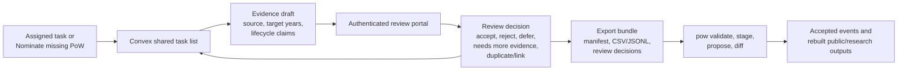

# Portal Submission Review Plan

Public direction: `ROADMAP.md`. Detailed active planning and governance records are maintained in the private research tier.

Portal hub: `docs/portal-data-entry-plan.md`.

Task-layer contract: `docs/convex-task-layer-spec.md`.

## Purpose

Review should be fast for trusted reviewers and strict about the master data
boundary. The review tool should show what was submitted, what the master
currently says, what evidence is available, which automated checks ran, and what
change would result if accepted.

## Current V1 Direction

The first review surface is a small authenticated static page at
`apps/regions/nz/review.html`. It uses the same Google/Convex sign-in bridge as
the assignment page and records review decisions against evidence drafts already
saved in Convex. This is the fastest path to reviewing André's first submitted
work without introducing a build step.

React + Vite + Convex React remain the preferred direction for the fuller
review workbench, but the migration should happen after the first review loop
has been exercised. The static v1 records decisions only; export bundles stay
in the maintainer workflow until the review decisions have been checked against
`pow`.

Incomplete but useful RA submissions should be recorded as unresolved notes
rather than forced into a complete evidence claim. This follows the lesson of
OpenStreetMap note workflows: keep a source-backed lead visible, preserve the
conversation and history, and let a reviewer accept, reject, defer, or ask for
more evidence once the uncertainty is clear.

Evidence intake should distinguish direct observation, interpretation, and uncertainty or follow-up. Denomination evidence should show starting source wording and any starting project taxonomy code beside the contributor's exact observed label, label basis, and provisional relation to the record. A reviewer may assess the raw-label evidence without treating it as an accepted taxonomy value, correction, historical event, or master change.

The media pilot should show an internal field-observation packet only to authorised roles. Reviewers should see time and location provenance, discrepancy, sensitivity state, the confirmed observer account, and provisional claims; they should not receive durable object URLs or accept a packet as an indivisible substitute for claim-level judgement.

For v1, keep the decision vocabulary narrow and aligned with the current
Convex schema:

- `accepted_for_export`,
- `rejected`,
- `needs_more_evidence`,
- `duplicate_task`,
- `deferred`.

The portal should not write to the master, publish public map changes, or
create a second review database. It reads and writes Convex task/review state,
then relies on the export bundle and `pow` for governed data changes.

Static v1 scope:

- list submitted New Zealand tasks that need review;
- list unresolved notes as their own review queue;
- show the task, latest evidence draft, generated wide row, target-year
  statuses, lifecycle notes, source details, and task history;
- record accepted-for-export, rejected, needs-more-evidence, duplicate, or
  deferred decisions;
- require an explicit decision and short decision note;
- keep reviewed and exported tasks inspectable after a decision;
- provide a reviewer shortcut for system-test submissions so they can be
  rejected/excluded without entering an export round;
- refresh the queue after each decision;
- omit export buttons.

## Review Queue

The first queue should support:

- filter by country, priority, proposed action, validation status, submitter, and
  media presence
- map preview with selected point or building outline
- current master record and proposed staged values
- source and evidence references
- validation warnings and duplicate-risk flags
- optional AI review notes, clearly marked as suggestions
- reviewer decision controls

Default review decisions:

- accept for export
- reject
- request more evidence
- mark duplicate or link to an existing site
- defer

Later versions may add retract, supersede, and adjudication routing once the
first reviewed export round trip works.

## States

Submission states should be explicit:

- `submitted`
- `validating`
- `needs_triage`
- `under_review`
- `needs_more_info`
- `accepted_for_change_proposal`
- `rejected`
- `deferred`
- `retracted`
- `superseded`
- `exported_to_master_dry_run`

State changes should be append-only audit events. Avoid overwriting a previous
decision in place.

## Undo And Reversal

Before review, a contributor or reviewer may retract a staged submission. After
review, correction should happen through a superseding decision linked to the
earlier decision. After a master change is accepted, reversal should require a
new reviewed change proposal.

This preserves the ability to explain what happened when project records are
reported, audited, or rebuilt.

## GitHub Audit Mirror

GitHub can be useful for community visibility and durable public snapshots, but
it should not be the primary review backend. For the live task-map spike,
Convex should be the source of truth for task state and reviewer decisions until
they are exported into the `pow` pipeline. Durable storage layers should remain
the source of truth for raw submissions, quarantined media, and reviewed export
manifests. Optional GitHub exports may include:

- signed or checksummed batch manifests
- reviewed change summaries
- generated issues for community discussion
- pull requests for static docs or public export updates

Do not store private contributor details, restricted sources, raw uploads, or
unreviewed sensitive evidence in GitHub.

## Open Design Tasks (logged 2026-09-04)

Task list for the review lane, in JB's words where he gave them. Status: `[ ]` open, `[~]` in progress, `[x]` done.

- `[~]` **PI-only acceptance layer.** Ruled 2026-09-04 (R-P1–R-P5 as recommended); brief `docs/development/pi-acceptance-layer-brief-2026-09-04.md`. PR-P1 backend built; PR-P2 review portal and PR-P3 guide/people pages to follow. "Before accepting the design to the backend, only PIs (JB or JW) should be granted that authority." A reviewer's `accepted for export` decision stays a recommendation; a separate acceptance step, available only to the principal investigators, moves the case into the export bundle. To design: a `pi` role (or a named allow-list) in `convex/lib/auth.ts`, an `acceptance` event on the task with the PI's identity and the reviewed draft's id, the review portal's decision panel showing *Accept into the backend* only to PIs and otherwise "awaiting PI acceptance", the export path (`pow`) reading acceptance rather than the reviewer decision, and the audit mirror carrying both. Open questions for JB: whether a PI may accept their own submission, whether acceptance needs both PIs for contested cases, and how the layer reads on the public map's ring legend. *(design, large)*
- `[ ]` **Country-switch layer.** "If I am hovering over e.g. India, and sign into the verification tasks, but move to e.g. NZ, the heading is still 'India verification tasks'." The portal's country is fixed by `?country=`; panning the map elsewhere leaves the heading, the batch, and the assignment sheet on the first country. To design: when the map centre leaves the country's registry bbox, a layer asks "Do you want India?" with the option to pick another country from the registry, the map shifting to it and the portal reloading with that `?country=`, keeping sign-in; the same prompt on sign-in when the map already sits over another country. *(UX, medium)*
- `[x]` **Satellite is the default imagery; hybrid stays on offer.** JB (2026-09-04): "hybrid and satellite serve the same map (both are satellite). Satellite should be default, as it is most informative, but we should allow hybrid." Checked against MapTiler: over a bush tile at zoom 16 the two endpoints return byte-identical images (no labels to draw), while over Wellington's centre at zoom 14 the hybrid tile carries labels, so hybrid differs only where MapTiler has something to label at that zoom. Done in this sitting: the add flow, the pin, and the review map now switch to satellite, and the Hybrid button remains. *(basemap, small)*

