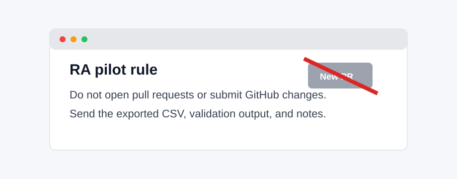
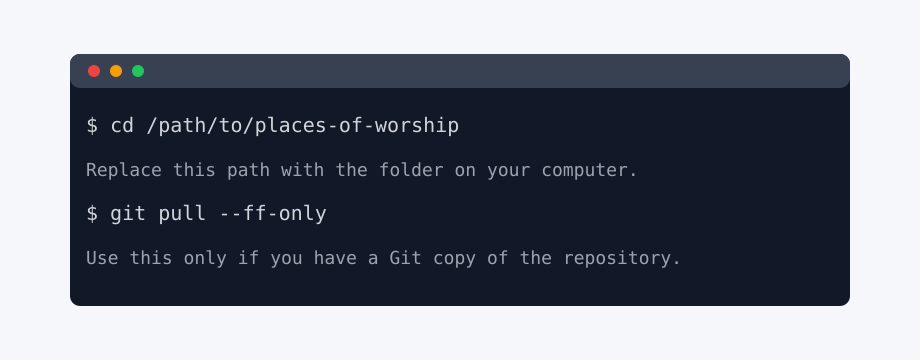
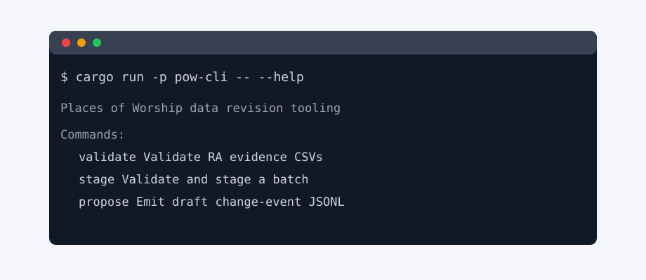
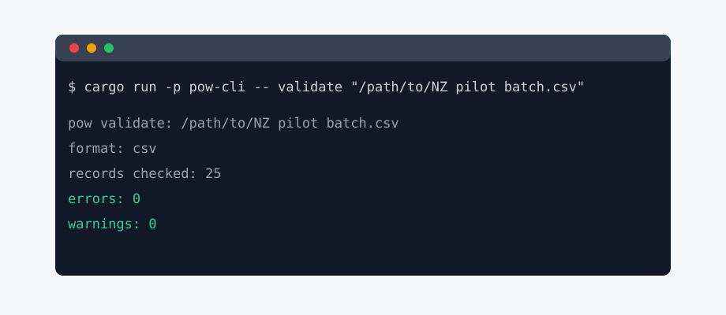
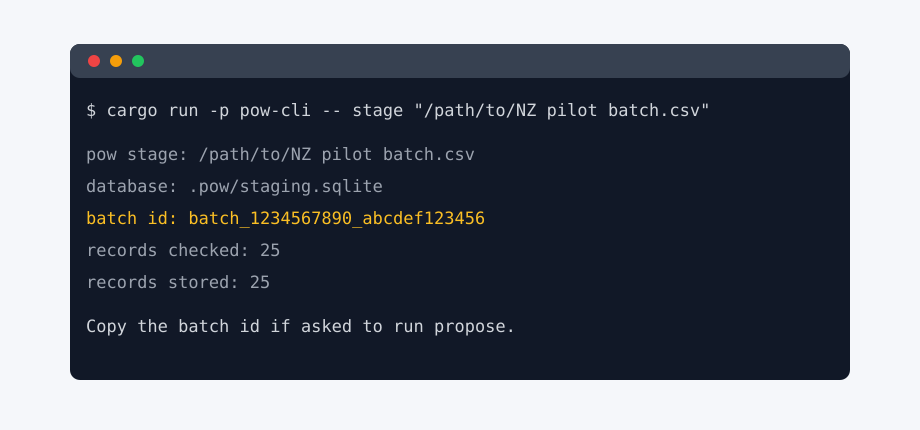
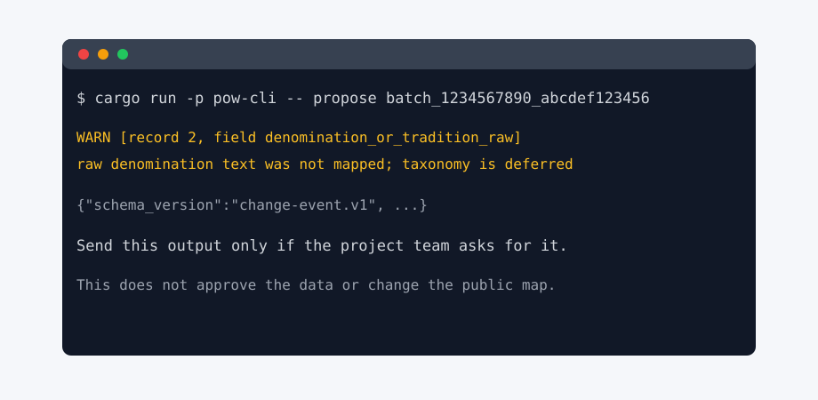

# RA CLI Tutorial

This tutorial explains how to check a small New Zealand places-of-worship
evidence batch with the local `pow` command.

The command-line tool is a safety check. It does not approve data, upload data,
or change the public map. It checks whether an exported CSV follows the project
templates. If asked, it can also make a local staging copy and print draft
events for review.

## Pilot Rules

Follow these rules for the current RA pilot:

1. Do not open pull requests.
2. Do not commit changes.
3. Do not edit files in the repository unless Joseph explicitly asks you to.
4. Enter evidence in the agreed working spreadsheet, not in the repository
   templates.
5. Export the spreadsheet tab as CSV when you are ready to check it.
6. Send the exported CSV, terminal output, and notes back to the project team.



## What You Need

You need:

1. A local copy of the `places-of-worship` repository.
2. A terminal app.
3. Rust and Cargo installed.
4. The exported CSV from the agreed working spreadsheet.

Check Cargo with:

```sh
cargo --version
```

If that command is not found, stop and ask the project team. Do not install
software unless the project team has asked you to.

## Step 1: Export The Spreadsheet

In the working spreadsheet:

1. Open the tab you have been asked to work on.
2. Use the spreadsheet menu to download or export the current tab as CSV.
3. Save the file somewhere you can find it.
4. Do not rename columns.
5. Do not delete columns.
6. Do not add extra columns.

The CSV columns must match the project template exactly.

## Step 2: Open The Project Folder

Open a terminal and move into the repository folder:

```sh
cd /path/to/places-of-worship
```

Replace `/path/to/places-of-worship` with the folder path on your computer.

If you are using a Git copy of the repository, update it:

```sh
git pull --ff-only
```



## Step 3: Check The Tool Is Available

Run:

```sh
cargo run -p pow-cli -- --help
```

You should see commands named `validate`, `stage`, and `propose`.



If the command fails, copy the full terminal output and send it to the project
team.

## Step 4: Validate The CSV

Run:

```sh
cargo run -p pow-cli -- validate "/path/to/NZ pilot batch.csv"
```

Replace `/path/to/NZ pilot batch.csv` with the path to your exported CSV.

Keep quotation marks around the file path if it contains spaces.



Validation reads the CSV and checks it. It does not stage, approve, upload, or
publish anything.

## Step 5: Read The Validation Result

The best result is:

```text
errors: 0
warnings: 0
```

If there are warnings, the file can be read, but some rows may need human review.

If there are errors, fix the spreadsheet, export a fresh CSV, and run
`validate` again.

Common errors are:

- A column has been renamed.
- A required field is blank.
- A controlled-vocabulary field contains a spelling variant.
- A date is not `YYYY`, `YYYY-MM`, or `YYYY-MM-DD`.
- A latitude or longitude is outside the valid range.
- A probability is not between `0` and `1`.

Do not guess how to fix unclear errors. Send the output to the project team.

## Step 6: Stage A Valid Batch

Only stage a file after validation has no errors.

Run:

```sh
cargo run -p pow-cli -- stage "/path/to/NZ pilot batch.csv"
```



The output includes a `batch id`. Copy that value if the project team asks you
to run `pow propose`.

Staging writes to:

```text
.pow/staging.sqlite
```

This file stays on your computer and is ignored by Git. Staging is not approval.

## Step 7: Propose Draft Events

Only run this step if the project team asks for it.

Use the batch id from `pow stage`:

```sh
cargo run -p pow-cli -- propose <staged_batch_id>
```

Replace `<staged_batch_id>` with the real batch id.



`pow propose` prints draft JSONL events for review. It does not approve the
batch, upload data, or change the public map.

Warnings about raw denomination or tradition text are expected at this stage.
Coded denomination mapping is deferred until the project taxonomy exists.

## Step 8: What To Send Back

Send the project team:

1. The exported CSV.
2. The `pow validate` output.
3. The `pow stage` output, if you staged the batch.
4. The `pow propose` output, if you were asked to run it.
5. A short note listing anything confusing.
6. A short note listing rows that need reviewer decisions.

Do not send private contact details, restricted source files, or raw uploads
unless the project team has explicitly approved the storage path.

## What Not To Do

Do not:

- open a pull request
- create a feature branch for this work
- commit files
- edit repository templates
- paste private or restricted source material into GitHub
- assume that staging means approval

The current task is evidence checking, not repository contribution.

## Quick Reference

```sh
cd /path/to/places-of-worship
git pull --ff-only
cargo run -p pow-cli -- --help
cargo run -p pow-cli -- validate "/path/to/NZ pilot batch.csv"
cargo run -p pow-cli -- stage "/path/to/NZ pilot batch.csv"
cargo run -p pow-cli -- propose <staged_batch_id>
```
