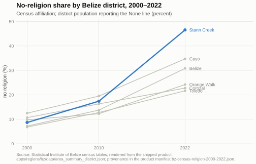
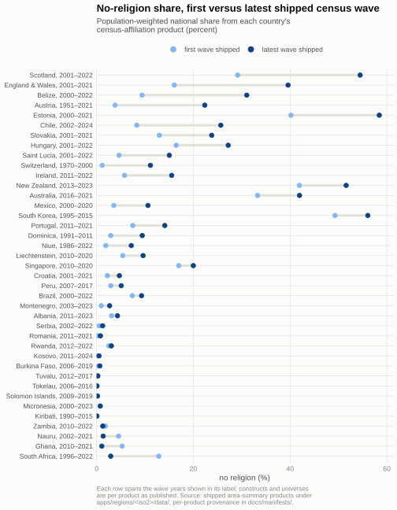
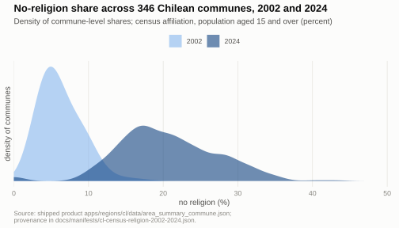

# Religious change in the census-religion corpus

This note describes what our shipped census-religion products document about religious change. Every number below is recomputed from the products under `apps/regions/<iso2>/data/` by `scripts/build_census_religion_note_figures.R`, which also generates the figures; nothing is hand-entered. For how to load and interpret the products yourself, start with [Using the census-religion data](using-the-census-religion-data.md).

The corpus carries 77 governed census-religion products and 86 live country pages. Of these, 39 products publish a genuine no-religion line in at least two comparable census waves; most sit at subnational grain, and the small-country series (Dominica, Nauru, Niue) are national by design. Those 39 products are the evidence base for this note. Register and membership series, survey-based waves, and the minority-share family are held out for the reasons given at the end.

## Belize: the sharpest three-wave series

Belize documents the fastest sustained secularisation in the corpus. The national no-religion share rose from 9.4 percent in 2000 to 15.5 percent in 2010 and 31.0 percent in 2022, on three census waves the source itself publishes as comparable. The district grain shows how uneven that rise was: Stann Creek went from 8.7 to 46.6 percent (nearly half the district by 2022), while Corozal rose 12 points over the same 22 years. A national series alone would hide a threefold spread across six districts.



## The corpus at a glance

Across the 39 products, the population-weighted national no-religion share rose in 33 and fell in 6. The largest rises span Europe and the Americas: Scotland rose 25.3 points (29.1 to 54.5 percent, 2001–2022) and England and Wales 23.5 points; Belize rose 21.6 points; Austria rose 18.5 points across seven waves back to 1951; Estonia rose 18.3 points to 58.4 percent; Chile rose 17.4 points (8.3 to 25.7 percent, 2002–2024). Four series now sit above the majority line: Estonia (58.4), South Korea (56.1), Scotland (54.5), and New Zealand (51.6). At the other end, the Pacific and West African series barely move: Solomon Islands, Tokelau, Tuvalu, Kiribati, Micronesia, and Burkina Faso all remain under one percent no religion across every shipped wave.



The full table behind this figure, with wave years and first and latest shares per country, ships beside it as [`no-religion-change-table.csv`](assets/census-religion-note/no-religion-change-table.csv).

## Change runs in both directions

Six series fall, four of them by half a point or more. South Africa's no-religion share dropped from 12.9 percent in 1996 to 2.9 percent in 2022, Ghana's from 5.3 to 1.1 percent (2010–2021), Nauru's from 4.5 to 1.3 percent (2002–2021), and Zambia's from 1.8 to 1.3 percent (2010–2022). Each figure renders the record as published. A fall in a census line can reflect changes in the instrument, the enumeration, or the answer categories as well as changes in what people believe. South Africa's manifest records the tension plainly: the 2011 census dropped the religion question entirely, and the 2016 intercensal Community Survey reported about 10.7 percent religiously unaffiliated against the 2.9 percent the 2022 census line carries. Our corpus treats these measurement regimes as signal to display rather than debt to hide: each wave's construct, universe, and category frame is preserved verbatim in the product and its manifest. The reader who needs to adjudicate a fall starts there.

## Chile: what commune grain adds

Chile shows why subnational grain earns its cost. The national no-religion share tripled from 8.3 to 25.7 percent between the 2002 and 2024 censuses, on a comparable aged-15-and-over universe in both waves. The 346 communes did not move together: among communes above 50,000 residents, the rise spans 10.3 points (Calama) to 27.1 points (Quilpué), and the whole commune distribution shifted shape — from a tight peak near 5 percent in 2002 to a wide spread centred near 20 percent in 2024.



## What this note holds out, and why

Six groups of products stay out of the comparison, each for a reason the corpus itself records.

The first group held out is the register and membership series (Iceland, Norway, Denmark, Poland, Italy, Taiwan, and the Swiss 2010–2024 survey years): these measure administrative membership or survey religiosity, a different construct from census affiliation, and joining them to census lines in one figure would falsify the comparison.

The second group held out is the minority-share family (Sri Lanka, Indonesia, and kin): in these products the `no_religion_percent` slot carries a named-minority complement (in Sri Lanka, the non-Buddhist share), and their own indicator declarations state it is not a measure of no religion. The figure script refuses these products by design.

The third group held out is Lithuania, whose 2021 religion figures are survey estimates over a census denominator; the product itself withholds cross-instrument change metrics, and this note follows it.

The fourth group held out is the Cook Islands, whose no-religion line changes frame mid-series; the safe comparison is 2016 to 2021, where the combined no-religion line doubled from 7.4 to 15.6 percent.

The fifth group held out is Kazakhstan, where the refused-to-indicate line rose from 0.5 to 11.0 percent between 2009 and 2021 while the no-religion line barely moved — a refusal signal worth describing in its own right, and wrong to plot as secularisation.

The sixth group held out is every single-wave product: with one wave there is no change to describe, only a baseline the next census will test.

## Reproducing this note

```sh
Rscript scripts/build_census_religion_note_figures.R
```

The script reads only shipped products, writes the three figures and the CSV to `docs/assets/census-religion-note/`, and prints the country table so the prose above can be tested against the current corpus. When new waves ship, rerun it and re-read this note against the printed table.
