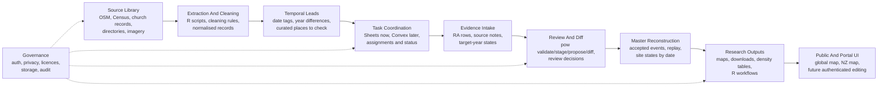

# System Map

This document gives a compact view of the project as a set of deep modules.
A deep module has a simple outside interface and hides messy internal details.
The aim is to make the system easy to hold in mind, easy to develop, and easy
to assign work within.

The map is not a replacement for `ROADMAP.md`, `PLANNING.md`, or `JOURNAL.md`.
It is the architectural index: what the major parts are, what each part owns,
and what each part gives to the next.

## Whole-System View

## Module Table

| Module | Owns | Does not own | Main interface |
| --- | --- | --- | --- |
| Source Library | Durable source packages, source manifests, source licence and access notes. | Cleaning decisions or accepted site states. | Source files plus manifests with hashes, counts, dates, and access notes. |
| Extraction And Cleaning | Deterministic R scripts, current/global extraction rules, obvious false-positive removal, cleaned intermediate outputs. | RA assignments or final historical truth. | Cleaned datasets and generated places-to-check files. |
| Temporal Leads | OSM date-tag leads, OSM year-difference leads, candidate gain/loss windows, small RA workpacks. | Acceptance decisions or public map layers. | Curated workpack CSV/Sheet rows with one narrow evidence question per row. |
| Task Coordination | Who is working on what, task status, provisional closure, shared task lists. | Accepted research data or master writes. | Private Google Sheets now; Convex task state later. |
| Evidence Intake | RA evidence rows, source notes, target-year statuses, uncertainty, candidate identifiers. | Final acceptance decisions. | Evidence CSV/Sheet exports that can be validated and staged. |
| Review And Diff | `pow` validation, staging, proposal generation, reviewer diff reports, review decisions. | Public research products or live task assignment. | Accepted, rejected, deferred, or revised events with rationale and hashes. |
| Master Reconstruction | Replay of accepted events, target-year site states, deterministic rebuilds. | Raw source collection or provisional task status. | Rebuilt snapshots and master state tables for target years and current maps. |
| Research Outputs | Density tables, map layers, downloads, R-readable summaries, analysis workflows. | Data intake or review decisions. | Investigator-facing CSV, GeoJSON, JSON, and R outputs. |
| Public And Portal UI | Map display, inspection, future authenticated contribution surfaces. | Direct master writes. | Read-only public products and, later, authenticated staged submissions. |
| Governance | Auth, privacy, licensing, storage rules, audit expectations, provider boundaries. | Day-to-day task completion. | Cross-module rules and checks that every module must respect. |

## Current Tactical Focus

The immediate New Zealand pilot sits across four modules:

1. **Temporal Leads**: generate the first 50-record RA workpack from OSM date
   tags and year-difference leads.
2. **Task Coordination**: assign that work through a private Sheet now, and
   later through Convex if the pilot needs shared live task status.
3. **Evidence Intake**: have André record source-backed target-year evidence,
   uncertainty, and useful lifecycle dates.
4. **Review And Diff**: validate, stage, propose, diff, and review the returned
   evidence before anything can affect the master.

## Development Rule

Every active task should name its module. A task can depend on another module's
output, but it should have one primary home.

Examples:

- `Generate first 50-record NZ temporal workpack` belongs to **Temporal Leads**.
- `Check assigned records` belongs to **Evidence Intake**.
- `Write Vanuatu source-first protocol` belongs to **Source Library**.
- `Define Vanuatu target years and timeline anchors` belongs to **Temporal
  Leads**.
- `Wire shared task status` belongs to **Task Coordination**.
- `Add reviewer decision semantics to pow` belongs to **Review And Diff**.

This keeps tactical work connected to the system design without turning the
roadmap into a task tracker.
